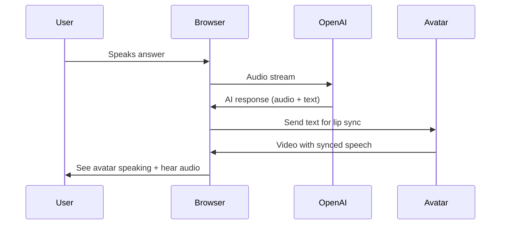

# Avatar Integration - User Experience Flow

## Overview
This document describes how the avatar integration affects the user experience during AI interviews, including startup, runtime behavior, and failure scenarios.

## Interview Initialization Flow

### Without Avatar (Current)
```
1. User clicks "Start Interview"
2. Browser requests OpenAI token from Fly.io (~1s)
3. WebRTC connection established (~1s)
4. Total time to ready: ~2 seconds
5. User hears: "Hello, I'm ready to begin your interview"
```

### With Avatar Enabled
```
1. User clicks "Start Interview"
2. Parallel initialization:
   - OpenAI token request from Fly.io (~1s)
   - Avatar session creation via Edge Function (~2s)
3. Parallel connection setup:
   - WebRTC to OpenAI (~1s)
   - Agora RTC to Akool (~1s)
4. Total time to ready: ~3-4 seconds
5. User sees avatar and hears: "Hello, I'm ready to begin your interview"
```

## During the Interview

### User Perspective
1. **Visual Experience**
   - Sees AI avatar's face/upper body
   - Avatar maintains eye contact
   - Lip movements sync with speech
   - Natural gestures and expressions

2. **Audio Experience**
   - Clear AI voice (from avatar stream)
   - No echo or dual audio
   - Natural conversation flow
   - <800ms response latency

3. **Interaction Flow**
   ```
   User: "Tell me about your experience with React"
   [Avatar thinking animation - 500ms]
   Avatar: [lips moving] "I have 5 years of experience with React..."
   [Natural gestures while speaking]
   ```

### Technical Flow


## Audio Handling Strategy

### Recommended: Single Audio Source
When avatar is enabled:
- **OpenAI audio**: Muted
- **Avatar audio**: Active
- **Benefit**: No echo or sync issues

### Alternative: Dual Audio (Not Recommended)
- Both streams active
- Requires precise synchronization
- Risk of echo effect

## Failure Scenarios

### Avatar Connection Fails at Start
```
1. User clicks "Start Interview"
2. OpenAI connects successfully
3. Avatar connection times out (3s)
4. System auto-switches to audio-only mode
5. User sees: "Continuing with audio-only mode" toast
6. Interview proceeds normally without video
```

### Avatar Fails During Interview
```
1. Interview in progress with avatar
2. Avatar stream disconnects
3. Avatar video freezes/disappears
4. Audio continues uninterrupted (switches to OpenAI audio)
5. User sees: "Avatar disconnected, continuing with audio"
6. No interview disruption
```

### Network Degradation
```
Low Bandwidth Detected:
1. Avatar video quality automatically reduces
2. If bandwidth critical: Avatar video pauses
3. Audio remains priority - never interrupted
4. User sees: "Limited bandwidth - video paused"
```

## Performance Characteristics

| Metric | Audio-Only | With Avatar | Impact |
|--------|------------|-------------|---------|
| Initial Load | ~2s | ~3-4s | +1-2s |
| Response Latency | <500ms | <800ms | +300ms |
| Bandwidth Usage | 128 kbps | 2-3 Mbps | 20-25x |
| CPU Usage | 5-10% | 15-25% | 2-3x |
| Memory Usage | 50MB | 150MB | 3x |

## User Controls

### Interview Interface
```
[🎤 Mute] [📹 Toggle Avatar] [⏸️ Interrupt] [📞 End Interview]
```

### Avatar-Specific Controls
- **Toggle Avatar**: Switch between video/audio-only during interview
- **Avatar Settings**: Choose different avatars (if enabled)
- **Quality Settings**: Auto/High/Medium/Low video quality

## Cost Implications

### Per 30-Minute Interview
- **Current (Audio-Only)**: ~$0.50
- **With Avatar**: ~$0.75-$0.95
  - OpenAI costs: $0.50 (unchanged)
  - Akool session: $0.20-$0.40
  - Additional bandwidth: $0.05

### Billing Considerations
- Avatar usage tracked per tenant
- Can set limits: "X avatar interviews per month"
- Automatic fallback to audio-only when limit reached

## Progressive Enhancement Strategy

### Phase 1: Opt-in Beta
- Avatar disabled by default
- Users can enable for specific interviews
- Clear cost implications shown

### Phase 2: Tenant Defaults
- Tenants can set avatar as default
- Still allow per-interview override
- Usage analytics available

### Phase 3: Full Integration
- Avatar as standard option
- Multiple avatar choices
- Custom avatar upload (premium)

## Browser Requirements

### Minimum Requirements
- Chrome 90+, Firefox 88+, Safari 14+, Edge 90+
- WebRTC support
- Stable internet connection (3+ Mbps)

### Optimal Experience
- Chrome or Edge (latest)
- 5+ Mbps connection
- Hardware video acceleration enabled

## Accessibility Considerations

- Avatar includes closed captions option
- Screen reader announces avatar state changes
- Keyboard controls for all avatar functions
- High contrast mode supported

## Analytics Events

```javascript
// Track avatar usage
analytics.track('avatar_session_started', {
  tenant_id: tenantId,
  interview_id: sessionId,
  avatar_type: avatarId
});

analytics.track('avatar_fallback', {
  reason: 'connection_failed' | 'bandwidth_low' | 'user_disabled',
  time_in_interview: secondsElapsed
});

analytics.track('avatar_quality_changed', {
  from_quality: 'high',
  to_quality: 'medium',
  reason: 'bandwidth'
});
```