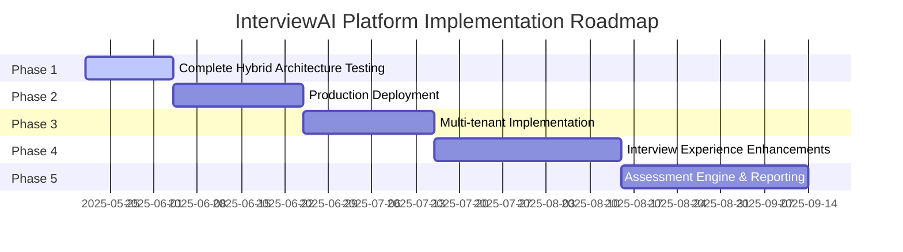

# InterviewAI - Consolidated Roadmap

This document provides a comprehensive roadmap for the AI Interview Insights Platform, consolidating information from various project files into a single source of truth for planning and tracking purposes.

## Overview

The roadmap is organized into five sequential phases, each with specific goals and deliverables. Tasks within each phase are categorized by functional area and marked with their current status.

## Completed Work (Pre-Roadmap)

Before starting the current roadmap phases, several major features and components were completed:

### Core Infrastructure
- ✅ Set up Supabase project with multi-tenant architecture
- ✅ Implemented authentication with tenant isolation
- ✅ Configured Row Level Security (RLS) for data isolation
- ✅ Created storage buckets (resumes, videos, audio)
- ✅ Established database schema with proper foreign key relationships
- ✅ Set up proper CI/CD pipeline with GitHub, Supabase, and Vercel
- ✅ Deployed to production environment with proper secrets management

### Resume Processing Flow
- ✅ Built resume upload component with file validation
- ✅ Implemented PDF preview functionality
- ✅ Created Edge Functions for text extraction (with PDF.co)
- ✅ Built AI analysis pipeline using OpenAI GPT-4o-mini
- ✅ Integrated People Data Labs (PDL) for candidate enrichment
- ✅ Created CandidateProfile page with tabbed interface
- ✅ Implemented enhanced profile display with PDL data

### Position Management System
- ✅ Created position management UI with form validation
- ✅ Implemented AI-powered position description generation
- ✅ Built competency suggestion based on position description
- ✅ Added competency weighting UI with validation
- ✅ Connected to database for storing positions and competencies
- ✅ Fixed RLS policies for position creation and access

### Interview System (Initial Implementation)
- ✅ Created interview session management interface
- ✅ Implemented session creation and detail pages
- ✅ Built interview room with video/audio controls
- ✅ Added real-time transcript panel
- ✅ Created session invitation system
- ✅ Implemented comprehensive testing infrastructure
- ✅ Evaluated infrastructure platforms (selected Fly.io)
- ✅ Created WebRTC SDP proxy proof-of-concept

### Edge Functions (Original Implementation)
- ✅ Developed process-resume edge function for PDF text extraction
- ✅ Created analyze-resume for AI analysis with GPT-4o-mini
- ✅ Implemented enrich-candidate for PDL integration
- ✅ Built generate-position for job descriptions
- ✅ Created interview-start (v5) with basic WebRTC support
- ✅ Implemented transcript-processor (v5) for transcript handling
- ✅ Created interview-transcript (v4) for session management
- ⚠️ These edge functions are deployed but not fully updated for hybrid architecture

### Hybrid Architecture (Initial Implementation)
- ✅ Implemented SDP proxy approach (fly-interview-poc)
- ✅ Created hybrid OpenAI approach (fly-interview-hybrid)
- ✅ Refactored WebRTC implementation with hooks-based architecture
- ✅ Fixed production routing issues and JS errors
- ✅ Fixed VM isolation security issue
- ✅ Created interview-hybrid-template VM for production
- ✅ Removed deprecated SDP proxy and POC test apps
- ⚠️ Modified interview-start edge function code for VM isolation but not fully deployed

## Phase 1: Complete Hybrid Architecture Testing (Current)

**Goal**: Finalize the hybrid WebRTC architecture testing framework and ensure robust test coverage before production deployment.

### Testing Infrastructure
- [x] Phase 1: Test Codebase Audit
- [x] Phase 2: Clean Up and Removal
- [x] Phase 3: Documentation Updates
- [ ] **Phase 4: Enhanced Hybrid Testing (CURRENT PRIORITY)**
  - [ ] Implement focused hybrid architecture tests
  - [ ] Add integration tests with real interview scenarios
  - [ ] Create test helper utilities for consistency
- [ ] **Phase 5: Test Automation**
  - [ ] Create streamlined test command
  - [ ] Document testing workflows
  - [ ] Set up continuous testing in CI/CD pipeline

### Core Infrastructure Finalization
- [x] Create separate Fly.io VM template for WebRTC proxy
  - [x] Deploy `interview-hybrid-template` to Fly.io
  - [x] Configure environment variables
  - [x] Set up resource limits (1GB memory, shared CPU)
- [x] Implement VM isolation security fix
  - [x] Modify interview-start edge function for per-session VMs
  - [x] Update WebRTC hooks to handle dynamic server URLs
  - [x] Document VM isolation model

### Client Components
- [x] Complete WebRTC hooks-based architecture
  - [x] Fix production routing issues
  - [x] Resolve JS errors in production bundle
  - [x] Clean up testing structure
- [ ] Enhance debug capabilities
  - [ ] Add comprehensive logging
  - [ ] Implement session recording for debugging
  - [ ] Create visualization tools for connection states

## Phase 2: Production Deployment

**Goal**: Deploy the complete hybrid architecture to production and verify all components work correctly in the production environment.

### Edge Function Deployment (CRITICAL)
- [ ] Deploy updated edge functions for hybrid architecture
  - [ ] Deploy interview-start (v6) with hybrid architecture support
    - [ ] Verify VM creation with proper isolation model
    - [ ] Ensure proper security token generation
    - [ ] Test tenant-specific WebRTC config
  - [ ] Deploy transcript-processor (v6) with hybrid data handling
    - [ ] Support direct WebRTC data channel processing
    - [ ] Implement proper transcript storage
  - [ ] Deploy interview-transcript (v5) with hybrid session mgmt
    - [ ] Add support for hybrid architecture states
    - [ ] Update transcript synchronization model

### Deployment & Configuration
- [ ] Configure production environment
  - [ ] Set up API keys and secrets for hybrid flow
  - [ ] Configure CORS and security headers
  - [ ] Verify database schema and tables for transcript storage
- [ ] Configure WebRTC production endpoints
  - [ ] Implement proper URL construction for production
  - [ ] Add CORS configuration for production domains
  - [ ] Set up fallback signal paths for robust connections

### Testing & Verification
- [ ] Test hybrid architecture with real interview sessions
  - [ ] Conduct end-to-end tests with actual interviews
  - [ ] Validate transcript storage and retrieval
  - [ ] Monitor VM creation and teardown
- [ ] Performance testing
  - [ ] Measure transcript latency
  - [ ] Test under various network conditions
  - [ ] Analyze resource usage patterns

### Fixes & Optimizations
- [ ] Update the hybrid architecture with improvements
  - [ ] Incorporate error handling improvements
  - [ ] Add enhanced logging for diagnostics
  - [ ] Implement session recovery mechanisms
- [ ] Performance optimizations
  - [ ] Optimize audio packet size
  - [ ] Reduce connection establishment time
  - [ ] Implement adaptive quality settings

## Phase 3: Multi-tenant Implementation

**Goal**: Implement robust multi-tenant isolation to ensure complete security and separation between different organizations' data.

### Security Architecture
- [ ] Configure multi-tenant isolation structure
  - [ ] Implement one VM per tenant architecture
  - [ ] Configure tenant-specific resource allocation
  - [ ] Create tenant provisioning automation
- [ ] Configure JWT validation for API endpoints
  - [ ] Add JWT validation to WebSocket connections
  - [ ] Implement token refresh mechanism
  - [ ] Secure tenant context in tokens

### Database & Storage
- [ ] Enhance RLS policies for interview data
  - [ ] Create policies for transcript_entries
  - [ ] Implement isolation for recordings
  - [ ] Add tenant-specific storage paths
- [ ] Implement efficient indexing strategy
  - [ ] Optimize query performance for transcript search
  - [ ] Add indexes for common filtering operations
  - [ ] Implement tenant-specific caching

### Monitoring & Operations
- [ ] Set up monitoring and alerting
  - [ ] Configure performance monitoring
  - [ ] Implement security event logging
  - [ ] Create tenant-specific dashboards
- [ ] Implement operational tools
  - [ ] Create tenant management scripts
  - [ ] Build usage tracking and quotas
  - [ ] Develop backup and recovery procedures

## Phase 4: Interview Experience Enhancements

**Goal**: Enhance the interview user experience with additional features and improvements to the UI.

### UI Enhancements
- [ ] Improve interview room experience
  - [ ] Create dedicated layout for interview experience
  - [ ] Add professional video/audio controls
  - [ ] Implement real-time transcript display with formatting
- [ ] Add visual feedback elements
  - [ ] Create connection quality indicators
  - [ ] Add audio level visualization
  - [ ] Implement responsive design for mobile compatibility

### Advanced Features
- [ ] Implement video recording integration
  - [ ] Integrate with api.video
  - [ ] Create secure token generation
  - [ ] Implement recording controls
  - [ ] Build playback interface with transcript alignment
- [ ] Interviewer AI persona selection
  - [ ] Create persona configuration UI
  - [ ] Implement persona instruction templates
  - [ ] Add real-time persona switching

### Reliability Improvements
- [ ] Add fallback mechanisms
  - [ ] Implement audio-only mode for poor connections
  - [ ] Create text-based fallback for WebRTC failures
  - [ ] Add offline recovery for connection interruptions
- [ ] Enhance error handling
  - [ ] Implement comprehensive error states
  - [ ] Add user-friendly error messages
  - [ ] Create recovery paths for common failures

## Phase 5: Assessment Engine & Reporting

**Goal**: Complete the end-to-end interview process with assessment generation, scoring, and reporting capabilities.

### Assessment Engine
- [ ] Implement assessment generation
  - [ ] Create interview summary generator
  - [ ] Build competency evaluation algorithms
  - [ ] Implement weighted scoring system
- [ ] Add behavioral analysis
  - [ ] Analyze speech patterns and confidence
  - [ ] Evaluate technical accuracy
  - [ ] Process non-verbal cues from video

### Reporting & Analytics
- [ ] Create assessment visualization
  - [ ] Build radar charts for competency scores
  - [ ] Implement comparison views
  - [ ] Add historical tracking
- [ ] Implement export capabilities
  - [ ] Create PDF reports
  - [ ] Build CSV/Excel exports
  - [ ] Implement ATS integration webhooks

### Integration & Expansion
- [ ] ATS integrations
  - [ ] Implement Greenhouse connector
  - [ ] Build Lever integration
  - [ ] Create generic webhook system
- [ ] Calendar integration
  - [ ] Add Google Calendar support
  - [ ] Implement Outlook/Exchange connector
  - [ ] Create interview scheduling UI

## Current Status & Priority

The project is currently in **Phase 1: Complete Hybrid Architecture Testing** with specific focus on implementing enhanced hybrid testing (Phase 4 of the test migration plan).

### Immediate Next Steps:
1. Complete implementation of focused hybrid architecture tests
2. Add integration tests with real interview scenarios
3. Create test helper utilities for consistency
4. Begin implementation of test automation

### Dependencies & Blockers:
- VM isolation security fix has been implemented but not fully deployed to production
- The interview-hybrid-template is active on Fly.io
- Legacy implementations (SDP proxy, POC tests) have been cleaned up
- **CRITICAL**: Edge functions need to be updated and deployed for hybrid architecture support
- Unit tests for WebRTC hooks architecture have been completed

## Success Criteria

| Metric | Target |
|--------|--------|
| Transcript latency | < 200ms |
| Transcript accuracy | ≥ 95% |
| Interview reliability | ≥ 99.9% session completion |
| Cross-tenant data bleed | 0 incidents (RLS enforced) |
| Weighted score variance (UI vs calculation) | ≤ 0.1 |

---

This roadmap will be updated regularly as tasks are completed and priorities evolve. Progress is tracked in the `memory-bank/progress.md` file, with detailed status updates for each component. 