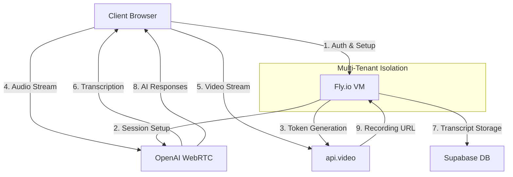

# WebRTC Architecture Comparison: SDP Proxy vs. Hybrid OpenAI Approach

> **HISTORICAL REFERENCE DOCUMENT**: This document describes the architectural transition from our original SDP proxy approach to the current hybrid architecture. The original SDP proxy approach is no longer supported, and we've fully migrated to the hybrid OpenAI approach.

This document explains the two different WebRTC implementation approaches that existed in our project: the original SDP proxy approach (now archived) and the current hybrid approach that leverages OpenAI's native WebRTC capabilities.

## Table of Contents

1. [Overview](#overview)
2. [SDP Proxy Approach (fly-interview-poc)](#sdp-proxy-approach-fly-interview-poc)
3. [Hybrid OpenAI Approach (fly-interview-hybrid)](#hybrid-openai-approach-fly-interview-hybrid)
4. [Key Differences](#key-differences)
5. [Hybrid Architecture Benefits](#hybrid-architecture-benefits)
6. [Implementation Status](#implementation-status)
7. [Testing Approaches](#testing-approaches)

## Overview

Our project has evolved from an initial SDP proxy implementation to a hybrid architecture that leverages OpenAI's native WebRTC capabilities for improved performance, security, and scalability. This document explains both approaches and how they differ.

## SDP Proxy Approach (fly-interview-poc)

The original approach in `fly-interview-poc` used a WebRTC SDP proxy for establishing connections between clients and a server, with full audio processing on the server side.

**Architecture:**
```
[Browser] <--WebSocket--> [Fly.io App] <--> [OpenAI API]
   |                          |
Audio Capture         Audio Processing &
                       Transcription
```

**Key Characteristics:**

- Full audio transmission over WebSockets (not true WebRTC)
- Server-side audio processing with OpenAI Whisper API
- Higher latency due to audio forwarding
- All audio processing happens on the server
- Traditional API-based interaction with OpenAI
- Higher server resource usage (CPU, memory)

**Components:**
- WebSockets for audio streaming
- Server-side audio buffer management
- Manual periodic API calls to OpenAI Whisper
- Server-managed transcript compilation

## Hybrid OpenAI Approach (fly-interview-hybrid)

The newer approach in `fly-interview-hybrid` leverages OpenAI's native WebRTC capabilities, using Fly.io only as a secure SDP exchange proxy while allowing direct WebRTC connections between the client and OpenAI.

**Architecture:**


**Key Characteristics:**

- True peer-to-peer WebRTC connection between client and OpenAI
- SDP exchange proxy for secure credential management
- Lower latency direct audio streaming
- Client-side audio capture and streaming
- OpenAI's native WebRTC endpoints for processing
- Reduced server resource usage
- Multi-tenant isolation through Fly.io VMs

**Components:**
- WebRTC DataChannel for control messages
- SDP exchange proxy on Fly.io
- Secure credential management
- Direct audio streaming to OpenAI
- Real-time transcription through WebRTC

## Key Differences

| Feature | SDP Proxy Approach | Hybrid OpenAI Approach |
|---------|-------------------|------------------------|
| **Audio Path** | Client → Fly.io → OpenAI | Client → OpenAI (direct) |
| **Server Role** | Full audio processing | SDP exchange only |
| **Latency** | Higher (audio forwarding) | Lower (direct connection) |
| **Resource Usage** | Higher (audio processing) | Lower (signaling only) |
| **Scalability** | Limited by server resources | Better (minimal server load) |
| **Implementation** | `fly-interview-poc` | `fly-interview-hybrid` |
| **OpenAI Integration** | REST API calls | Native WebRTC endpoints |
| **Security Model** | Server handles all credentials | Server proxies credentials |

## Hybrid Architecture Benefits

The hybrid approach offers several significant advantages:

1. **Reduced Latency**: Direct WebRTC connections eliminate server-side forwarding of audio data, resulting in more responsive conversations.

2. **Improved Scalability**: Since servers are only handling signaling (not audio), they can manage many more concurrent sessions with minimal resources.

3. **Enhanced Security**: API keys never leave the server, but audio still flows directly to OpenAI's services.

4. **Better Audio Quality**: Direct WebRTC connections maintain higher audio quality without intermediate compression or processing.

5. **Multi-tenant Isolation**: Each tenant organization gets complete isolation through Fly.io's hierarchical structure.

6. **Efficient Resource Utilization**: Fly.io VMs can be smaller and handle more concurrent sessions.

7. **Cost Efficiency**: Pay only for the actual VM usage during interview sessions.

## Implementation Status

### SDP Proxy (fly-interview-poc)
- ✅ Basic WebRTC SDP proxy implemented
- ✅ Local testing environment complete
- ✅ Core audio capture functionality working
- ✅ Simple transcript output implemented
- ❌ Not integrated with main application
- ❌ Limited to demonstration purposes

### Hybrid OpenAI (fly-interview-hybrid)
- ✅ WebRTC SDP exchange proxy implemented
- ✅ Simulation mode for testing without OpenAI API
- ✅ Connection status tracking and error handling
- ✅ Fly.io deployment configuration
- ✅ Reconnection logic with exponential backoff
- ✅ Audio visualization in test UI
- 🔄 Integration with main application (in progress)
- 🔄 Multi-tenant isolation (in progress)
- 🔄 Full production testing (in progress)

## Testing Approaches

Both implementations provide testing utilities:

### SDP Proxy Test (`fly-interview-poc/test-sdp-proxy.js`)
Tests the basic WebRTC signaling flow with mock SDP offers and ICE candidates.

### Hybrid Simulation Mode
The hybrid implementation includes a simulation server that allows testing the full WebRTC flow without actually connecting to OpenAI:

```bash
# Start the simulation server
cd fly-interview-hybrid
npm run simulate

# In another terminal, start the application
cd ..
npm run dev
```

Then access the test page at:
```
http://localhost:8080/interview-test-simple
```

## Conclusion

We are transitioning from the initial SDP proxy approach to the hybrid OpenAI approach for its significant advantages in latency, scalability, and resource efficiency. The `fly-interview-hybrid` implementation represents our current direction, though elements from both approaches are being used during the transition period.

For new development, focus on the hybrid architecture as outlined in the [Hybrid Architecture Specification](./hybrid-architecture-spec.md) and [Hybrid Technical Flow](../development/hybrid-technical-flow.md) documentation.