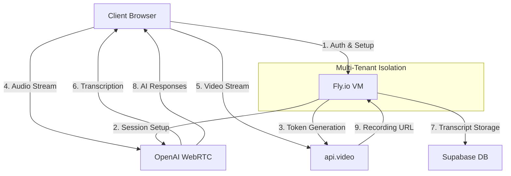
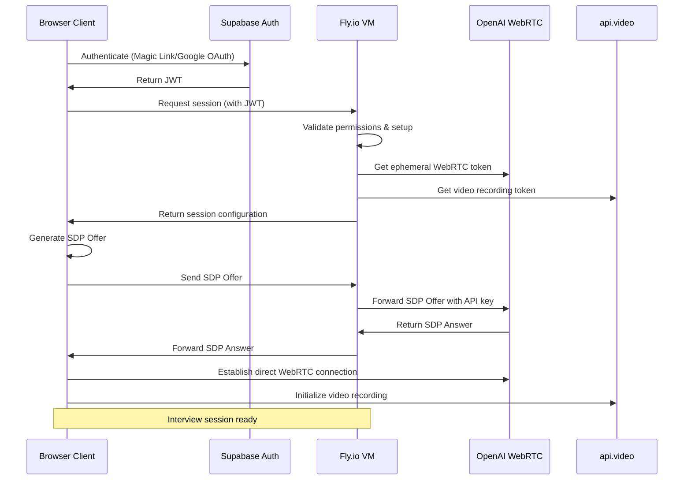
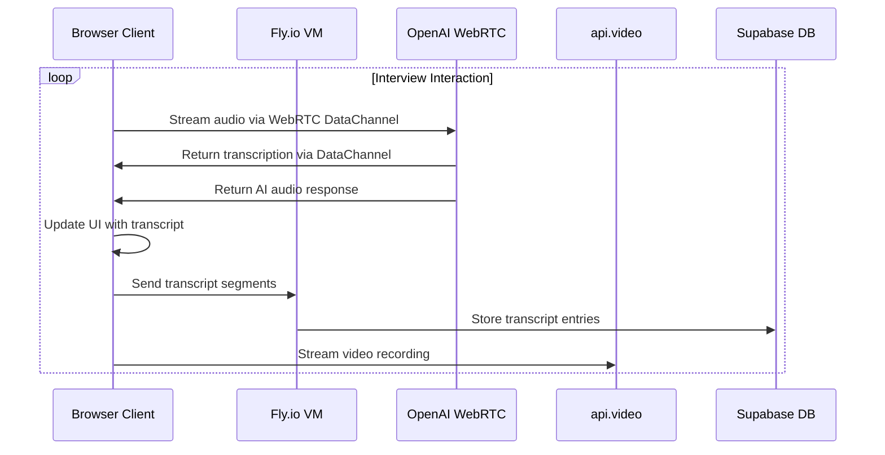
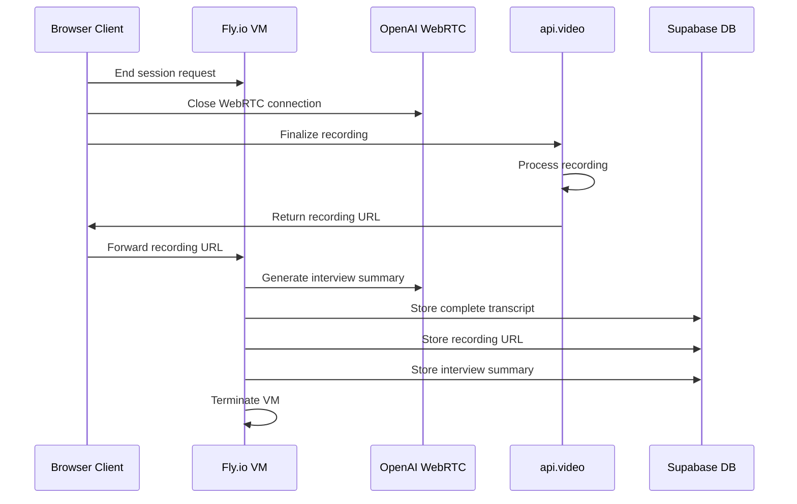

# Hybrid Architecture for AI Interview Platform
# Fly.io + OpenAI WebRTC Implementation

## Overview

This document outlines the hybrid architecture for the AI Interview Insights Platform, combining Fly.io and OpenAI's WebRTC capabilities. This approach leverages WebRTC for direct, secure audio streaming between clients and OpenAI, with Fly.io serving as an SDP proxy to maintain security without compromising performance.

## System Architecture

### Visual Overview

```
┌─────────────────────────────────────────────────────────────────────┐
│                          Browser Client                             │
│                                                                     │
│  ┌────────────┐        ┌────────────┐        ┌────────────┐         │
│  │ Microphone │───────►│  WebRTC    │◄───────┤ Text UI    │         │
│  │ Capture    │  Audio │ Connection │  Text  │ Display    │         │
│  └────────────┘        └──────┬─────┘        └────────────┘         │
│                               │                                     │
└───────────────────────────────┼─────────────────────────────────────┘
                                │
                                │
           ┌──────────────────┐ │ ┌───────────────────┐
           │  1. SDP Signaling│ │ │                   │
           │  & ICE Setup     │ │ │  2. Direct WebRTC │
           └─────────┬────────┘ │ │     Connection    │
                     │          │ │                   │
                     ▼          │ │                   │
┌────────────────────────────┐  │ │                   │
│                            │  │ │                   │
│         Fly.io             │  │ │                   │
│       (SDP Proxy)          │  │ │                   │
│                            │  │ │                   │
└──────────────┬─────────────┘  │ │                   │
               │                │ │                   │
               │                │ │                   │
               ▼                ▼ │                   │
┌────────────────────────────────────────────────────▼───────────────┐
│                                                                     │
│                             OpenAI                                  │
│  ┌────────────────────┐    ┌────────────────┐    ┌────────────┐    │
│  │ API Authentication │    │ Speech-to-Text │    │  WebRTC    │    │
│  │ & SDP Processing   │───►│ Processor      │◄───┤  Endpoint  │    │
│  └────────────────────┘    └───────┬────────┘    └────────────┘    │
│                                    │                                │
└────────────────────────────────────┼────────────────────────────────┘
                                     │
                                     │
                                     ▼
┌───────────────────────────────────────────────────────────────────┐
│                                                                   │
│                           Supabase                                │
│                                                                   │
│   ┌───────────────────┐     ┌────────────────────────────────┐   │
│   │  Auth & Session   │     │           Database             │   │
│   │   Management      │     │                                │   │
│   └───────────────────┘     │    ┌───────────────────────┐   │   │
│                             │    │  Transcript Storage   │   │   │
│                             │    │  & Processing         │   │   │
│                             │    └───────────────────────┘   │   │
│                             └────────────────────────────────┘   │
│                                                                   │
└───────────────────────────────────────────────────────────────────┘
```

### Flow Diagram



## Core Components

### 1. Browser Client
- Captures audio via `getUserMedia()` and `MediaRecorder` APIs
- Establishes WebRTC connection following signaling protocol
- Streams audio directly to OpenAI's WebRTC endpoint
- Receives real-time transcription via WebRTC data channel
- Renders transcript UI for user interaction
- Persists final session data to Supabase
- Streams video to api.video for recording (optional)

### 2. Fly.io (SDP Proxy)
- Tenant-isolated session managers (one VM per session)
- Handles WebRTC signaling without exposing API keys
- Processes SDP offers from clients
- Generates compatible SDP answers
- Manages ICE candidate exchange
- Maintains session state with unique IDs
- Provides secure WebSocket connectivity
- Persists transcript data to Supabase
- Generate interview summaries

### 3. OpenAI WebRTC Endpoint
- Receives and validates API authentication
- Accepts SDP offers via proxy
- Processes incoming audio streams in real-time
- Performs speech-to-text conversion
- Returns transcript data through WebRTC data channel
- Maintains WebRTC connection
- Handles turn detection and interruptions

### 4. api.video Service (Optional)
- Manage video recording sessions
- Handle encoding and storage of recordings
- Provide playback URLs for recorded sessions

### 5. Supabase Backend
- Provides authentication and authorization
- Stores user, candidate, and interview session data
- Persists final transcripts
- Offers edge functions for post-processing analyses
- Manages multi-tenant data isolation
- Handles file storage for recordings and documents

## Multi-Tenant Architecture

### Tenant Isolation with Fly.io

Each tenant organization gets complete isolation through Fly.io's hierarchical structure:

1. **Organization Level**
   - Separated by Fly Apps (one app per tenant)
   - Independent networking and firewall rules
   - Isolated configuration and secrets

2. **Session Level**
   - Individual Fly Machines per interview session
   - Resource isolation (CPU, memory)
   - Independent scaling and regional deployment

3. **Network Level**
   - Private networks between tenant machines
   - Explicit firewall rules
   - No cross-tenant communication paths

## Technical Data Flow

### 1. Session Initialization



### 2. Streaming Phase (Direct Connection)



### 3. Session Completion



## API Interfaces

### 1. Fly.io Session Management API

**Create Session**

```http
POST /api/sessions
Host: interviews-{tenant-id}.fly.dev
Authorization: Bearer {jwt}
Content-Type: application/json

{
  "candidate_id": "uuid",
  "position_id": "uuid",
  "settings": {
    "voice": "alloy",
    "language": "en-US",
    "temperature": 0.7
  }
}
```

**Response**

```json
{
  "session_id": "uuid",
  "websocket_url": "wss://interview-{session-id}.fly.dev/ws",
  "video_token": "api_video_token",
  "interview_context": {
    "position": { "title": "Software Engineer", ... },
    "company": { "name": "Acme Corp", ... },
    "competencies": [...]
  }
}
```

**WebSocket Events**

The WebSocket connection to Fly.io VM is used for session management, not media streaming:

```javascript
// Client → Fly.io: SDP Offer
{
  "type": "sdp_offer",
  "sdp": "v=0\no=- 5991916764837950231..."
}

// Fly.io → Client: SDP Answer
{
  "type": "sdp_answer",
  "sdp": "v=0\no=- 5991916764837950231..."
}

// Client → Fly.io: Transcript Update
{
  "type": "transcript_update",
  "entries": [
    {
      "text": "Tell me about yourself.",
      "speaker": "ai",
      "timestamp": "2024-06-10T14:32:01.123Z"
    },
    {
      "text": "I have five years of experience...",
      "speaker": "candidate",
      "timestamp": "2024-06-10T14:32:10.456Z"
    }
  ]
}

// Client → Fly.io: End Session
{
  "type": "end_session",
  "recording_url": "https://api.video/videos/vi52d1jtaik8jfej213r",
  "final_transcript": {...}
}
```

### 2. OpenAI WebRTC Interface

The interaction with OpenAI's WebRTC API follows their Realtime API protocol:

**Data Channel Messages (Client → OpenAI)**

```javascript
// Update session parameters
{
  "type": "session.update",
  "session": {
    "instructions": "You are an interviewer for a software engineering position...",
    "voice": "alloy",
    "tools": [...], // Function definitions
    "tool_choice": "auto",
    "input_audio_transcription": {"model": "whisper-1"},
    "temperature": 0.7
  }
}

// Append audio chunk
{
  "type": "input_audio_buffer.append",
  "audio": "base64EncodedAudioData"
}

// Create response
{
  "type": "response.create",
  "response": {
    "modalities": ["text", "audio"],
    "instructions": "Ask the candidate about their experience...",
    "max_output_tokens": 100
  }
}
```

**Data Channel Messages (OpenAI → Client)**

```javascript
// Transcript updates
{
  "type": "conversation.item.input_audio_transcription.completed",
  "transcript": "I have five years of experience..."
}

// AI response transcript
{
  "type": "response.audio_transcript.delta",
  "text": "Can you tell me more about your..."
}

// Function call (if configured)
{
  "type": "response.function_call_arguments.done",
  "name": "end_session"
}
```

## SDP Format Compatibility

The SDP proxy carefully preserves the exact format of the client's SDP offer, maintaining:
- Media line order
- Session-level attributes
- ICE credentials (with secure generation)
- Codec configurations

Example SDP processing:
```javascript
function createAnswerFromOffer(offerSdp) {
  const lines = offerSdp.split('\r\n');
  const answer = [];
  
  for (let i = 0; i < lines.length; i++) {
    const line = lines[i];
    let newLine = line;
    
    // Change offer to answer
    if (line === 'a=type:offer') {
      newLine = 'a=type:answer';
    }
    // Reverse the setup role
    else if (line.startsWith('a=setup:')) {
      if (line === 'a=setup:actpass') {
        newLine = 'a=setup:active';
      }
    }
    // Other necessary transformations...
    
    answer.push(newLine);
  }
  
  return answer.join('\r\n') + '\r\n';
}
```

## Security Considerations

### Authentication and Authorization

1. **Client Authentication**
   - Magic link or Google OAuth via Supabase
   - JWT token passed to Fly.io for validation

2. **API Security**
   - API keys never exposed to client browser
   - All API key usage happens server-side within Fly.io
   - SDP proxy acts as a secure intermediary
   - Ephemeral tokens generated for client use
   - Short-lived access tokens with minimal scope

3. **Network Security**
   - TLS/WSS for all communications
   - Private networking between Fly Machines
   - Firewall rules for tenant isolation
   - All WebRTC connections encrypted with DTLS
   - WebSocket connections use WSS (secure WebSockets)
   - API authentication with proper token validation

### Data Protection

1. **Data Isolation**
   - Each interview gets unique session ID
   - Tenant isolation implemented at Fly.io VM level
   - Row-Level Security policies enforce access control in database

2. **In Transit**
   - Encrypted WebRTC streams (DTLS-SRTP)
   - TLS for HTTP/WebSocket communications
   - Secure API token exchange

3. **At Rest**
   - Encrypted storage in Supabase
   - Encrypted video storage at api.video
   - No persistent data on Fly.io VMs
   - Row-level security in Supabase
   - Tenant-specific encryption keys
   - Role-based access to recordings and transcripts

## Performance Considerations

### Latency Optimization

1. **Direct Audio Streaming**
   - Once WebRTC connection is established, audio flows directly to OpenAI
   - No proxy in the middle of the high-bandwidth audio stream
   - Lowest possible latency for real-time transcription

2. **Global Distribution**
   - Deploy Fly.io VMs in regions closest to participants
   - Multiple api.video edge locations
   - Regional optimization for lowest latency path

3. **Connection Handling**
   - WebRTC includes built-in mechanisms for handling network changes
   - ICE framework helps establish connections even in challenging network environments
   - Connection recovery handled gracefully
   - Connection quality monitoring
   - Adaptive bitrate for varying network conditions

### Resource Efficiency

1. **Resource Utilization**
   - Fly.io only handles signaling, not media streaming
   - Compute-intensive audio processing handled by OpenAI
   - Efficient separation of concerns for better scaling
   - VMs destroyed after interview completion
   - Pay-as-you-go pricing for actual usage
   - Tiered resources based on interview importance

2. **Bandwidth Optimization**
   - Local processing where appropriate
   - Efficient audio encoding
   - Selective transcript synchronization

## Deployment Strategy

### Infrastructure as Code

```terraform
# Terraform example for tenant app provisioning
resource "fly_app" "tenant_app" {
  name = "interviews-${var.tenant_id}"
  org  = "interview-platform"
  
  network = {
    name = "tenant-${var.tenant_id}-network"
    private = true
  }
}

# Fly Machine provisioning for interview sessions
resource "fly_machine" "interview_session" {
  app      = fly_app.tenant_app.name
  region   = var.region
  name     = "interview-${var.session_id}"
  image    = "registry.fly.io/interview-processor:latest"
  services = [{
    ports = [
      { port = 80, handlers = ["http"] }
    ]
    protocol = "tcp"
    internal_port = 8080
  }]
  
  env = {
    SESSION_ID    = var.session_id
    TENANT_ID     = var.tenant_id
    CANDIDATE_ID  = var.candidate_id
    POSITION_ID   = var.position_id
  }
  
  guest = {
    cpu_kind  = "shared"
    cpus      = 1
    memory_mb = 1024
  }
}
```

### Error Recovery

- Automatic reconnection attempts for dropped connections
- Session state preserved during brief disconnections
- Graceful degradation when optimal connections not possible

## Implementation Roadmap

### Phase 1: Proof of Concept (Completed)
- Set up basic Fly.io infrastructure
- Implement OpenAI WebRTC integration
- Develop simple client UI for testing
- Validate audio quality and latency

### Phase 2: Core Platform (In Progress)
- Implement multi-tenant isolation
- Integrate api.video for recording
- Develop session management APIs
- Create administrative interfaces

### Phase 3: Production Readiness
- Implement monitoring and alerting
- Develop scaling and failover capabilities
- Perform security audits
- Set up CI/CD pipelines

### Phase 4: Enhancement
- Add advanced analytics
- Implement AI-driven feedback
- Develop integration interfaces
- Create customization capabilities

## Next Steps

1. Implement React components for WebRTC handling in frontend
2. Deploy SDP proxy to production Fly.io environment
3. Create comprehensive monitoring for connection statistics
4. Implement production-ready error handling and recovery
5. Add support for additional media types beyond audio-only

---

## Note

This is a consolidated document that combines information from:
- `/docs/architecture/hybrid-webrtc-architecture.md`
- `/docs/development/hybrid-architecture-spec.md`

Please refer to this document as the definitive architecture specification for the hybrid WebRTC implementation.