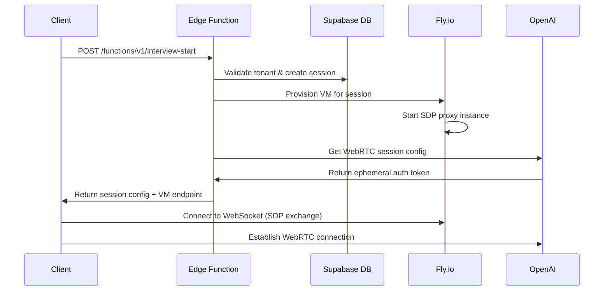
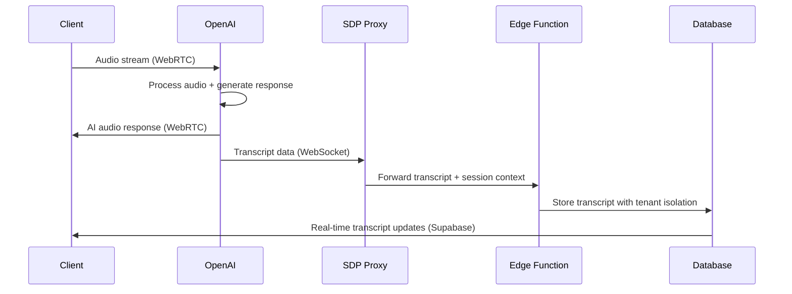
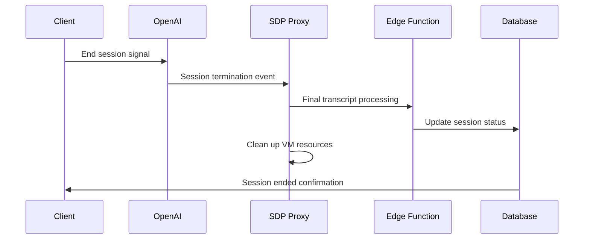

# Hybrid Architecture Implementation Details

## Overview

This document provides comprehensive technical details of the hybrid WebRTC architecture implementation. It covers the complete data flow, component interactions, API specifications, and implementation considerations for developers working with the system.

## Contents

- [Architecture Components](#architecture-components)
- [Data Flow and Sequence](#data-flow-and-sequence)
- [API Specifications](#api-specifications)
- [Implementation Patterns](#implementation-patterns)
- [State Management](#state-management)
- [Error Handling](#error-handling)
- [Performance Optimizations](#performance-optimizations)
- [Security Implementation](#security-implementation)

## Architecture Components

### 1. Client-Side WebRTC Stack

**React Hooks Architecture**:
```typescript
// Main orchestration hook
useWebRTC(config: WebRTCConfig): WebRTCState

// Specialized connection hooks
useOpenAIConnection(sessionConfig): OpenAIConnectionState
useSDPProxy(proxyConfig): SDPProxyState
useTranscriptManager(sessionId): TranscriptState
useConnectionState(): ConnectionState
useRetry(retryConfig): RetryState
```

**Component Hierarchy**:
```
WebRTCManager (UI Component)
├── useWebRTC (Main Hook)
│   ├── useConnectionState (State Management)
│   ├── useRetry (Retry Logic)
│   ├── useSDPProxy (SDP Exchange)
│   ├── useOpenAIConnection (Direct OpenAI)
│   └── useTranscriptManager (Transcript Handling)
└── TranscriptPanel (UI Component)
```

### 2. Server-Side Infrastructure

**SDP Proxy Server** (`fly-interview-hybrid/`):
```javascript
// WebSocket server for SDP exchange
const server = new WebSocketServer({
  port: process.env.PORT || 3001,
  perMessageDeflate: false
});

// Session management
const activeSessions = new Map();
const sessionMetrics = new Map();
```

**Edge Functions** (`supabase/functions/`):
- `interview-start`: Session initialization and VM provisioning
- `transcript-processor`: Real-time transcript storage

### 3. Database Schema

**Core Tables**:
```sql
-- Interview sessions with tenant isolation
CREATE TABLE interview_sessions (
  id UUID PRIMARY KEY DEFAULT gen_random_uuid(),
  tenant_id UUID NOT NULL REFERENCES tenants(id),
  company_id UUID REFERENCES companies(id),
  session_data JSONB,
  created_at TIMESTAMPTZ DEFAULT NOW()
);

-- Real-time transcripts with speaker identification
CREATE TABLE transcript_entries (
  id UUID PRIMARY KEY DEFAULT gen_random_uuid(),
  session_id UUID NOT NULL REFERENCES interview_sessions(id),
  speaker TEXT NOT NULL, -- 'ai' | 'candidate'
  content TEXT NOT NULL,
  timestamp TIMESTAMPTZ DEFAULT NOW(),
  source TEXT DEFAULT 'hybrid' -- Architecture source
);
```

## Data Flow and Sequence

### 1. Session Initialization Flow



### 2. Real-Time Audio and Transcript Flow



### 3. Session Cleanup Flow



## API Specifications

### 1. Edge Function: interview-start

**Request**:
```typescript
interface InterviewStartRequest {
  architecture?: 'hybrid' | 'direct'; // Default: 'hybrid'
  sessionConfig?: {
    maxDuration?: number; // Default: 3600 seconds
    voiceConfig?: OpenAIVoiceConfig;
    instructions?: string;
  };
}
```

**Response**:
```typescript
interface InterviewStartResponse {
  sessionId: string;
  sessionToken: string; // JWT for this session
  webrtcConfig: {
    sdpProxyUrl: string; // VM-specific WebSocket URL
    openaiConfig: {
      url: string;
      model: string;
      voice: string;
      instructions: string;
    };
    stunServers: string[];
    turnServers?: TurnServerConfig[];
  };
  metadata: {
    tenantId: string;
    userId: string;
    createdAt: string;
    expiresAt: string;
  };
}
```

### 2. SDP Proxy WebSocket Protocol

**Connection URL**:
```
wss://session-{sessionId}.interview-sdp-proxy.fly.dev/ws?token={sessionToken}
```

**Message Types**:
```typescript
// Client -> Proxy
interface ClientMessage {
  type: 'session' | 'offer' | 'answer' | 'ice_candidate';
  sessionId: string;
  data: any;
}

// Proxy -> Client
interface ProxyMessage {
  type: 'session_ready' | 'transcript' | 'error' | 'session_ended';
  data: any;
  timestamp: string;
}
```

### 3. Transcript Processor API

**Real-time Processing**:
```typescript
interface TranscriptEvent {
  sessionId: string;
  speaker: 'ai' | 'candidate';
  content: string;
  timestamp: string;
  confidence?: number;
  metadata?: {
    audioLevel?: number;
    processingLatency?: number;
  };
}
```

## Implementation Patterns

### 1. Hook-Based State Management

**useWebRTC Pattern**:
```typescript
export function useWebRTC(config: WebRTCConfig) {
  const connectionState = useConnectionState();
  const retry = useRetry({ maxAttempts: 3, backoff: 'exponential' });
  const sdpProxy = useSDPProxy(config.proxyUrl);
  const openaiConnection = useOpenAIConnection(config.openaiConfig);
  const transcriptManager = useTranscriptManager(config.sessionId);

  // Orchestrate all hooks
  useEffect(() => {
    if (connectionState.status === 'connecting') {
      initializeConnection();
    }
  }, [connectionState.status]);

  return {
    connect: connectionState.connect,
    disconnect: connectionState.disconnect,
    status: connectionState.status,
    transcript: transcriptManager.transcript,
    error: connectionState.error || retry.error
  };
}
```

### 2. Connection State Management

**State Machine Pattern**:
```typescript
type ConnectionStatus = 
  | 'idle'
  | 'connecting'
  | 'connected'
  | 'disconnecting'
  | 'disconnected'
  | 'error'
  | 'reconnecting';

interface ConnectionState {
  status: ConnectionStatus;
  error?: Error;
  retryCount: number;
  lastConnected?: Date;
  metrics: ConnectionMetrics;
}
```

### 3. Error Recovery Patterns

**Exponential Backoff Retry**:
```typescript
const retryConfig = {
  maxAttempts: 3,
  baseDelay: 1000,
  maxDelay: 10000,
  backoffFactor: 2,
  jitter: true
};

// Automatic retry for transient failures
if (isRetriableError(error) && retryCount < maxAttempts) {
  const delay = calculateBackoffDelay(retryCount, retryConfig);
  setTimeout(() => retry(), delay);
}
```

## State Management

### 1. Global State Architecture

**Context Providers**:
```typescript
<SessionProvider sessionId={sessionId}>
  <WebRTCProvider config={webrtcConfig}>
    <TranscriptProvider>
      <InterviewRoom />
    </TranscriptProvider>
  </WebRTCProvider>
</SessionProvider>
```

### 2. Local State Management

**Component State**:
```typescript
// WebRTC connection state
const [connectionState, setConnectionState] = useState<ConnectionState>({
  status: 'idle',
  retryCount: 0,
  metrics: initialMetrics
});

// Transcript state
const [transcript, setTranscript] = useState<TranscriptEntry[]>([]);
const [isRecording, setIsRecording] = useState(false);
```

### 3. Persistent State

**Session Storage**:
```typescript
// Store session configuration
sessionStorage.setItem('webrtc-session', JSON.stringify({
  sessionId,
  sessionToken,
  webrtcConfig
}));

// Store transcript for recovery
localStorage.setItem(`transcript-${sessionId}`, JSON.stringify(transcript));
```

## Error Handling

### 1. Error Categories

**Connection Errors**:
```typescript
class WebRTCConnectionError extends Error {
  constructor(
    message: string,
    public code: string,
    public retryable: boolean = false
  ) {
    super(message);
    this.name = 'WebRTCConnectionError';
  }
}
```

**Error Types**:
- `SDP_EXCHANGE_FAILED`: SDP proxy communication failure
- `WEBRTC_CONNECTION_FAILED`: Direct WebRTC connection failure
- `AUTHENTICATION_FAILED`: JWT validation or session auth failure
- `VM_PROVISIONING_FAILED`: VM startup or allocation failure
- `TRANSCRIPT_PROCESSING_FAILED`: Transcript storage or processing failure

### 2. Error Recovery Strategies

**Automatic Recovery**:
```typescript
const errorRecoveryMap = {
  'SDP_EXCHANGE_FAILED': 'retry_with_backoff',
  'WEBRTC_CONNECTION_FAILED': 'retry_with_new_session',
  'AUTHENTICATION_FAILED': 'refresh_token_and_retry',
  'VM_PROVISIONING_FAILED': 'retry_with_different_region',
  'TRANSCRIPT_PROCESSING_FAILED': 'continue_session_log_error'
};
```

### 3. User Experience During Errors

**Graceful Degradation**:
```typescript
// Continue audio even if transcript fails
if (transcriptError && audioConnectionActive) {
  showWarning('Transcript temporarily unavailable');
  continueAudioSession();
}

// Fallback to cached data during connection issues
if (connectionError && cachedTranscript.length > 0) {
  showCachedTranscript();
  attemptReconnection();
}
```

## Performance Optimizations

### 1. Connection Optimization

**Parallel Initialization**:
```typescript
// Start VM provisioning and OpenAI session in parallel
const [vmEndpoint, openaiSession] = await Promise.all([
  provisionVM(sessionConfig),
  initializeOpenAISession(sessionConfig)
]);
```

**Connection Pooling**:
```typescript
// Reuse WebSocket connections where possible
const connectionPool = new Map<string, WebSocket>();
const getOrCreateConnection = (url: string) => {
  return connectionPool.get(url) || createNewConnection(url);
};
```

### 2. Transcript Processing

**Batched Transcript Updates**:
```typescript
// Batch transcript updates for better performance
const transcriptBuffer: TranscriptEntry[] = [];
const flushInterval = 100; // ms

const flushTranscripts = debounce(() => {
  if (transcriptBuffer.length > 0) {
    updateTranscriptUI(transcriptBuffer.splice(0));
  }
}, flushInterval);
```

### 3. Memory Management

**Cleanup Strategies**:
```typescript
// Clean up resources on unmount
useEffect(() => {
  return () => {
    connectionManager.disconnect();
    transcriptManager.cleanup();
    audioContext?.close();
    // Clear any timers or intervals
  };
}, []);
```

## Security Implementation

### 1. JWT Validation

**Session Token Structure**:
```typescript
interface SessionJWT {
  sub: string; // userId
  tenant_id: string;
  session_id: string;
  permissions: string[];
  iat: number;
  exp: number;
}
```

**Validation Process**:
```typescript
// Validate JWT on every WebSocket message
const validateSessionToken = (token: string, sessionId: string) => {
  const decoded = jwt.verify(token, process.env.JWT_SECRET);
  
  if (decoded.session_id !== sessionId) {
    throw new Error('Session ID mismatch');
  }
  
  if (decoded.exp < Date.now() / 1000) {
    throw new Error('Token expired');
  }
  
  return decoded;
};
```

### 2. Tenant Isolation

**Database-Level Security**:
```sql
-- RLS policy for transcript entries
CREATE POLICY transcript_tenant_isolation ON transcript_entries
  USING (session_id IN (
    SELECT id FROM interview_sessions 
    WHERE tenant_id = auth.jwt() ->> 'tenant_id'
  ));
```

**Application-Level Security**:
```typescript
// Ensure all operations include tenant context
const executeWithTenantContext = async (operation: Function, tenantId: string) => {
  const context = { tenantId, timestamp: new Date() };
  return await operation(context);
};
```

### 3. Data Encryption

**In-Transit Encryption**:
- All WebRTC audio streams encrypted with DTLS
- WebSocket connections use WSS (TLS 1.3)
- Database connections use SSL/TLS

**At-Rest Encryption**:
- Supabase database encryption enabled
- No persistent storage in VMs (ephemeral only)
- Session tokens have short expiration (1 hour)

## Related Documentation

- [WebRTC Entry Point](webrtc-entry-point.md) - Main implementation overview
- [VM Isolation Guide](vm-isolation-guide.md) - Security and isolation details
- [Hybrid WebRTC Architecture](hybrid-webrtc-architecture.md) - High-level architecture
- [Development Implementation Guide](../development/hybrid-implementation-guide.md) - Step-by-step development guide

## Change History

- 2025-05-22: Initial comprehensive implementation details
- 2025-05-22: Added API specifications and data flow diagrams
- 2025-05-22: Included security implementation details

---

**Developer Note**: This document provides the technical foundation for implementing and extending the hybrid WebRTC architecture. All code examples are based on the current production implementation and should be kept in sync with actual codebase changes.