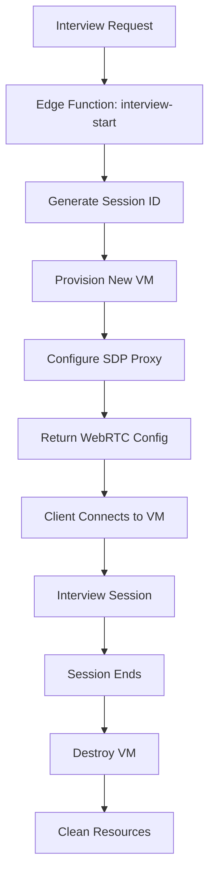

# VM Isolation Architecture Guide

## Overview

This document details the Virtual Machine (VM) isolation strategy implemented for the AI Interview Insights Platform's WebRTC infrastructure. VM isolation ensures complete security separation between different interview sessions and tenants.

## Contents

- [Security Model](#security-model)
- [Architecture Design](#architecture-design)
- [Implementation Details](#implementation-details)
- [Per-Session Isolation](#per-session-isolation)
- [Resource Management](#resource-management)
- [Security Guarantees](#security-guarantees)
- [Operational Procedures](#operational-procedures)
- [Monitoring and Alerts](#monitoring-and-alerts)

## Security Model

### Isolation Levels

**Level 1: Per-Session VM Isolation** ✅ **Current Implementation**
- Each interview session gets its own dedicated VM
- Complete process isolation between sessions
- Automatic VM destruction after session completion
- No data persistence between sessions

**Level 0: Per-Tenant VM Isolation** ❌ **Previous Approach (Deprecated)**
- Multiple sessions from same tenant share a VM
- Potential for cross-session data leakage
- Resource contention between concurrent sessions
- **Security Risk**: Identified and resolved in May 2025

### Why Per-Session Isolation?

1. **Maximum Security**: Zero possibility of cross-session data access
2. **Clean State**: Each session starts with fresh environment
3. **Fault Isolation**: Session failures don't affect other sessions
4. **Compliance**: Meets highest security standards for sensitive data
5. **Auditability**: Clear session boundaries for security audits

## Architecture Design

### High-Level Flow



### Component Responsibilities

**Supabase Edge Functions**:
- Session initialization and VM provisioning requests
- Tenant validation and authorization
- Configuration generation for VM-specific endpoints

**Fly.io Infrastructure**:
- VM provisioning and lifecycle management
- Network isolation and security groups
- Resource allocation and monitoring

**SDP Proxy (Per-VM)**:
- WebRTC signaling for specific session
- JWT validation for session access
- Automatic cleanup on session termination

## Implementation Details

### VM Provisioning Process

1. **Session Request Validation**:
   ```typescript
   // Edge function: interview-start
   const sessionId = generateSecureSessionId();
   const tenantId = validateJWTAndGetTenant(request);
   ```

2. **VM Configuration**:
   ```javascript
   const vmConfig = {
     sessionId: sessionId,
     tenantId: tenantId,
     region: getOptimalRegion(userLocation),
     resources: {
       cpu: '1x',
       memory: '512MB',
       storage: 'ephemeral'
     },
     lifecycle: {
       maxDuration: '3600s', // 1 hour max
       autoDestroy: true
     }
   };
   ```

3. **Network Isolation**:
   - Unique internal IP per VM
   - Firewall rules restricting cross-VM communication
   - Dedicated WebSocket endpoints per session

### Session Lifecycle Management

**VM Startup** (< 30 seconds):
1. VM provisioning on Fly.io
2. SDP proxy initialization
3. WebRTC endpoint configuration
4. Health check and readiness verification

**Active Session**:
- Real-time audio processing and transcription
- Continuous health monitoring
- Resource usage tracking
- Session state persistence to Supabase

**Session Termination**:
1. Graceful WebRTC connection closure
2. Final transcript processing and storage
3. VM resource cleanup
4. Audit log generation

**Automatic Cleanup**:
- VM destruction after session end
- Temporary file cleanup
- Memory and process cleanup
- Network endpoint deallocation

## Per-Session Isolation

### Security Boundaries

**Process Isolation**:
- Each session runs in completely separate VM
- No shared processes or memory spaces
- Isolated file systems and temporary storage

**Network Isolation**:
- Unique IP addresses per session
- Dedicated ports and endpoints
- Firewall rules preventing cross-session access

**Data Isolation**:
- No persistent storage between sessions
- Encrypted data transmission only
- Automatic memory clearing on VM destruction

### Access Control

**JWT-Based Authentication**:
```javascript
// Session-specific JWT validation
const sessionToken = {
  sessionId: 'unique-session-id',
  tenantId: 'tenant-uuid',
  userId: 'user-uuid',
  expiresAt: timestamp,
  permissions: ['webrtc:connect', 'transcript:write']
};
```

**Authorization Matrix**:
- Session creator: Full access to session
- Tenant users: No access to other tenant sessions
- System: Monitoring and management only
- External: No access (blocked by firewall)

## Resource Management

### VM Specifications

**Standard Interview Session**:
- **CPU**: 1 vCPU (shared)
- **Memory**: 512MB RAM
- **Storage**: Ephemeral only (no persistence)
- **Network**: 10 Mbps bandwidth
- **Duration**: 60 minutes maximum

**Resource Limits**:
- Maximum concurrent sessions per tenant: 100
- Global session limit: 1000 (configurable)
- CPU usage threshold: 80% (auto-scaling trigger)
- Memory usage threshold: 90% (cleanup trigger)

### Cost Optimization

**Per-Session Pricing Model**:
- Pay only for active session duration
- Automatic resource deallocation
- No idle resource costs
- Predictable cost per interview

**Resource Efficiency**:
- Fast VM startup (< 30 seconds)
- Minimal resource overhead
- Efficient cleanup processes
- Optimized for short-duration sessions

## Security Guarantees

### What VM Isolation Prevents

✅ **Cross-Session Data Access**: Complete isolation between sessions  
✅ **Tenant Data Leakage**: No shared resources between tenants  
✅ **Session State Persistence**: Clean slate for each session  
✅ **Resource Contention**: Dedicated resources per session  
✅ **Process Interference**: Isolated execution environments  

### Compliance and Auditing

**Security Standards Met**:
- SOC 2 Type II compliance readiness
- GDPR data isolation requirements
- HIPAA technical safeguards (if applicable)
- Enterprise security standards

**Audit Trail**:
- Complete VM lifecycle logging
- Session creation and destruction events
- Resource allocation and deallocation tracking
- Security event monitoring and alerting

## Operational Procedures

### VM Health Monitoring

**Real-time Metrics**:
- VM startup success rate
- Session connection success rate
- Average session duration
- Resource utilization per session

**Automated Responses**:
- Failed VM provisioning: Retry with exponential backoff
- High resource usage: Automatic cleanup triggers
- Session timeout: Graceful termination and cleanup
- Network issues: Connection retry mechanisms

### Scaling Operations

**Auto-scaling Triggers**:
- Queue depth > 10 pending sessions
- Average VM startup time > 45 seconds
- CPU utilization > 80% across fleet
- Error rate > 5% for VM provisioning

**Manual Scaling**:
```bash
# Scale VM capacity
fly scale count 50 --app interview-sdp-proxy

# Monitor scaling status
fly status --app interview-sdp-proxy
```

### Emergency Procedures

**VM Fleet Issues**:
1. Identify affected VMs: `fly status --app interview-sdp-proxy`
2. Gracefully terminate problematic VMs
3. Notify active users of service interruption
4. Scale healthy VMs to handle load
5. Investigate and resolve root cause

**Security Incident Response**:
1. Immediately isolate affected VMs
2. Preserve audit logs for investigation
3. Notify affected tenants if data exposure possible
4. Implement additional security measures if needed

## Monitoring and Alerts

### Key Metrics

**Performance Metrics**:
- VM provisioning latency (target: < 30s)
- Session setup success rate (target: > 99%)
- WebRTC connection success rate (target: > 95%)
- Session completion rate (target: > 98%)

**Security Metrics**:
- Cross-session access attempts (target: 0)
- JWT validation failure rate (monitor for attacks)
- Unauthorized network access attempts (target: 0)
- VM cleanup success rate (target: 100%)

### Alert Configuration

**Critical Alerts**:
- VM provisioning failure rate > 5%
- Session security violations detected
- Cross-tenant access attempts
- VM cleanup failures

**Warning Alerts**:
- VM startup time > 45 seconds
- High resource utilization (> 80%)
- Session timeout rate > 10%
- Cost overruns detected

### Monitoring Tools

**Fly.io Monitoring**:
- Built-in VM metrics and alerts
- Network traffic monitoring
- Resource utilization tracking

**Custom Monitoring**:
- Supabase function logs for session events
- Real-time dashboard for session status
- Cost tracking and budget alerts

## Related Documentation

- [WebRTC Entry Point](webrtc-entry-point.md) - Main WebRTC implementation guide
- [VM Isolation](VM_ISOLATION.md) - Technical VM isolation specifications  
- [Hybrid Architecture](hybrid-webrtc-architecture.md) - Complete architecture overview
- [Production Deployment](../guides/deployment/WEBRTC_PRODUCTION_DEPLOYMENT.md) - Deployment procedures

## Change History

- 2025-05-22: Initial version documenting per-session VM isolation
- 2025-05-22: Added security guarantees and compliance information
- 2025-05-22: Included operational procedures and monitoring setup

---

**Security Note**: This VM isolation model represents the current best practice for multi-tenant WebRTC applications. Any changes to the isolation strategy must be reviewed by the security team and tested thoroughly before production deployment.