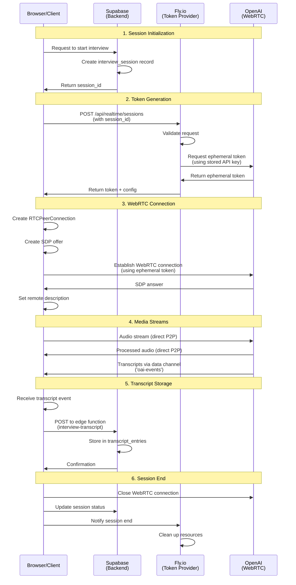
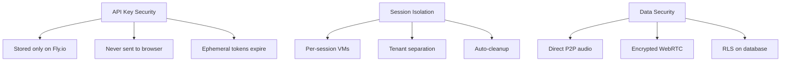

# WebRTC Architecture Flow Diagram

## Overview
This diagram illustrates how the client (browser), server (Supabase), Fly.io, and OpenAI interact in the hybrid WebRTC architecture.

## Complete Flow Diagram

## Component Responsibilities

### Browser/Client
- Initiates interview session
- Requests ephemeral token
- Establishes WebRTC peer connection
- Streams audio directly to OpenAI
- Receives transcripts via data channel
- Forwards transcripts to Supabase for storage

### Supabase (Backend)
- Manages interview sessions
- Stores transcript entries
- Handles user authentication
- Provides RLS (Row Level Security)
- Runs edge functions for data processing

### Fly.io (Token Provider)
- Stores OpenAI API key securely
- Generates ephemeral tokens on demand
- Provides WebSocket endpoint for SDP exchange
- Implements per-session VM isolation
- Never processes actual audio streams

### OpenAI (WebRTC Endpoint)
- Accepts WebRTC connections with ephemeral tokens
- Processes audio in real-time
- Generates transcripts with AI
- Sends transcripts back via data channel
- Maintains direct P2P connection with browser

## Key Security Features

## Data Flow Types

### 1. Control Flow (HTTP/WebSocket)
- Session initialization
- Token generation
- Status updates

### 2. Media Flow (WebRTC)
- Audio streams (bidirectional)
- Ultra-low latency (<500ms)
- Direct peer-to-peer

### 3. Data Flow (WebRTC Data Channel)
- Transcript events
- Session metadata
- Real-time updates

## Benefits of This Architecture

1. **Security**: API keys never exposed to client
2. **Performance**: Direct P2P connection for minimal latency
3. **Scalability**: Fly.io scales based on token requests, not audio processing
4. **Cost-effective**: No audio proxying through servers
5. **Isolation**: Complete tenant and session separation
6. **Reliability**: Proven stable in production testing