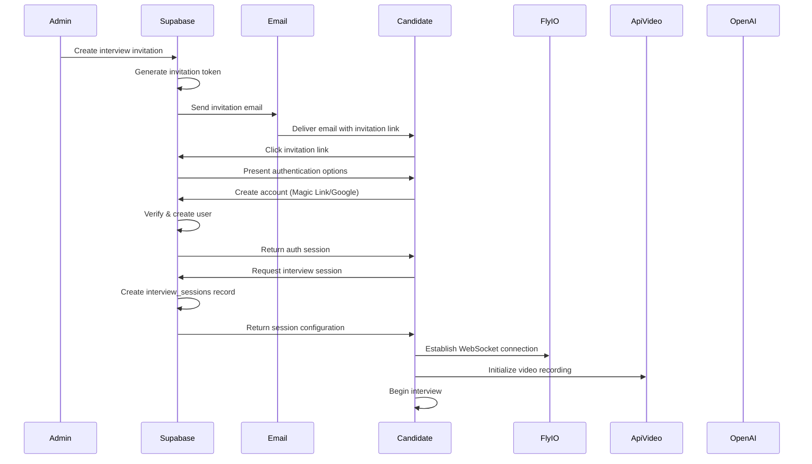
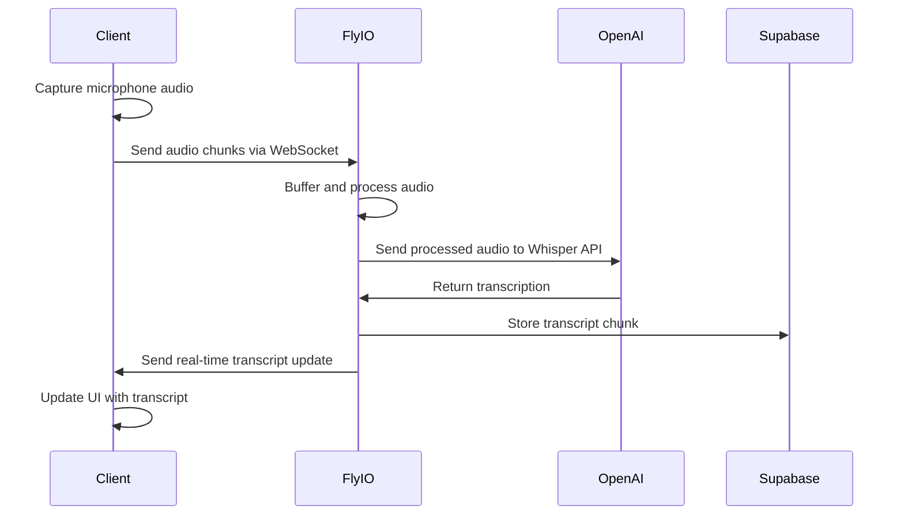
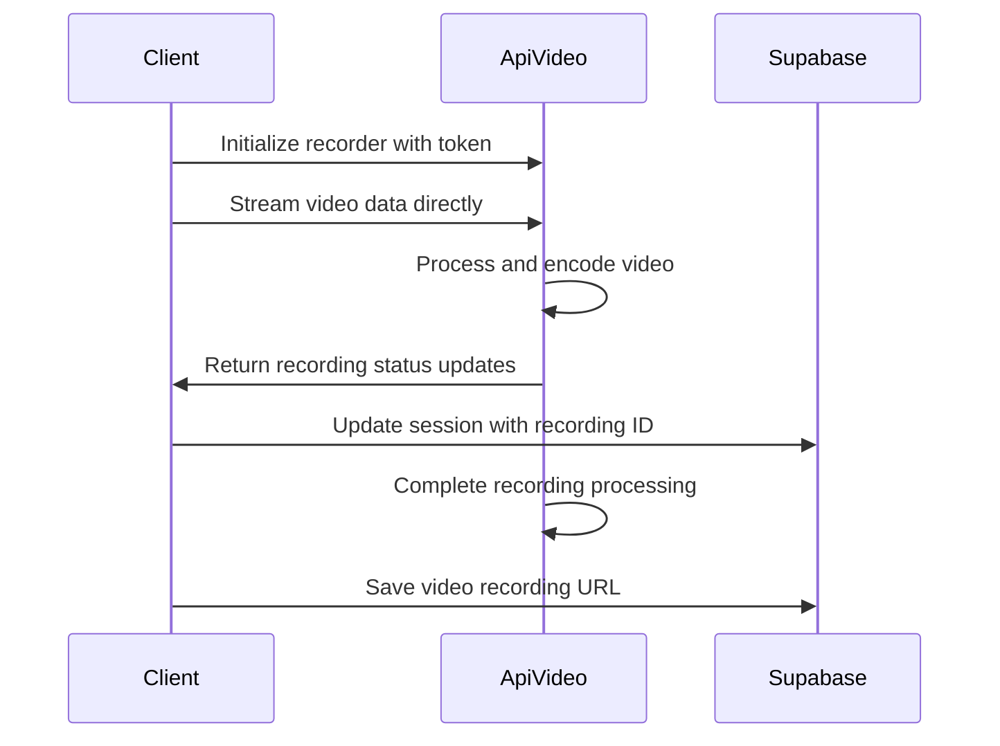
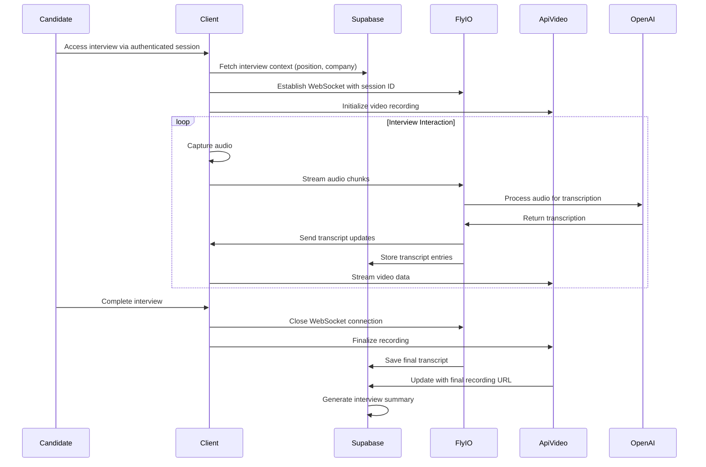
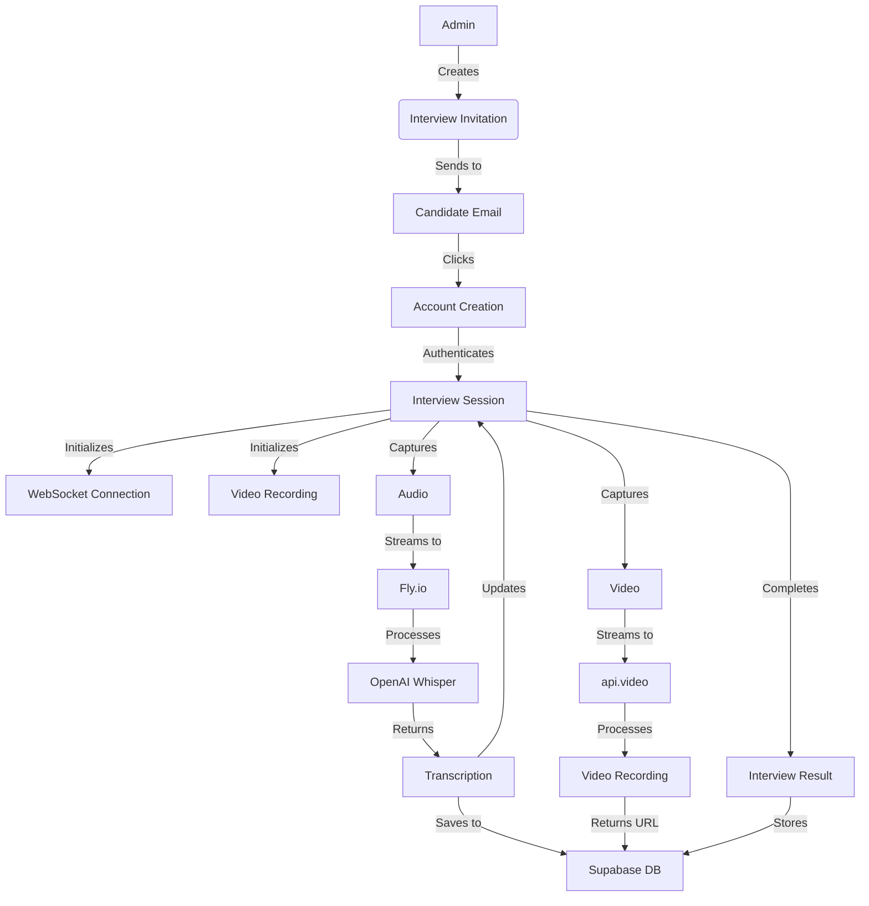

> **DEPRECATED**: This document describes the legacy triangular architecture which has been replaced by the hybrid OpenAI approach. See [Hybrid WebRTC Architecture](/docs/architecture/hybrid-webrtc-architecture.md) for the current implementation.

# Triangular Architecture: Technical Flow [ARCHIVED]

This document outlines the detailed technical flow for the AI Interview Platform's triangular architecture, with specific API calls, data transformations, and component interactions.

## Invitation & Authentication Flow



## Audio Processing Flow



## Video Recording Flow



## Interview Session Flow



## Technical Implementation Details

### 1. Invitation Generation

```typescript
// Edge Function: generate-interview-invitation
import { createClient } from '@supabase/supabase-js';
import { nanoid } from 'nanoid';

// Secure token generation
const generateInvitationToken = () => {
  return nanoid(32); // Generate a secure random ID
};

// Store invitation in database
const storeInvitation = async (supabase, {
  candidateId,
  positionId,
  tenantId,
  token,
  expiration
}) => {
  const { data, error } = await supabase
    .from('interview_invitations')
    .insert({
      candidate_id: candidateId,
      position_id: positionId,
      tenant_id: tenantId,
      token: token,
      expires_at: expiration,
      status: 'pending'
    })
    .select('id')
    .single();
    
  return { data, error };
};
```

### 2. Candidate Account Creation

```typescript
// React component for account creation
const CandidateAccountCreation = () => {
  const [email, setEmail] = useState('');
  const [invitationToken, setInvitationToken] = useState('');
  const [isLoading, setIsLoading] = useState(false);
  const supabase = useSupabaseClient();
  
  useEffect(() => {
    // Extract token from URL
    const params = new URLSearchParams(window.location.search);
    const token = params.get('token');
    if (token) setInvitationToken(token);
  }, []);
  
  const handleMagicLink = async () => {
    setIsLoading(true);
    
    // Verify token is valid before sending magic link
    const { data: invitation } = await supabase
      .from('interview_invitations')
      .select('*')
      .eq('token', invitationToken)
      .single();
      
    if (!invitation) {
      alert('Invalid or expired invitation');
      setIsLoading(false);
      return;
    }
    
    // Send magic link
    const { error } = await supabase.auth.signInWithOtp({
      email,
      options: {
        emailRedirectTo: `${window.location.origin}/interview?token=${invitationToken}`,
      },
    });
    
    setIsLoading(false);
    if (error) {
      alert('Error sending magic link');
    } else {
      alert('Check your email for the login link');
    }
  };
  
  const handleGoogleSignIn = async () => {
    const { error } = await supabase.auth.signInWithOAuth({
      provider: 'google',
      options: {
        redirectTo: `${window.location.origin}/interview?token=${invitationToken}`,
      },
    });
    
    if (error) {
      alert('Error signing in with Google');
    }
  };
  
  return (
    // UI implementation
  );
};
```

### 3. WebSocket Server (Fly.io)

```javascript
// server.js on Fly.io
import express from 'express';
import http from 'http';
import { WebSocketServer } from 'ws';
import { v4 as uuidv4 } from 'uuid';
import { OpenAI } from 'openai';

const app = express();
const server = http.createServer(app);
const wss = new WebSocketServer({ server });

// Initialize OpenAI
const openai = new OpenAI({
  apiKey: process.env.OPENAI_API_KEY,
});

// Track active sessions
const sessions = new Map();

// Verify session token with Supabase
const verifySession = async (sessionToken) => {
  // Implementation to verify token with Supabase API
  // ...
  return { isValid: true, sessionId: '123', tenantId: '456' };
};

wss.on('connection', async (ws, req) => {
  // Extract and verify session token
  const url = new URL(req.url, `http://${req.headers.host}`);
  const sessionToken = url.searchParams.get('token');
  
  const { isValid, sessionId, tenantId } = await verifySession(sessionToken);
  
  if (!isValid) {
    ws.close(4000, 'Invalid session token');
    return;
  }
  
  // Set up session tracking
  const clientId = uuidv4();
  sessions.set(clientId, { 
    ws, 
    sessionId,
    tenantId,
    audioChunks: [],
    transcript: []
  });
  
  // Handle incoming audio data
  ws.on('message', async (message) => {
    const session = sessions.get(clientId);
    try {
      const data = JSON.parse(message);
      
      if (data.type === 'audio') {
        // Process audio chunk
        session.audioChunks.push(data.chunk);
        
        // When buffer reaches threshold, transcribe
        if (session.audioChunks.length >= 5) {
          const audioBuffer = processAudioChunks(session.audioChunks);
          const transcription = await transcribeAudio(audioBuffer);
          
          // Save to database via API call
          await saveTranscriptChunk(sessionId, tenantId, transcription);
          
          // Send back to client
          ws.send(JSON.stringify({
            type: 'transcript',
            text: transcription.text,
            timestamp: Date.now()
          }));
          
          // Reset buffer
          session.audioChunks = [];
        }
      }
    } catch (error) {
      console.error('Error processing message:', error);
    }
  });
  
  // Handle disconnection
  ws.on('close', () => {
    const session = sessions.get(clientId);
    if (session) {
      // Process any remaining audio
      if (session.audioChunks.length > 0) {
        // ... final processing
      }
      
      // Clean up
      sessions.delete(clientId);
    }
  });
});

// Audio processing functions
const processAudioChunks = (chunks) => {
  // Combine and process audio chunks
  // ...
  return processedAudio;
};

const transcribeAudio = async (audioBuffer) => {
  // Use OpenAI Whisper API
  const transcription = await openai.audio.transcriptions.create({
    file: audioBuffer,
    model: "whisper-1",
  });
  
  return transcription;
};

const saveTranscriptChunk = async (sessionId, tenantId, transcription) => {
  // API call to Supabase to save transcript chunk
  // ...
};

server.listen(process.env.PORT || 3000);
```

### 4. api.video Integration

```typescript
// Video recording component
import { useEffect, useState } from 'react';
import { createRecorder } from '@api.video/video-recorder';

const VideoRecorder = ({ sessionId, onRecordingUpdate }) => {
  const [recorder, setRecorder] = useState(null);
  const [recordingId, setRecordingId] = useState(null);
  const [status, setStatus] = useState('initializing');
  
  useEffect(() => {
    const initializeRecorder = async () => {
      try {
        // Get api.video token from backend
        const response = await fetch('/api/get-video-token', {
          method: 'POST',
          headers: { 'Content-Type': 'application/json' },
          body: JSON.stringify({ sessionId })
        });
        
        const { token, recordingId } = await response.json();
        setRecordingId(recordingId);
        
        // Initialize recorder
        const recorder = createRecorder({
          apiKey: token,
          recordingId,
          features: {
            recorder: {
              autoStart: false,
              camera: true,
              audio: true,
              countdown: 3
            }
          }
        });
        
        // Set up event listeners
        recorder.on('recording.started', () => {
          setStatus('recording');
          onRecordingUpdate({ status: 'recording', recordingId });
        });
        
        recorder.on('recording.stopped', () => {
          setStatus('completed');
          onRecordingUpdate({ 
            status: 'completed', 
            recordingId,
            url: recorder.getAssets().mp4
          });
        });
        
        setRecorder(recorder);
      } catch (error) {
        console.error('Error initializing recorder:', error);
        setStatus('error');
      }
    };
    
    initializeRecorder();
    
    return () => {
      // Cleanup
      if (recorder) {
        recorder.destroy();
      }
    };
  }, [sessionId]);
  
  const startRecording = () => {
    if (recorder && status === 'initializing') {
      recorder.start();
    }
  };
  
  const stopRecording = () => {
    if (recorder && status === 'recording') {
      recorder.stop();
    }
  };
  
  return (
    // UI implementation with start/stop controls
  );
};
```

### 5. Interview Session Manager

```typescript
// Main interview controller component
const InterviewSession = () => {
  const [sessionState, setSessionState] = useState({
    status: 'initializing',
    transcript: [],
    videoRecordingId: null,
    videoUrl: null
  });
  
  const supabase = useSupabaseClient();
  const { sessionId } = useParams();
  const [sessionData, setSessionData] = useState(null);
  const [wsConnection, setWsConnection] = useState(null);
  
  useEffect(() => {
    // Fetch session data
    const fetchSessionData = async () => {
      const { data, error } = await supabase
        .from('interview_sessions')
        .select('*, positions(*), candidates(*)')
        .eq('id', sessionId)
        .single();
        
      if (error) {
        console.error('Error fetching session:', error);
        return;
      }
      
      setSessionData(data);
    };
    
    fetchSessionData();
  }, [sessionId]);
  
  useEffect(() => {
    if (!sessionData) return;
    
    // Initialize WebSocket connection
    const initializeWs = async () => {
      // Get token for WebSocket authentication
      const { data: authData } = await supabase.auth.getSession();
      
      const wsUrl = `wss://interview-processor.fly.dev/ws?session=${sessionId}&token=${authData.session.access_token}`;
      const ws = new WebSocket(wsUrl);
      
      ws.onopen = () => {
        console.log('WebSocket connected');
        setSessionState(prev => ({ ...prev, status: 'connected' }));
      };
      
      ws.onmessage = (event) => {
        const data = JSON.parse(event.data);
        
        if (data.type === 'transcript') {
          setSessionState(prev => ({
            ...prev,
            transcript: [...prev.transcript, {
              text: data.text,
              timestamp: data.timestamp,
              speaker: 'candidate'
            }]
          }));
        }
      };
      
      ws.onclose = () => {
        console.log('WebSocket disconnected');
        setSessionState(prev => ({ ...prev, status: 'disconnected' }));
      };
      
      setWsConnection(ws);
    };
    
    initializeWs();
    
    return () => {
      if (wsConnection) {
        wsConnection.close();
      }
    };
  }, [sessionData]);
  
  // Handle audio capture and sending
  const handleAudioCapture = (audioChunk) => {
    if (wsConnection && wsConnection.readyState === WebSocket.OPEN) {
      wsConnection.send(JSON.stringify({
        type: 'audio',
        chunk: audioChunk
      }));
    }
  };
  
  // Handle video recording updates
  const handleVideoUpdate = ({ status, recordingId, url }) => {
    setSessionState(prev => ({
      ...prev,
      videoRecordingId: recordingId,
      videoUrl: url || prev.videoUrl
    }));
    
    // Update session in database
    if (url) {
      supabase
        .from('interview_sessions')
        .update({
          video_recording_id: recordingId,
          video_recording_url: url,
          status: status === 'completed' ? 'completed' : 'in_progress'
        })
        .eq('id', sessionId);
    }
  };
  
  // Save final interview state
  const completeInterview = async () => {
    // Close connections
    if (wsConnection) {
      wsConnection.close();
    }
    
    // Update session status
    await supabase
      .from('interview_sessions')
      .update({
        status: 'completed',
        completed_at: new Date().toISOString()
      })
      .eq('id', sessionId);
      
    setSessionState(prev => ({ ...prev, status: 'completed' }));
  };
  
  return (
    // UI implementation with combined audio/video components
  );
};
```

## Data Flow Diagram



## API Contract

### 1. Generate Interview Invitation

**Endpoint:** `POST /api/invitations`

**Request:**
```json
{
  "candidate_id": "uuid",
  "position_id": "uuid",
  "expiration_hours": 48
}
```

**Response:**
```json
{
  "id": "uuid",
  "token": "string",
  "invitation_url": "string",
  "expires_at": "timestamp"
}
```

### 2. Validate Invitation

**Endpoint:** `GET /api/invitations/validate`

**Request:**
```
?token=invitation_token
```

**Response:**
```json
{
  "valid": true,
  "invitation": {
    "id": "uuid",
    "candidate_id": "uuid",
    "position_id": "uuid",
    "tenant_id": "uuid",
    "expires_at": "timestamp"
  }
}
```

### 3. Initialize Interview Session

**Endpoint:** `POST /api/sessions`

**Request:**
```json
{
  "invitation_id": "uuid"
}
```

**Response:**
```json
{
  "session_id": "uuid",
  "websocket_url": "wss://url",
  "video_token": "string",
  "position": {
    "id": "uuid",
    "title": "string",
    "description": "string"
  },
  "company": {
    "id": "uuid",
    "name": "string"
  }
}
```

### 4. Get Video Token

**Endpoint:** `POST /api/video/token`

**Request:**
```json
{
  "session_id": "uuid"
}
```

**Response:**
```json
{
  "token": "string",
  "recording_id": "string"
}
```

### 5. Update Session Recording

**Endpoint:** `PATCH /api/sessions/:id/recording`

**Request:**
```json
{
  "recording_id": "string",
  "recording_url": "string",
  "status": "in_progress|completed"
}
```

**Response:**
```json
{
  "success": true,
  "session_id": "uuid"
}
```

## Security Considerations

1. **Authentication**:
   - All API endpoints require authenticated users
   - WebSocket connections validated with JWT tokens
   - Session ID validation against user context

2. **Data Isolation**:
   - RLS policies ensure tenant data isolation
   - Each interview session scoped to specific tenant

3. **API Keys**:
   - No API keys exposed to client
   - All sensitive operations conducted server-side
   - Temporary tokens generated for api.video

4. **Encryption**:
   - All communication over TLS/WSS
   - Sensitive data encrypted at rest in Supabase

5. **Permission Validation**:
   - Regular verification of user access to resources
   - Session ownership validation 

## Dependencies and External Services

### 1. Core Services

| Service | Purpose | Features Used | Documentation |
|---------|---------|---------------|--------------|
| **Supabase** | Backend & Authentication | Auth, Database, Storage, Edge Functions | [Supabase Docs](https://supabase.com/docs) |
| **Fly.io** | Audio Processing & Transcription | VM deployment, WebSockets | [Fly.io Docs](https://fly.io/docs/) |
| **api.video** | Video Recording & Storage | Client Recorder, Video API | [api.video Docs](https://api.video/docs) |
| **OpenAI** | Transcription & AI Interview | Whisper API, GPT API | [OpenAI API Docs](https://platform.openai.com/docs/api-reference) |

### 2. Frontend Dependencies

| Package | Version | Purpose | 
|---------|---------|---------|
| `@supabase/supabase-js` | ^2.39.0 | Supabase client for authentication and data access |
| `@api.video/video-recorder` | ^1.0.0 | Client-side video recording integration |
| `react` | ^18.2.0 | UI framework |
| `react-dom` | ^18.2.0 | DOM rendering for React |
| `nanoid` | ^5.0.4 | Generate secure tokens |
| `zod` | ^3.22.4 | Form and data validation |

### 3. Backend Dependencies

| Package | Version | Purpose |
|---------|---------|---------|
| `express` | ^4.18.2 | Web server framework for Fly.io |
| `ws` | ^8.16.0 | WebSocket server implementation |
| `openai` | ^4.29.0 | OpenAI API client |
| `uuid` | ^9.0.1 | Generate unique identifiers |
| `node-fetch` | ^3.3.2 | HTTP client for API communication |
| `cors` | ^2.8.5 | Cross-origin resource sharing |

### 4. API Endpoints

| Service | Endpoint | Authentication |
|---------|----------|----------------|
| **Supabase Auth** | `https://[project-ref].supabase.co/auth/v1/*` | API Key |
| **Supabase Database** | `https://[project-ref].supabase.co/rest/v1/*` | JWT + API Key |
| **OpenAI Whisper** | `https://api.openai.com/v1/audio/transcriptions` | API Key |
| **OpenAI GPT** | `https://api.openai.com/v1/chat/completions` | API Key |
| **api.video** | `https://ws.api.video/upload` | API Key |
| **Fly.io WebSocket** | `wss://[app-name].fly.dev/ws` | JWT Token |

### 5. Environment Variables

| Variable | Service | Purpose |
|----------|---------|---------|
| `SUPABASE_URL` | Supabase | Project API URL |
| `SUPABASE_ANON_KEY` | Supabase | Public API key |
| `SUPABASE_SERVICE_ROLE_KEY` | Supabase | Admin API key for Edge Functions |
| `OPENAI_API_KEY` | OpenAI | API authentication for Whisper and GPT |
| `API_VIDEO_API_KEY` | api.video | API authentication |
| `FLY_APP_NAME` | Fly.io | App name for WebSocket URLs |
| `JWT_SECRET` | Custom | Verify WebSocket authentication |
| `EMAIL_SERVICE_API_KEY` | SendGrid/Mailgun | Send invitation emails | 