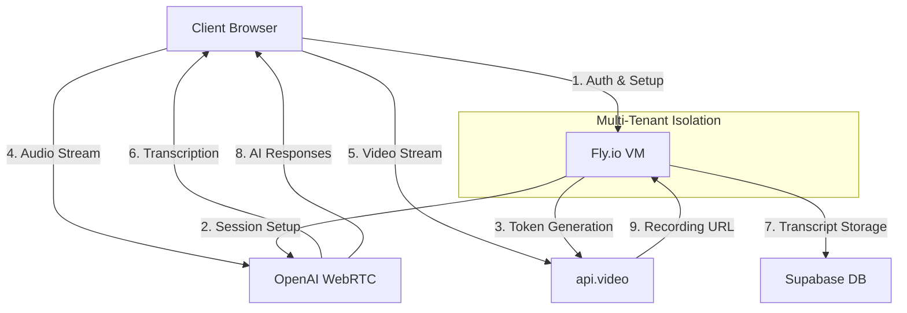
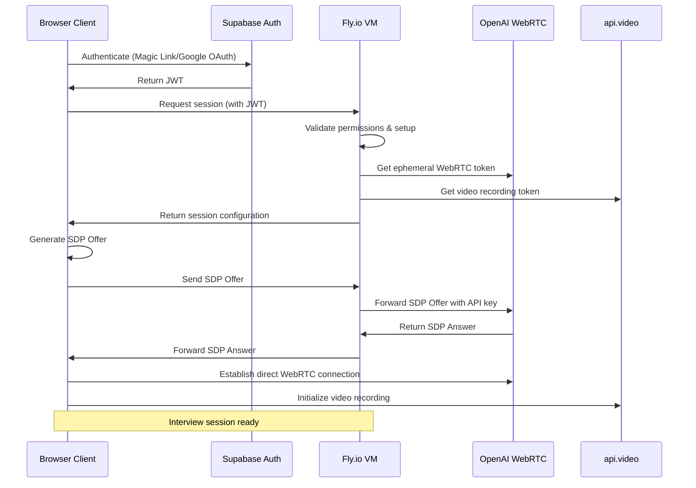
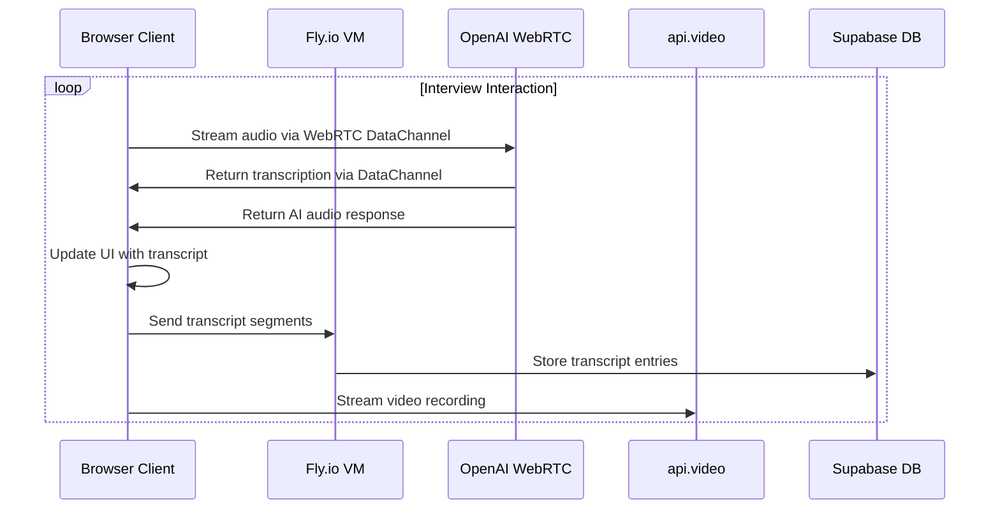
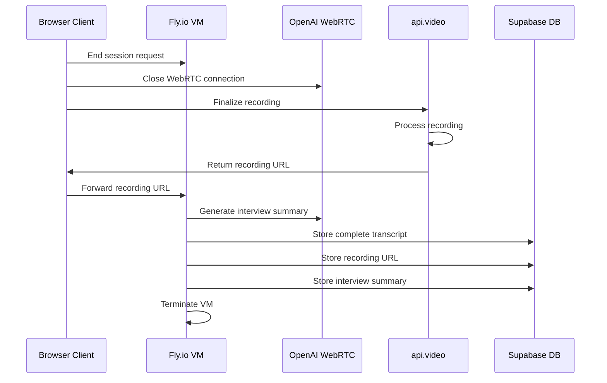

# Hybrid Architecture Specification
# Fly.io + OpenAI WebRTC for AI Interview Platform

## Overview

This document outlines the hybrid architecture combining Fly.io and OpenAI's WebRTC capabilities for our AI Interview Platform. This approach leverages the multi-tenant isolation and security benefits of Fly.io while utilizing OpenAI's native WebRTC implementation for optimal audio processing.

## System Architecture



### Core Components

1. **Client Browser**
   - Captures audio/video from user
   - Establishes WebRTC connection with OpenAI
   - Streams video to api.video
   - Presents transcription and AI responses to user

2. **Fly.io Virtual Machines**
   - Tenant-isolated session managers (one VM per session)
   - Securely store API credentials (OpenAI, api.video)
   - Orchestrate WebRTC setup between client and OpenAI
   - Persist transcript data to Supabase
   - Generate interview summaries

3. **OpenAI WebRTC Endpoints**
   - Process audio streams from client
   - Generate AI responses using configured voice
   - Return real-time transcriptions
   - Handle turn detection and interruptions

4. **api.video Service**
   - Manage video recording sessions
   - Handle encoding and storage of recordings
   - Provide playback URLs for recorded sessions

5. **Supabase Backend**
   - Authentication and authorization
   - Tenant and user management
   - Session data persistence
   - Transcript storage
   - Recording metadata storage

## Multi-Tenant Architecture

### Tenant Isolation with Fly.io

Each tenant organization gets complete isolation through Fly.io's hierarchical structure:

1. **Organization Level**
   - Separated by Fly Apps (one app per tenant)
   - Independent networking and firewall rules
   - Isolated configuration and secrets

2. **Session Level**
   - Individual Fly Machines per interview session
   - Resource isolation (CPU, memory)
   - Independent scaling and regional deployment

3. **Network Level**
   - Private networks between tenant machines
   - Explicit firewall rules
   - No cross-tenant communication paths

## Data Flow

### Session Initialization



### During Interview



### Session Completion



## API Interfaces

### 1. Fly.io Session Management API

**Create Session**

```http
POST /api/sessions
Host: interviews-{tenant-id}.fly.dev
Authorization: Bearer {jwt}
Content-Type: application/json

{
  "candidate_id": "uuid",
  "position_id": "uuid",
  "settings": {
    "voice": "alloy",
    "language": "en-US",
    "temperature": 0.7
  }
}
```

**Response**

```json
{
  "session_id": "uuid",
  "websocket_url": "wss://interview-{session-id}.fly.dev/ws",
  "video_token": "api_video_token",
  "interview_context": {
    "position": { "title": "Software Engineer", ... },
    "company": { "name": "Acme Corp", ... },
    "competencies": [...]
  }
}
```

**WebSocket Events**

The WebSocket connection to Fly.io VM is used for session management, not media streaming:

```javascript
// Client → Fly.io: SDP Offer
{
  "type": "sdp_offer",
  "sdp": "v=0\no=- 5991916764837950231..."
}

// Fly.io → Client: SDP Answer
{
  "type": "sdp_answer",
  "sdp": "v=0\no=- 5991916764837950231..."
}

// Client → Fly.io: Transcript Update
{
  "type": "transcript_update",
  "entries": [
    {
      "text": "Tell me about yourself.",
      "speaker": "ai",
      "timestamp": "2024-06-10T14:32:01.123Z"
    },
    {
      "text": "I have five years of experience...",
      "speaker": "candidate",
      "timestamp": "2024-06-10T14:32:10.456Z"
    }
  ]
}

// Client → Fly.io: End Session
{
  "type": "end_session",
  "recording_url": "https://api.video/videos/vi52d1jtaik8jfej213r",
  "final_transcript": {...}
}
```

### 2. OpenAI WebRTC Interface

The interaction with OpenAI's WebRTC API follows their Realtime API protocol:

**Data Channel Messages (Client → OpenAI)**

```javascript
// Update session parameters
{
  "type": "session.update",
  "session": {
    "instructions": "You are an interviewer for a software engineering position...",
    "voice": "alloy",
    "tools": [...], // Function definitions
    "tool_choice": "auto",
    "input_audio_transcription": {"model": "whisper-1"},
    "temperature": 0.7
  }
}

// Append audio chunk
{
  "type": "input_audio_buffer.append",
  "audio": "base64EncodedAudioData"
}

// Create response
{
  "type": "response.create",
  "response": {
    "modalities": ["text", "audio"],
    "instructions": "Ask the candidate about their experience...",
    "max_output_tokens": 100
  }
}
```

**Data Channel Messages (OpenAI → Client)**

```javascript
// Transcript updates
{
  "type": "conversation.item.input_audio_transcription.completed",
  "transcript": "I have five years of experience..."
}

// AI response transcript
{
  "type": "response.audio_transcript.delta",
  "text": "Can you tell me more about your..."
}

// Function call (if configured)
{
  "type": "response.function_call_arguments.done",
  "name": "end_session"
}
```

### 3. api.video Integration

```javascript
// Initialize recorder
const recorder = createRecorder({
  apiKey: videoToken,
  recordingId: sessionId,
  features: {
    recorder: {
      autoStart: false,
      camera: true,
      audio: false, // Audio handled by OpenAI
      countdown: 3
    }
  }
});

// Listen for events
recorder.on('recording.started', () => {
  // Update UI
});

recorder.on('recording.stopped', () => {
  // Get recording URL
  const videoUrl = recorder.getAssets().mp4;
  // Send to Fly.io
});
```

## Security Considerations

### Authentication and Authorization

1. **Client Authentication**
   - Magic link or Google OAuth via Supabase
   - JWT token passed to Fly.io for validation

2. **API Security**
   - OpenAI and api.video API keys stored only on Fly.io
   - Ephemeral tokens generated for client use
   - Short-lived access tokens with minimal scope

3. **Network Security**
   - TLS/WSS for all communications
   - Private networking between Fly Machines
   - Firewall rules for tenant isolation

### Data Protection

1. **In Transit**
   - Encrypted WebRTC streams (DTLS-SRTP)
   - TLS for HTTP/WebSocket communications
   - Secure API token exchange

2. **At Rest**
   - Encrypted storage in Supabase
   - Encrypted video storage at api.video
   - No persistent data on Fly.io VMs

3. **Access Control**
   - Row-level security in Supabase
   - Tenant-specific encryption keys
   - Role-based access to recordings and transcripts

## Performance Considerations

### Latency Optimization

1. **Global Distribution**
   - Deploy Fly.io VMs in regions closest to participants
   - Multiple api.video edge locations
   - Regional optimization for lowest latency path

2. **Connection Handling**
   - Direct WebRTC connection to OpenAI after setup
   - Connection quality monitoring
   - Adaptive bitrate for varying network conditions

3. **Resource Management**
   - Appropriate VM sizing based on workload
   - Standby VMs for zero-startup time in critical scenarios
   - Automatic scaling for concurrent interviews

### Cost Efficiency

1. **Resource Utilization**
   - VMs destroyed after interview completion
   - Pay-as-you-go pricing for actual usage
   - Tiered resources based on interview importance

2. **Bandwidth Optimization**
   - Local processing where appropriate
   - Efficient audio encoding
   - Selective transcript synchronization

## Deployment Strategy

### Infrastructure as Code

```terraform
# Terraform example for tenant app provisioning
resource "fly_app" "tenant_app" {
  name = "interviews-${var.tenant_id}"
  org  = "interview-platform"
  
  network = {
    name = "tenant-${var.tenant_id}-network"
    private = true
  }
}

# Fly Machine provisioning for interview sessions
resource "fly_machine" "interview_session" {
  app      = fly_app.tenant_app.name
  region   = var.region
  name     = "interview-${var.session_id}"
  image    = "registry.fly.io/interview-processor:latest"
  services = [{
    ports = [
      { port = 80, handlers = ["http"] }
    ]
    protocol = "tcp"
    internal_port = 8080
  }]
  
  env = {
    SESSION_ID    = var.session_id
    TENANT_ID     = var.tenant_id
    CANDIDATE_ID  = var.candidate_id
    POSITION_ID   = var.position_id
  }
  
  guest = {
    cpu_kind  = "shared"
    cpus      = 1
    memory_mb = 1024
  }
}
```

### Monitoring and Observability

1. **Metrics Collection**
   - Session performance metrics
   - VM resource utilization
   - API latency and errors

2. **Logging Strategy**
   - Structured logs for all components
   - Correlation IDs across services
   - Tenant-specific log segregation

3. **Alerting**
   - Critical session failures
   - Unusual resource consumption
   - API availability issues

## Disaster Recovery

1. **Session Resilience**
   - Periodic transcript synchronization
   - Reconnection capabilities
   - Session state persistence

2. **Regional Failover**
   - Multi-region deployment capability
   - Region selection based on availability
   - Cross-region state replication

3. **Backup Strategy**
   - Regular database backups
   - Recording redundancy
   - Audit trail preservation

## Implementation Roadmap

### Phase 1: Proof of Concept
- Set up basic Fly.io infrastructure
- Implement OpenAI WebRTC integration
- Develop simple client UI for testing
- Validate audio quality and latency

### Phase 2: Core Platform
- Implement multi-tenant isolation
- Integrate api.video for recording
- Develop session management APIs
- Create administrative interfaces

### Phase 3: Production Readiness
- Implement monitoring and alerting
- Develop scaling and failover capabilities
- Perform security audits
- Set up CI/CD pipelines

### Phase 4: Enhancement
- Add advanced analytics
- Implement AI-driven feedback
- Develop integration interfaces
- Create customization capabilities 