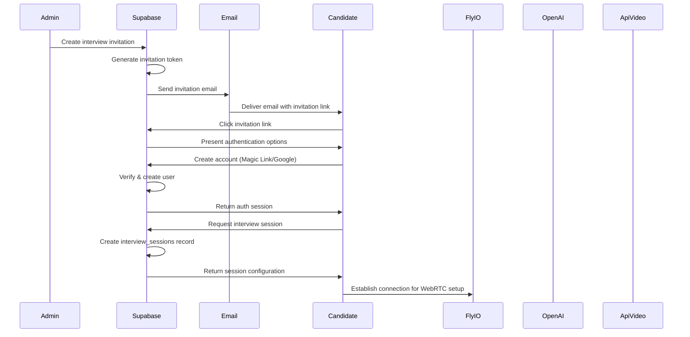
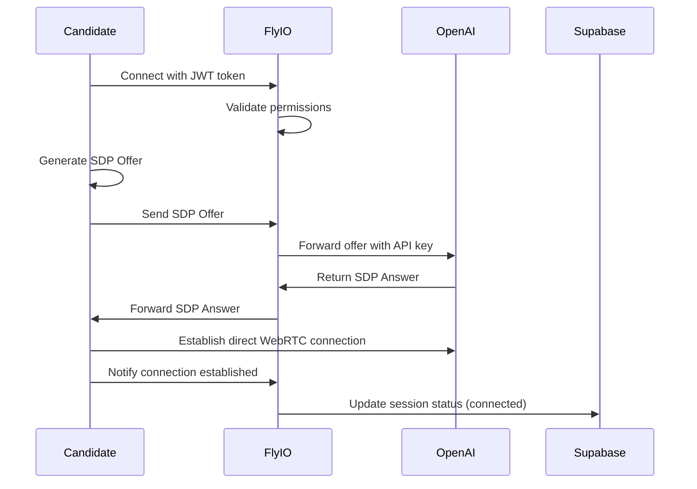
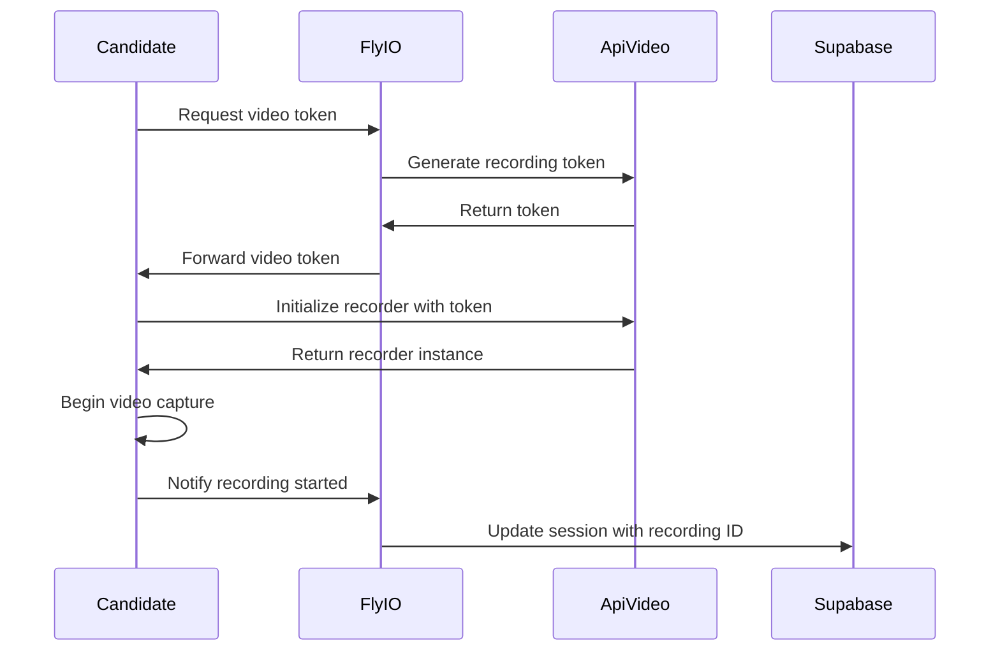
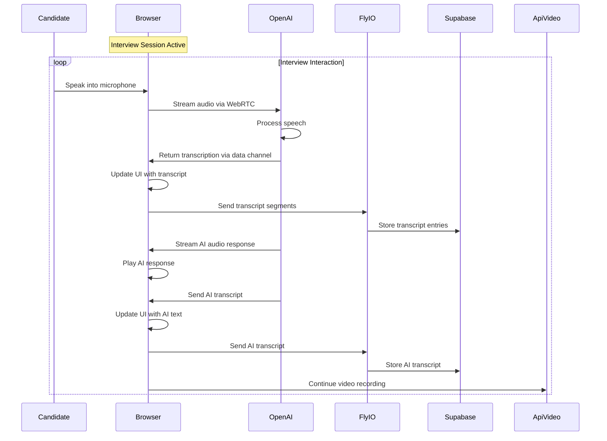
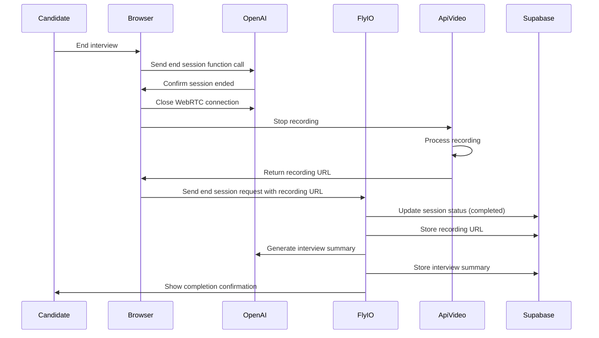
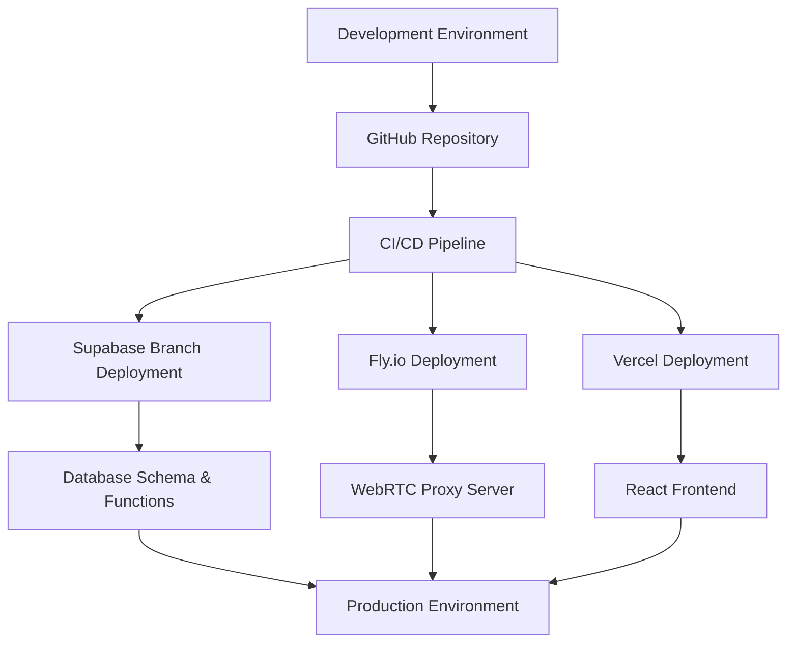

# Hybrid Architecture: Technical Flow

This document outlines the detailed technical flow for the AI Interview Platform's hybrid architecture, covering specific API calls, data transformations, and component interactions.

## Authentication & Invitation Flow



## WebRTC Connection Establishment



## Video Recording Initialization



## Interview Interaction Flow



## Session Completion Flow



## Technical Implementation Details

### 1. Authentication and Invitation

```typescript
// Create interview invitation
const createInvitation = async (supabase, {
  candidateId,
  positionId,
  tenantId,
  expirationHours = 48
}) => {
  // Generate secure invitation token
  const token = crypto.randomBytes(32).toString('hex');
  
  // Calculate expiration date
  const expiresAt = new Date();
  expiresAt.setHours(expiresAt.getHours() + expirationHours);
  
  // Store invitation in database
  const { data, error } = await supabase
    .from('interview_invitations')
    .insert({
      candidate_id: candidateId,
      position_id: positionId,
      tenant_id: tenantId,
      token,
      expires_at: expiresAt.toISOString(),
      status: 'pending'
    })
    .select()
    .single();
    
  if (error) throw error;
  
  // Generate invitation URL
  const invitationUrl = `${process.env.PUBLIC_APP_URL}/interview/join?token=${token}`;
  
  return { 
    invitation: data, 
    invitationUrl 
  };
};
```

### 2. WebRTC Connection Establishment

```javascript
// Fly.io server handling SDP exchange
app.post('/api/sdp-exchange', async (req, res) => {
  try {
    const { sdpOffer, sessionId } = req.body;
    const authHeader = req.headers.authorization;
    
    if (!authHeader || !authHeader.startsWith('Bearer ')) {
      return res.status(401).json({ error: 'Unauthorized' });
    }
    
    // Validate session access
    const sessionResult = await validateSessionAccess(sessionId, authHeader);
    if (!sessionResult.valid) {
      return res.status(403).json({ error: sessionResult.error });
    }
    
    // Forward SDP offer to OpenAI
    const response = await fetch('https://api.openai.com/v1/realtime', {
      method: 'POST',
      headers: {
        'Authorization': `Bearer ${process.env.OPENAI_API_KEY}`,
        'Content-Type': 'application/sdp'
      },
      body: sdpOffer
    });
    
    if (!response.ok) {
      return res.status(502).json({ 
        error: 'OpenAI connection failed',
        status: response.status 
      });
    }
    
    // Return SDP answer to client
    const sdpAnswer = await response.text();
    res.json({ sdpAnswer });
    
    // Update session status
    await updateSessionStatus(sessionId, 'webrtc_connected');
  } catch (error) {
    console.error('SDP exchange error:', error);
    res.status(500).json({ error: 'Internal server error' });
  }
});
```

### 3. Client-Side WebRTC Implementation

```javascript
// Client-side WebRTC setup
const setupWebRTC = async (sessionId, token) => {
  try {
    // Create peer connection
    const peerConnection = new RTCPeerConnection({
      iceServers: [
        { urls: 'stun:stun1.l.google.com:19302' },
        { urls: 'stun:stun2.l.google.com:19302' }
      ]
    });
    
    // Add audio track from microphone
    const stream = await navigator.mediaDevices.getUserMedia({ audio: true });
    stream.getAudioTracks().forEach(track => {
      peerConnection.addTrack(track, stream);
    });
    
    // Create offer
    const offer = await peerConnection.createOffer();
    await peerConnection.setLocalDescription(offer);
    
    // Wait for ICE gathering to complete
    await new Promise(resolve => {
      if (peerConnection.iceGatheringState === 'complete') {
        resolve();
      } else {
        peerConnection.addEventListener('icegatheringstatechange', () => {
          if (peerConnection.iceGatheringState === 'complete') {
            resolve();
          }
        });
      }
    });
    
    // Send SDP offer to Fly.io server
    const response = await fetch('/api/sdp-exchange', {
      method: 'POST',
      headers: {
        'Authorization': `Bearer ${token}`,
        'Content-Type': 'application/json'
      },
      body: JSON.stringify({
        sdpOffer: peerConnection.localDescription.sdp,
        sessionId
      })
    });
    
    if (!response.ok) {
      throw new Error('Failed to exchange SDP information');
    }
    
    const { sdpAnswer } = await response.json();
    
    // Set remote description from SDP answer
    await peerConnection.setRemoteDescription({
      type: 'answer',
      sdp: sdpAnswer
    });
    
    // Set up data channel for control messages
    const dataChannel = peerConnection.createDataChannel('openai-control');
    
    // Set up event handlers
    dataChannel.onopen = () => {
      // Configure OpenAI session
      dataChannel.send(JSON.stringify({
        type: 'session.update',
        session: {
          instructions: "You are an interviewer for the position of Software Engineer...",
          voice: "alloy",
          tools: [
            {
              type: "function",
              name: "end_session",
              description: "End the interview session",
              parameters: {}
            }
          ],
          input_audio_transcription: { model: "whisper-1" },
          turn_detection: {
            type: "server_vad",
            threshold: 0.5,
            silence_duration_ms: 800,
            create_response: true
          }
        }
      }));
      
      // Start the interview
      dataChannel.send(JSON.stringify({
        type: 'response.create',
        response: {
          modalities: ['text', 'audio'],
          instructions: "Introduce yourself and ask the candidate about their experience"
        }
      }));
    };
    
    return { peerConnection, dataChannel, stream };
  } catch (error) {
    console.error('WebRTC setup error:', error);
    throw error;
  }
};
```

### 4. Video Recording Integration

```javascript
// Initialize api.video recorder
const initializeVideoRecording = async (sessionId, token) => {
  try {
    // Get video token from Fly.io server
    const response = await fetch('/api/video-token', {
      method: 'POST',
      headers: {
        'Authorization': `Bearer ${token}`,
        'Content-Type': 'application/json'
      },
      body: JSON.stringify({ sessionId })
    });
    
    if (!response.ok) {
      throw new Error('Failed to get video token');
    }
    
    const { videoToken } = await response.json();
    
    // Initialize recorder with api.video token
    const recorder = createRecorder({
      apiKey: videoToken,
      recordingId: sessionId,
      features: {
        recorder: {
          autoStart: false,
          camera: true,
          audio: false, // Audio handled by WebRTC
          countdown: 3
        }
      }
    });
    
    // Set up event handlers
    recorder.on('recording.started', () => {
      console.log('Video recording started');
      // Update UI to show recording in progress
    });
    
    recorder.on('recording.stopped', () => {
      console.log('Video recording stopped');
      // Get video URL
      const videoUrl = recorder.getAssets().mp4;
      // Send to server
      fetch('/api/sessions/recording', {
        method: 'POST',
        headers: {
          'Authorization': `Bearer ${token}`,
          'Content-Type': 'application/json'
        },
        body: JSON.stringify({
          sessionId,
          recordingUrl: videoUrl
        })
      });
    });
    
    return recorder;
  } catch (error) {
    console.error('Video recording initialization error:', error);
    throw error;
  }
};
```

### 5. Transcript Management

```javascript
// Handle incoming transcripts from WebRTC data channel
dataChannel.onmessage = async (event) => {
  try {
    const message = JSON.parse(event.data);
    
    switch (message.type) {
      case 'conversation.item.input_audio_transcription.completed':
        // Candidate transcript
        const candidateEntry = {
          sessionId,
          speaker: 'candidate',
          text: message.transcript,
          timestamp: new Date().toISOString()
        };
        
        // Update UI
        addTranscriptEntry(candidateEntry);
        
        // Send to server
        await sendTranscriptToServer(candidateEntry);
        break;
        
      case 'response.audio_transcript.delta':
        // AI transcript
        if (message.text && message.text.trim()) {
          const aiEntry = {
            sessionId,
            speaker: 'ai',
            text: message.text,
            timestamp: new Date().toISOString()
          };
          
          // Update UI
          addTranscriptEntry(aiEntry);
          
          // Send to server
          await sendTranscriptToServer(aiEntry);
        }
        break;
        
      case 'response.function_call_arguments.done':
        if (message.name === 'end_session') {
          handleEndSession();
        }
        break;
    }
  } catch (error) {
    console.error('Error processing WebRTC message:', error);
  }
};

// Send transcript to server
const sendTranscriptToServer = async (entry) => {
  try {
    await fetch('/api/transcript', {
      method: 'POST',
      headers: {
        'Authorization': `Bearer ${token}`,
        'Content-Type': 'application/json'
      },
      body: JSON.stringify(entry)
    });
  } catch (error) {
    console.error('Failed to send transcript to server:', error);
    // Queue for retry
    pendingTranscripts.push(entry);
  }
};
```

### 6. Session Completion

```javascript
// Handle end session
const handleEndSession = async () => {
  try {
    // Stop WebRTC connection
    if (dataChannel && dataChannel.readyState === 'open') {
      dataChannel.close();
    }
    
    if (peerConnection) {
      peerConnection.close();
    }
    
    // Stop audio tracks
    if (stream) {
      stream.getTracks().forEach(track => track.stop());
    }
    
    // Stop video recording
    if (recorder) {
      await recorder.stop();
      // Recording URL will be sent via recorder.on('recording.stopped') event
    }
    
    // Update session status on server
    await fetch(`/api/sessions/${sessionId}/complete`, {
      method: 'POST',
      headers: {
        'Authorization': `Bearer ${token}`,
        'Content-Type': 'application/json'
      }
    });
    
    // Show completion message to user
    showCompletionScreen();
  } catch (error) {
    console.error('Error ending session:', error);
    // Show error message to user
  }
};
```

## API Contract

### 1. Create Interview Invitation

**Endpoint:** `POST /api/invitations`

**Request:**
```json
{
  "candidate_id": "uuid",
  "position_id": "uuid",
  "expiration_hours": 48
}
```

**Response:**
```json
{
  "id": "uuid",
  "token": "string",
  "invitation_url": "string",
  "expires_at": "timestamp"
}
```

### 2. Initialize Interview Session

**Endpoint:** `POST /api/sessions`

**Request:**
```json
{
  "invitation_id": "uuid"
}
```

**Response:**
```json
{
  "session_id": "uuid",
  "fly_app_url": "string",
  "position": {
    "id": "uuid",
    "title": "string",
    "description": "string"
  },
  "company": {
    "id": "uuid",
    "name": "string"
  }
}
```

### 3. SDP Exchange

**Endpoint:** `POST /api/sdp-exchange`

**Request:**
```json
{
  "sessionId": "uuid",
  "sdpOffer": "string"
}
```

**Response:**
```json
{
  "sdpAnswer": "string"
}
```

### 4. Get Video Token

**Endpoint:** `POST /api/video-token`

**Request:**
```json
{
  "sessionId": "uuid"
}
```

**Response:**
```json
{
  "videoToken": "string"
}
```

### 5. Add Transcript Entry

**Endpoint:** `POST /api/transcript`

**Request:**
```json
{
  "sessionId": "uuid",
  "speaker": "ai|candidate",
  "text": "string",
  "timestamp": "ISO datetime"
}
```

**Response:**
```json
{
  "id": "uuid",
  "success": true
}
```

### 6. Complete Session

**Endpoint:** `POST /api/sessions/{sessionId}/complete`

**Request:**
```json
{
  "recordingUrl": "string"
}
```

**Response:**
```json
{
  "success": true,
  "session_id": "uuid",
  "status": "completed"
}
```

## Database Schema Updates

The hybrid architecture requires several schema updates to support the new flow:

```sql
-- Add WebRTC related fields to the interview_sessions table
ALTER TABLE interview_sessions ADD COLUMN webrtc_status TEXT;
ALTER TABLE interview_sessions ADD COLUMN webrtc_connection_time TIMESTAMP WITH TIME ZONE;
ALTER TABLE interview_sessions ADD COLUMN webrtc_disconnection_time TIMESTAMP WITH TIME ZONE;

-- Add transcript table for storing conversation segments
CREATE TABLE transcript_entries (
  id UUID PRIMARY KEY DEFAULT uuid_generate_v4(),
  session_id UUID REFERENCES interview_sessions(id),
  tenant_id UUID REFERENCES tenants(id),
  speaker TEXT NOT NULL,
  text TEXT NOT NULL,
  start_time TIMESTAMP WITH TIME ZONE DEFAULT NOW(),
  end_time TIMESTAMP WITH TIME ZONE,
  sequence_number INTEGER
);

-- Add RLS policies
ALTER TABLE transcript_entries ENABLE ROW LEVEL SECURITY;
CREATE POLICY transcript_tenant_isolation ON transcript_entries
  USING (tenant_id IN (
    SELECT tenant_id FROM tenant_users WHERE user_id = auth.uid()
  ));
  
-- Add support for multiple video segments
CREATE TABLE video_segments (
  id UUID PRIMARY KEY DEFAULT uuid_generate_v4(),
  session_id UUID REFERENCES interview_sessions(id),
  tenant_id UUID REFERENCES tenants(id),
  url TEXT NOT NULL,
  start_time TIMESTAMP WITH TIME ZONE DEFAULT NOW(),
  end_time TIMESTAMP WITH TIME ZONE,
  sequence_number INTEGER
);

ALTER TABLE video_segments ENABLE ROW LEVEL SECURITY;
CREATE POLICY video_tenant_isolation ON video_segments
  USING (tenant_id IN (
    SELECT tenant_id FROM tenant_users WHERE user_id = auth.uid()
  ));
```

## Security Considerations

1. **Authentication**
   - JWT tokens used for all API requests
   - WebSocket connections secured with WSS protocol
   - Supabase handles user authentication and session management
   - Session tokens validated against database records

2. **API Key Security**
   - OpenAI API keys stored only on Fly.io servers
   - API keys never exposed to client
   - SDP exchange proxied through Fly.io for authentication
   - API credential rotation handled on server side

3. **Multi-tenant Isolation**
   - Each tenant organization has dedicated Fly.io app
   - Per-session VMs for complete isolation
   - Database RLS policies for tenant data separation
   - JWT tokens include tenant context for authorization

4. **Data Protection**
   - All audio processing handled in WebRTC with E2E encryption
   - Video stored with tenant-specific encryption keys
   - Transcripts stored with proper tenant isolation
   - Interview data accessible only to authorized users

## Deployment Strategy



## Dependencies and External Services

| Service | Purpose | API Documentation |
|---------|---------|-------------------|
| **Supabase** | Authentication, Database, Storage | [Supabase Docs](https://supabase.com/docs) |
| **Fly.io** | WebRTC Proxy, Session Management | [Fly.io Docs](https://fly.io/docs) |
| **OpenAI** | Speech-to-Text, AI Interview | [OpenAI WebRTC Docs](https://platform.openai.com/docs/guides/realtime) |
| **api.video** | Video Recording, Storage | [api.video Docs](https://api.video/docs) |

## Environment Configuration

| Variable | Service | Purpose |
|----------|---------|---------|
| `OPENAI_API_KEY` | OpenAI | API authentication |
| `API_VIDEO_KEY` | api.video | Video API access |
| `SUPABASE_URL` | Supabase | Project API endpoint |
| `SUPABASE_ANON_KEY` | Supabase | Public API key |
| `SUPABASE_SERVICE_ROLE_KEY` | Supabase | Admin API key for server |
| `JWT_SECRET` | Custom | Verify WebSocket connections |

## Error Handling Strategy

1. **Connection Failures**
   - Automatic reconnection attempts for WebRTC
   - Fallback to lower quality modes on poor connections
   - Client-side buffering of transcript data
   - Session resumption capabilities

2. **Service Availability**
   - Regional failover for Fly.io instances
   - Service degradation modes for partial availability
   - Cached configuration for offline capability
   - Background synchronization when connectivity restored

3. **Data Consistency**
   - Transaction-based database operations
   - Idempotent API endpoints for retry safety
   - Periodic transcript synchronization during sessions
   - Conflict resolution strategy for concurrent updates

## Performance Optimization

1. **WebRTC Tuning**
   - Optimized audio format (24kHz mono)
   - Adaptive buffer sizes based on network conditions
   - Turn detection threshold tuning for responsiveness
   - ICE candidate prioritization for lower latency

2. **Network Strategy**
   - Regional deployment based on user location
   - Optimized server distribution in high-usage regions
   - Connection quality monitoring with automatic adaptation
   - Bandwidth usage optimization for mobile devices 