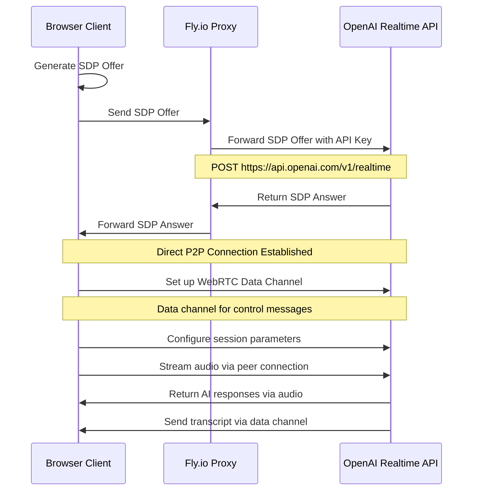
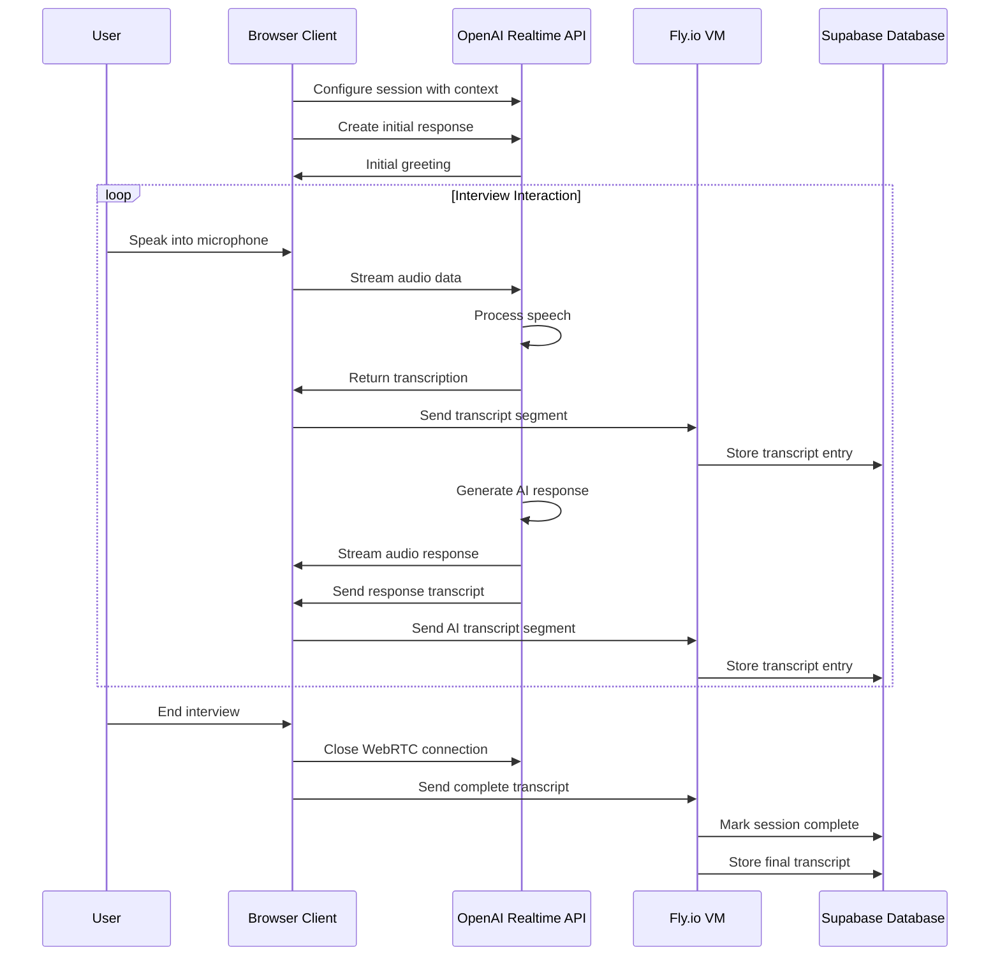

# OpenAI WebRTC API Integration Guide
# For AI Interview Platform

This technical document details the integration with OpenAI's WebRTC-based Realtime API for our AI Interview Platform, focusing on the audio processing and transcription aspects of the hybrid architecture.

## OpenAI Realtime API Overview

OpenAI's Realtime API provides a WebRTC-based interface for real-time audio processing and AI interactions. Unlike traditional REST APIs, it establishes a peer-to-peer connection with the client through WebRTC for low-latency communication.

Key features:
- Direct WebRTC audio streaming
- Data channel for control messages
- Real-time transcription
- AI-generated spoken responses
- Turn detection capabilities

## WebRTC Connection Flow



## SDP Negotiation Details

The Fly.io VM acts as a secure proxy for the initial SDP (Session Description Protocol) exchange, without processing the media streams:

1. **Client**: Generates WebRTC offer
2. **Fly.io**: Forwards offer to OpenAI with API key authentication
3. **OpenAI**: Processes offer and returns SDP answer
4. **Fly.io**: Forwards answer to client
5. **Client**: Establishes direct connection with OpenAI

```javascript
// Client-side offer generation
const peerConnection = new RTCPeerConnection({
  iceServers: [{ urls: 'stun:stun.l.google.com:19302' }]
});

// Add audio track
const stream = await navigator.mediaDevices.getUserMedia({ audio: true });
const [audioTrack] = stream.getAudioTracks();
peerConnection.addTrack(audioTrack, stream);

// Create offer
const offer = await peerConnection.createOffer();
await peerConnection.setLocalDescription(offer);

// Send to server
const sdpOffer = peerConnection.localDescription.sdp;

// Server-side forwarding to OpenAI
const response = await fetch('https://api.openai.com/v1/realtime?model=gpt-4o-realtime-preview', {
  method: 'POST',
  headers: {
    'Authorization': `Bearer ${OPENAI_API_KEY}`,
    'Content-Type': 'application/sdp'
  },
  body: sdpOffer
});

// Get SDP answer
const sdpAnswer = await response.text();

// Client sets remote description
await peerConnection.setRemoteDescription({
  type: 'answer',
  sdp: sdpAnswer
});
```

## Data Channel Communication

After the WebRTC connection is established, all control messages and transcriptions are sent via the WebRTC data channel:

### Session Configuration Messages

```javascript
// Configure AI behavior
{
  "type": "session.update",
  "session": {
    "instructions": "You are an interviewer for a software engineering position...",
    "voice": "alloy",
    "tools": [
      {
        "type": "function",
        "name": "end_session",
        "description": "End the interview session",
        "parameters": {}
      }
    ],
    "tool_choice": "auto",
    "input_audio_transcription": {"model": "whisper-1"},
    "temperature": 0.7,
    "turn_detection": {
      "type": "server_vad",
      "threshold": 0.5,
      "prefix_padding_ms": 300,
      "silence_duration_ms": 800,
      "create_response": true,
      "interrupt_response": true
    }
  }
}
```

### Starting the Interview

```javascript
// Begin the interview
{
  "type": "response.create",
  "response": {
    "modalities": ["text", "audio"],
    "instructions": "Introduce yourself and ask the candidate about their experience.",
    "max_output_tokens": 100
  }
}
```

### Audio Stream Management

```javascript
// Send audio chunk
{
  "type": "input_audio_buffer.append",
  "audio": "base64EncodedAudioData"
}

// Commit audio
{
  "type": "input_audio_buffer.commit"
}

// In VAD disabled mode, trigger response
{
  "type": "input_audio_buffer.finalize"
}
```

### Receiving Messages

```javascript
// Candidate transcription complete
{
  "type": "conversation.item.input_audio_transcription.completed",
  "transcript": "I have five years of experience..."
}

// AI response transcription updates
{
  "type": "response.audio_transcript.delta",
  "text": "Can you tell me more about your..."
}

// Function call (for ending session)
{
  "type": "response.function_call_arguments.done",
  "name": "end_session"
}
```

## Voice Activity Detection (VAD)

OpenAI's Realtime API supports two modes of turn detection:

1. **Server-side VAD**: OpenAI automatically detects when the user has stopped speaking and generates a response.

    ```javascript
    "turn_detection": {
      "type": "server_vad",
      "threshold": 0.5,         // Sensitivity (0.0-1.0)
      "prefix_padding_ms": 300,  // Audio to include before speech
      "silence_duration_ms": 800, // Silence needed to end turn
      "create_response": true,    // Auto-respond
      "interrupt_response": true  // Allow interruptions
    }
    ```

2. **Manual Mode**: Client controls when to finalize audio and trigger a response.

    ```javascript
    "turn_detection": {
      "type": "none"
    }
    ```

## Audio Format Requirements

OpenAI's Realtime API expects specific audio formats:

- **Sample Rate**: 16 kHz, 24 kHz, or 48 kHz (24 kHz recommended)
- **Format**: 16-bit PCM
- **Channels**: Mono
- **Encoding**: Linear PCM (no compression)

```javascript
// Client-side audio capture configuration
const audioContext = new AudioContext({
  sampleRate: 24000, // 24 kHz
  latencyHint: 'interactive'
});

// Capture stream with constraints
const stream = await navigator.mediaDevices.getUserMedia({
  audio: {
    sampleRate: 24000,
    channelCount: 1,
    echoCancellation: true,
    noiseSuppression: true,
    autoGainControl: true
  }
});
```

## Interview Flow Processing



## Error Handling

### Connection Failures

```javascript
// Client-side error handling
peerConnection.addEventListener('connectionstatechange', () => {
  switch(peerConnection.connectionState) {
    case 'connected':
      console.log('Connection established');
      break;
    case 'disconnected':
      console.warn('Connection lost, attempting to reconnect');
      // Implement reconnection logic
      break;
    case 'failed':
      console.error('Connection failed');
      handleConnectionFailure();
      break;
  }
});

// Timeout handling for connection
const connectionTimeout = setTimeout(() => {
  if (peerConnection.connectionState !== 'connected') {
    console.error('Connection timeout');
    handleConnectionFailure();
  }
}, 10000);
```

### Audio Processing Errors

```javascript
dataChannel.addEventListener('message', (event) => {
  try {
    const message = JSON.parse(event.data);
    
    if (message.type === 'error') {
      console.error('OpenAI processing error:', message.error);
      // Handle specific error types
      switch(message.error.code) {
        case 'audio_processing_failed':
          handleAudioProcessingError();
          break;
        case 'transcription_failed':
          handleTranscriptionError();
          break;
        // Other error types
      }
    }
  } catch (error) {
    console.error('Data channel message error:', error);
  }
});
```

## Security Considerations

### API Key Protection

The most critical security aspect is protecting the OpenAI API key:

```javascript
// ❌ NEVER DO THIS - Exposing API key to client
const apiKey = "sk-..."; // API key hardcoded or sent to client

// ✅ CORRECT APPROACH - Server-side API key usage
// In Fly.io VM code
const apiKey = process.env.OPENAI_API_KEY;
const response = await fetch('https://api.openai.com/v1/realtime', {
  method: 'POST',
  headers: {
    'Authorization': `Bearer ${apiKey}`,
    'Content-Type': 'application/sdp'
  },
  body: sdpOffer
});
```

### Ephemeral Token Option

For production applications with additional security requirements, OpenAI provides an ephemeral token option:

```javascript
// Generate ephemeral token (server-side only)
const response = await fetch('https://api.openai.com/v1/realtime/tokens', {
  method: 'POST',
  headers: {
    'Authorization': `Bearer ${OPENAI_API_KEY}`,
    'Content-Type': 'application/json'
  },
  body: JSON.stringify({
    model: 'gpt-4o-realtime-preview',
    // Optional expiration settings
  })
});

const { token } = await response.json();
// Send token to client for direct WebRTC setup
```

## Performance Optimizations

### Audio Processing

1. **Chunk Size Optimization**
   - Balancing latency and processing efficiency
   - Recommended: 100-200ms audio chunks

2. **Sample Rate Selection**
   - 24 kHz provides best balance of quality and bandwidth
   - Lower sample rates reduce bandwidth but may impact quality

3. **Buffer Management**
   - Implement adaptive buffering based on network conditions
   - Clear buffers when user interrupts AI

```javascript
// Example adaptive buffer sizing
let bufferSize = 4096; // Default size

// Monitor audio processing time
const monitorProcessingLatency = (startTime, endTime) => {
  const latency = endTime - startTime;
  
  // Adjust buffer size based on processing latency
  if (latency > 200) { // If processing takes too long
    bufferSize = Math.max(1024, bufferSize / 2); // Reduce buffer size
  } else if (latency < 50 && bufferSize < 8192) { // If processing is fast
    bufferSize *= 1.5; // Increase buffer size
  }
};
```

### Connection Management

1. **ICE Server Configuration**
   - Use multiple STUN/TURN servers for reliable connectivity
   - Consider geographic distribution of servers

```javascript
const peerConnection = new RTCPeerConnection({
  iceServers: [
    { urls: 'stun:stun1.l.google.com:19302' },
    { urls: 'stun:stun2.l.google.com:19302' },
    // Add TURN servers for NAT traversal if needed
  ],
  iceTransportPolicy: 'all',
  bundlePolicy: 'max-bundle',
  rtcpMuxPolicy: 'require'
});
```

2. **Connection Quality Monitoring**
   - Track connection metrics to detect issues early
   - Implement graceful degradation for poor connections

```javascript
// Monitor WebRTC connection quality
setInterval(() => {
  if (peerConnection && peerConnection.connectionState === 'connected') {
    peerConnection.getStats(null).then(stats => {
      stats.forEach(report => {
        if (report.type === 'inbound-rtp' && report.kind === 'audio') {
          // Monitor packet loss, jitter, etc.
          const packetLoss = report.packetsLost / report.packetsReceived;
          if (packetLoss > 0.05) { // 5% packet loss
            console.warn('High packet loss detected:', packetLoss);
            // Implement quality degradation strategy
          }
        }
      });
    });
  }
}, 5000);
```

## Model Configuration Options

OpenAI's Realtime API supports multiple models with different capabilities:

| Model | Description | Best For |
|-------|-------------|----------|
| `gpt-4o-realtime-preview` | Latest model with best capabilities | Production use, complex interviews |
| `gpt-4o-mini-realtime-preview` | Smaller, faster model | Development testing, simpler interviews |

### Model Parameters

Key parameters for interview fine-tuning:

```javascript
{
  "type": "session.update",
  "session": {
    // Personality and behavior
    "instructions": "Detailed interviewer instructions...",
    
    // Voice selection
    "voice": "alloy", // Options: alloy, echo, fable, onyx, nova, shimmer
    
    // Response characteristics
    "temperature": 0.7, // 0.0-2.0, higher = more creative/random
    
    // Transcription settings
    "input_audio_transcription": {
      "model": "whisper-1",
      "language": "en", // Optional language hint
      "prompt": "Technical interview vocabulary" // Optional context
    },
    
    // Function calling config
    "tools": [...], // Available functions
    "tool_choice": "auto" // or specific function name
  }
}
```

## Advanced Features

### Candidate Interruption Handling

```javascript
// Detecting when candidate interrupts AI
dataChannel.addEventListener('message', (event) => {
  const message = JSON.parse(event.data);
  
  if (message.type === 'input_audio_buffer.speech_started' && 
      currentState === 'ai_speaking') {
    
    // Candidate started speaking while AI was talking
    console.log('Candidate interrupted AI');
    
    // Option 1: Let server-side VAD handle it
    // (if interrupt_response: true is set)
    
    // Option 2: Manually cancel the current response
    dataChannel.send(JSON.stringify({
      type: 'response.cancel'
    }));
    
    // Update UI to show interruption
    updateUIForInterruption();
  }
});
```

### Function Calling for Interview Control

```javascript
// Define interview control functions
const interviewFunctions = [
  {
    type: 'function',
    name: 'end_session',
    description: 'End the interview session',
    parameters: {}
  },
  {
    type: 'function',
    name: 'rate_candidate',
    description: 'Rate the candidate on a specific dimension',
    parameters: {
      type: 'object',
      properties: {
        dimension: {
          type: 'string',
          description: 'The skill or quality to rate',
          enum: ['technical_knowledge', 'communication', 'problem_solving']
        },
        rating: {
          type: 'integer',
          description: 'Rating from 1-5',
          minimum: 1,
          maximum: 5
        },
        justification: {
          type: 'string',
          description: 'Why this rating was given'
        }
      },
      required: ['dimension', 'rating', 'justification']
    }
  }
];

// Handle function calls
dataChannel.addEventListener('message', (event) => {
  const message = JSON.parse(event.data);
  
  if (message.type === 'response.function_call_arguments.done') {
    const { name, arguments: args } = message;
    
    switch (name) {
      case 'end_session':
        handleEndSession();
        break;
        
      case 'rate_candidate':
        const ratingData = JSON.parse(args);
        storeRating(ratingData);
        break;
    }
  }
});
```

## Troubleshooting Common Issues

### Connection Failures

1. **ICE Connection Issues**
   - Symptom: Connection state stuck at 'checking' or moves to 'failed'
   - Solutions:
     - Ensure proper STUN server configuration
     - Check network firewalls and NAT traversal
     - Add TURN servers for fallback

2. **Audio Not Flowing**
   - Symptom: Connection established but no audio transmission
   - Solutions:
     - Verify microphone permissions
     - Check audio track is properly added to peer connection
     - Ensure audio constraints are properly set

3. **Data Channel Not Opening**
   - Symptom: Data channel state remains 'connecting'
   - Solutions:
     - Verify network connectivity
     - Check SDP negotiation for data channel inclusion
     - Monitor for errors in connection establishment

### Audio Quality Issues

1. **Poor Transcription Accuracy**
   - Symptom: Incorrect or garbled transcription
   - Solutions:
     - Ensure proper audio format (16-bit PCM, 24kHz)
     - Add language hint if speaking non-English
     - Improve microphone quality or noise reduction

2. **High Latency**
   - Symptom: Long delays between speaking and AI response
   - Solutions:
     - Optimize chunk size for audio processing
     - Check network latency to OpenAI servers
     - Reduce buffer sizes for faster processing

3. **Choppy Audio**
   - Symptom: Stuttering or interrupted audio
   - Solutions:
     - Check network stability
     - Increase audio buffer size
     - Monitor packet loss and jitter

## Integration Testing

### Test Matrix

| Test Case | Description | Expected Result |
|-----------|-------------|-----------------|
| Basic Connection | Establish WebRTC connection | Connection successful, data channel opened |
| Audio Transmission | Send audio chunks | Audio received and processed by OpenAI |
| Transcription | Speak test phrases | Accurate transcription returned |
| AI Response | Complete interaction loop | AI responds with audio and transcript |
| Interruption | Interrupt AI mid-response | AI stops and listens to user |
| Function Calling | Trigger end_session function | Function called with correct arguments |
| Error Recovery | Simulate connection drop | Reconnection attempted or error handled |
| Long Session | Maintain connection for 30+ min | Stable performance throughout |

### Test Script

```javascript
// Example test script for the WebRTC connection
const testOpenAIConnection = async () => {
  console.log('Starting WebRTC connection test...');
  
  // Generate test SDP offer
  const pc = new RTCPeerConnection({
    iceServers: [{ urls: 'stun:stun.l.google.com:19302' }]
  });
  
  // Add audio track
  const stream = await navigator.mediaDevices.getUserMedia({ audio: true });
  stream.getTracks().forEach(track => pc.addTrack(track, stream));
  
  // Create data channel
  const dc = pc.createDataChannel('test-channel');
  
  // Connection events
  let testResults = {
    connectionEstablished: false,
    dataChannelOpened: false,
    audioTransmitted: false,
    transcriptionReceived: false,
    aiResponseReceived: false
  };
  
  pc.onconnectionstatechange = () => {
    console.log(`Connection state: ${pc.connectionState}`);
    if (pc.connectionState === 'connected') {
      testResults.connectionEstablished = true;
    }
  };
  
  dc.onopen = () => {
    console.log('Data channel opened');
    testResults.dataChannelOpened = true;
    
    // Send test config
    dc.send(JSON.stringify({
      type: 'session.update',
      session: {
        instructions: 'You are a test assistant responding to a WebRTC test.',
        voice: 'alloy'
      }
    }));
    
    // Send test prompt
    dc.send(JSON.stringify({
      type: 'response.create',
      response: {
        modalities: ['text', 'audio'],
        instructions: 'Say "WebRTC test successful" and nothing else.',
        max_output_tokens: 20
      }
    }));
  };
  
  dc.onmessage = (event) => {
    const message = JSON.parse(event.data);
    console.log('Received message:', message.type);
    
    if (message.type === 'conversation.item.input_audio_transcription.completed') {
      testResults.transcriptionReceived = true;
    }
    
    if (message.type === 'response.audio_transcript.delta') {
      testResults.aiResponseReceived = true;
    }
  };
  
  // Create and set local description
  const offer = await pc.createOffer();
  await pc.setLocalDescription(offer);
  
  // Wait for ICE gathering
  await new Promise(resolve => {
    if (pc.iceGatheringState === 'complete') {
      resolve();
    } else {
      pc.onicegatheringstatechange = () => {
        if (pc.iceGatheringState === 'complete') {
          resolve();
        }
      };
    }
  });
  
  // Forward to server/OpenAI and get answer
  // ... code to get SDP answer ...
  
  // Set remote description
  // await pc.setRemoteDescription({type: 'answer', sdp: sdpAnswer});
  
  // Run test for 10 seconds
  await new Promise(resolve => setTimeout(resolve, 10000));
  
  // Log test results
  console.log('Test results:', testResults);
  
  // Cleanup
  pc.close();
  stream.getTracks().forEach(track => track.stop());
};
```

## Reference Client Implementation

OpenAI provides an open-source reference client for the Realtime API:

```bash
# Install from GitHub
npm install openai/openai-realtime-api-beta
```

```javascript
// Using the reference client
import { RealtimeClient } from '@openai/realtime-api-beta';

// Initialize client
const client = new RealtimeClient({
  apiKey: process.env.OPENAI_API_KEY,
});

// Set up event handling
client.on('conversation.updated', (event) => {
  const { item, delta } = event;
  console.log('Conversation updated:', item.type);
  if (delta) {
    if (delta.audio) console.log('Audio delta received');
    if (delta.transcript) console.log('Transcript:', delta.transcript);
    if (delta.arguments) console.log('Function arguments:', delta.arguments);
  }
});

// Connect to Realtime API
await client.connect();

// Send a message
client.sendUserMessageContent([
  { type: 'input_text', text: 'Tell me about yourself' }
]);

// For audio streaming
client.appendInputAudio(audioChunk);
client.createResponse();
``` 