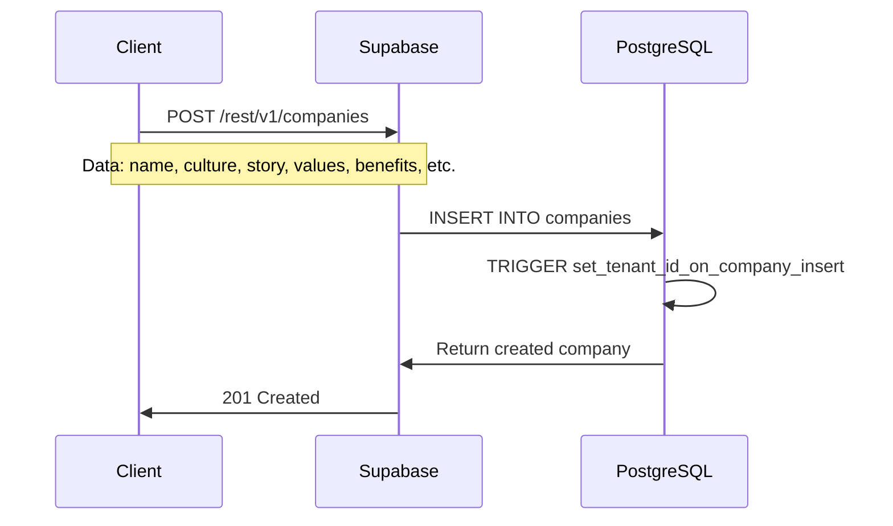
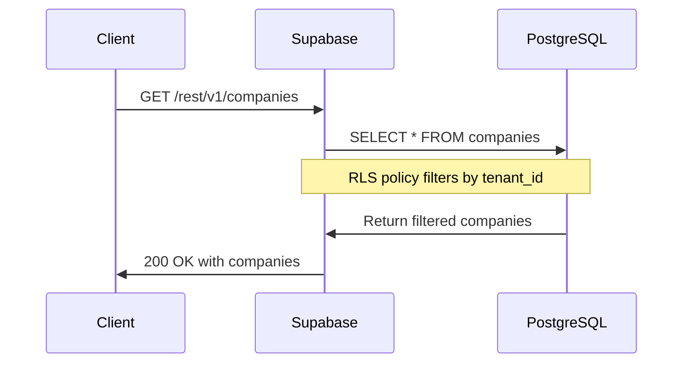
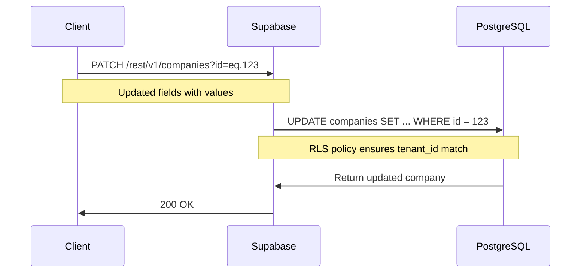
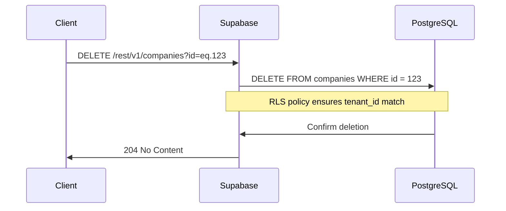

# Company Management API Flow

## Overview

This document details the API flow for company management in the AI Interview Insights Platform. Unlike candidate management, which uses Edge Functions for processing, company management relies entirely on direct Supabase API calls with database triggers for tenant association.

## Architecture

### Database Schema

The company management system uses a straightforward schema with robust tenant isolation:

```sql
CREATE TABLE companies (
  id UUID PRIMARY KEY DEFAULT uuid_generate_v4(),
  tenant_id UUID NOT NULL REFERENCES tenants(id) ON DELETE CASCADE,
  name TEXT NOT NULL,
  culture TEXT,
  story TEXT,
  values TEXT,
  benefits TEXT,
  core_values JSONB DEFAULT '[]'::jsonb,
  benefits_list JSONB DEFAULT '[]'::jsonb,
  created_at TIMESTAMPTZ NOT NULL DEFAULT NOW(),
  updated_at TIMESTAMPTZ NOT NULL DEFAULT NOW()
);
```

### Database Functions and Triggers

A key architectural pattern is the use of database triggers to automatically handle tenant association:

```sql
-- Function to automatically set tenant_id on company insert
CREATE OR REPLACE FUNCTION set_tenant_id_on_company_insert()
RETURNS TRIGGER AS $$
DECLARE
  default_tenant_id UUID;
BEGIN
  -- Get the first tenant_id as a fallback
  SELECT id INTO default_tenant_id FROM tenants LIMIT 1;
  
  -- Set the tenant_id if it's NULL
  IF NEW.tenant_id IS NULL THEN
    NEW.tenant_id := default_tenant_id;
  END IF;
  
  RETURN NEW;
END;
$$ LANGUAGE plpgsql;

-- Trigger to set tenant_id automatically on company creation
CREATE TRIGGER set_tenant_id_on_company_insert
BEFORE INSERT ON companies
FOR EACH ROW EXECUTE FUNCTION set_tenant_id_on_company_insert();
```

This pattern ensures that every company is properly associated with a tenant, even if the frontend doesn't explicitly specify a tenant_id.

## API Flow

### Company Creation



The company creation flow uses direct Supabase API calls without Edge Functions:

1. Client submits company data through React Hook Form
2. Frontend sends an insert request to Supabase REST API
3. Database trigger automatically sets tenant_id if not provided
4. Created company is returned to the client

```typescript
// From NewCompany.tsx
const createCompany = useMutation({
  mutationFn: async (data: CompanyData) => {
    const { data: result, error } = await supabase
      .from('companies' as any)
      .insert(data as any)
      .select()
      .single();

    if (error) throw error;
    return result;
  },
  onSuccess: () => {
    toast({
      title: "Company created",
      description: "Company has been successfully created.",
    });
    navigate("/companies");
  }
});
```

### Company Retrieval



Company retrieval leverages Row-Level Security to ensure proper tenant isolation:

1. Client requests company list
2. Supabase forwards request to PostgreSQL
3. RLS policies automatically filter results by tenant_id
4. Filtered company list is returned to client

```typescript
// From Companies.tsx
const { data: companies, isLoading } = useQuery({
  queryKey: ["companies"],
  queryFn: async () => {
    const { data, error } = await supabase
      .from("companies" as any)
      .select("*")
      .order("name", { ascending: true });

    if (error) throw error;
    return data as Company[];
  },
});
```

### Company Update



Company updates are secured through RLS policies:

1. Client submits updated company data
2. Frontend sends an update request to Supabase REST API
3. RLS policies ensure the user can only update companies in their tenant
4. Updated company is returned to the client

```typescript
// From EditCompany.tsx
const updateCompany = useMutation({
  mutationFn: async (data: any) => {
    const { data: result, error } = await supabase
      .from("companies" as any)
      .update(data as any)
      .eq("id", id)
      .select()
      .single();

    if (error) throw error;
    return result;
  },
  onSuccess: () => {
    queryClient.invalidateQueries({ queryKey: ["companies"] });
    queryClient.invalidateQueries({ queryKey: ["company", id] });
    toast({
      title: "Company updated",
      description: "Company has been successfully updated.",
    });
    navigate("/companies");
  }
});
```

### Company Deletion



Company deletion is also protected through RLS:

1. Client initiates company deletion
2. Frontend sends a delete request to Supabase REST API
3. RLS policies ensure the user can only delete companies in their tenant
4. Confirmation is returned to the client

```typescript
// From EditCompany.tsx
const deleteCompany = useMutation({
  mutationFn: async () => {
    const { error } = await supabase
      .from("companies" as any)
      .delete()
      .eq("id", id);

    if (error) throw error;
  },
  onSuccess: () => {
    queryClient.invalidateQueries({ queryKey: ["companies"] });
    toast({
      title: "Company deleted",
      description: "Company has been successfully deleted.",
    });
    navigate("/companies");
  }
});
```

## Frontend Components

### 1. Companies.tsx

Main page that lists all companies belonging to the current tenant:
- Uses React Query for data fetching and caching
- Provides search functionality
- Includes a link to create new companies

### 2. CompanyForm.tsx

Reusable form component used for both creation and updating:
- Form validation with Zod
- Complex fields for core values and benefits lists
- Handles both text fields and array data

### 3. NewCompany.tsx

Page for creating a new company:
- Uses the CompanyForm component
- Handles form submission through React Query mutation
- Provides user feedback through toast notifications

### 4. EditCompany.tsx

Page for updating an existing company:
- Fetches existing company data
- Uses the same CompanyForm component
- Includes deletion functionality with confirmation dialog
- Handles optimistic UI updates

### 5. CompanyCard.tsx

Card component for displaying company information:
- Shows core details like name, culture snippet
- Displays core values and benefits as badges
- Provides a link to edit the company

### 6. CompanySelect.tsx

Dropdown component for selecting companies:
- Used in forms that need company selection
- Includes a shortcut to create a new company
- Handles loading and empty states

## Row-Level Security Policies

The system initially used granular RLS policies, but evolved to a more permissive approach with tenant association handled through database triggers:

```sql
-- Initial approach: Granular policies
CREATE POLICY tenant_select_companies ON companies
  FOR SELECT USING (tenant_id IN (
    SELECT tenant_id FROM users WHERE id = auth.uid()
  ));

-- Current approach: Simplified permissive policy
CREATE POLICY allow_all_for_authenticated ON companies
  FOR ALL TO authenticated
  USING (true)
  WITH CHECK (true);
```

The current approach relies on:
1. Automatic tenant_id association through triggers
2. General permissive RLS policy for authenticated users
3. Database-level referential integrity through foreign keys

## Data Flow Patterns

### State Management with React Query

The application uses React Query for efficient data management:

1. **Caching**: Responses are cached to minimize API calls
2. **Invalidation**: Related queries are invalidated on mutations
3. **Loading States**: Consistent loading state handling

```typescript
// Query invalidation pattern
onSuccess: () => {
  queryClient.invalidateQueries({ queryKey: ["companies"] });
  queryClient.invalidateQueries({ queryKey: ["company", id] });
}
```

### Form State Management

Form state is managed with React Hook Form:

1. **Validation**: Zod schema for validation rules
2. **Default Values**: Initial form values properly handled
3. **Error Handling**: Form-level and field-level errors
4. **Submission**: Controlled submission process

## Error Handling

The system implements comprehensive error handling:

1. **API Errors**: Caught and displayed to the user
2. **Form Validation**: Client-side validation prevents invalid data
3. **Database Constraints**: Server-side validation through database constraints
4. **User Feedback**: Toast notifications for success and error states

```typescript
onError: (error) => {
  console.error("Error updating company:", error);
  toast({
    title: "Error updating company",
    description: "There was an error updating the company. Please try again.",
    variant: "destructive",
  });
}
```

## Conclusion

The company management flow demonstrates a different architectural approach compared to the candidate flow:

1. **Direct API**: Uses Supabase direct API calls instead of Edge Functions
2. **Database Triggers**: Leverages database triggers for tenant association
3. **Simple API Flow**: Straightforward CRUD operations without complex processing
4. **RLS-Based Security**: Secures data access through Row-Level Security policies

This approach provides a lightweight, efficient solution for company management while maintaining proper multi-tenant isolation and data integrity. 

## Implementation Notes

**Migration Issue (May 7, 2025)**: We discovered that while the companies table migration existed in our codebase (20250430131455_add_companies_table.sql), it wasn't properly applied to the database. This was fixed by creating a new migration (20250507000000_ensure_companies_table.sql) that safely checks if the table exists before creating it, ensuring the company functionality works without affecting other working flows. 