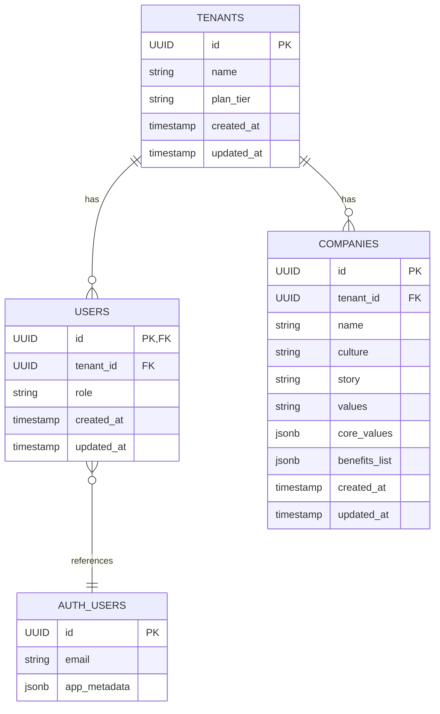
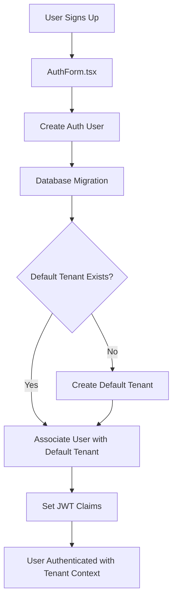
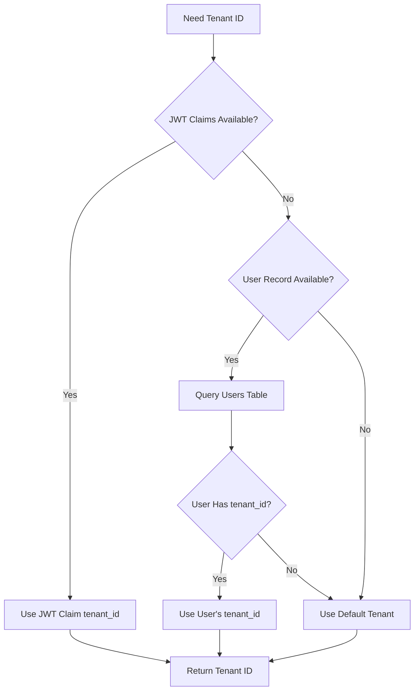

# Tenant and Company Creation Flow Documentation

## Overview

This document outlines the tenant and company creation flow in the AI Interview Insights Platform. The system implements a multi-tenant architecture where each tenant can have multiple companies. This design supports organizational structures while maintaining proper data isolation.

### System Diagram



## Architecture

### Database Schema

#### Tenants Table
```sql
CREATE TABLE tenants (
  id UUID PRIMARY KEY DEFAULT uuid_generate_v4(),
  name TEXT NOT NULL,
  plan_tier TEXT NOT NULL DEFAULT 'free',
  created_at TIMESTAMPTZ NOT NULL DEFAULT NOW(),
  updated_at TIMESTAMPTZ NOT NULL DEFAULT NOW()
);
```

#### Users Table
```sql
CREATE TABLE users (
  id UUID PRIMARY KEY REFERENCES auth.users ON DELETE CASCADE,
  tenant_id UUID NOT NULL REFERENCES tenants(id) ON DELETE CASCADE,
  role TEXT NOT NULL DEFAULT 'user',
  created_at TIMESTAMPTZ NOT NULL DEFAULT NOW(),
  updated_at TIMESTAMPTZ NOT NULL DEFAULT NOW()
);
```

#### Companies Table
```sql
CREATE TABLE companies (
  id UUID PRIMARY KEY DEFAULT uuid_generate_v4(),
  tenant_id UUID NOT NULL REFERENCES tenants(id) ON DELETE CASCADE,
  name TEXT NOT NULL,
  culture TEXT,
  story TEXT,
  values TEXT,
  benefits TEXT,
  core_values JSONB DEFAULT '[]'::jsonb,
  benefits_list JSONB DEFAULT '[]'::jsonb,
  created_at TIMESTAMPTZ NOT NULL DEFAULT NOW(),
  updated_at TIMESTAMPTZ NOT NULL DEFAULT NOW()
);
```

### Database Functions

The system uses several database functions to manage tenant association:

```sql
-- Function to automatically set tenant_id on company insert
CREATE OR REPLACE FUNCTION set_tenant_id_on_company_insert()
RETURNS TRIGGER AS $$
DECLARE
  user_tenant_id UUID;
BEGIN
  -- Get tenant_id from users table based on current user
  SELECT tenant_id INTO user_tenant_id
  FROM users
  WHERE id = auth.uid();
  
  -- Set the tenant_id if it's NULL
  IF NEW.tenant_id IS NULL THEN
    NEW.tenant_id := user_tenant_id;
  END IF;
  
  RETURN NEW;
END;
$$ LANGUAGE plpgsql;

-- Function to get current user's tenant_id
CREATE OR REPLACE FUNCTION public.get_tenant_id()
RETURNS UUID AS $$
DECLARE
  tenant_id UUID;
BEGIN
  -- Try to get from users table first
  SELECT u.tenant_id INTO tenant_id
  FROM public.users u
  WHERE u.id = auth.uid();
  
  -- If not found, get the first tenant as fallback
  IF tenant_id IS NULL THEN
    SELECT id INTO tenant_id FROM public.tenants LIMIT 1;
  END IF;
  
  RETURN tenant_id;
END;
$$ LANGUAGE plpgsql SECURITY DEFINER;
```

## End-to-End Flow

### User Registration and Tenant Association Flow



### 1. User Registration and Tenant Association

**Component**: `AuthForm.tsx`

1. User signs up through the registration form
2. Frontend creates a new user with default tenant association
3. Database migrations ensure default tenants exist
4. User is automatically associated with a default tenant

```typescript
// Example from AuthForm.tsx
const { email, password, name } = data as SignupFormValues;
// For simplicity, we're using a default tenant ID for new signups
// In a real implementation, this would come from an organization creation flow
const defaultTenantId = '00000000-0000-0000-0000-000000000000';

await signUp(email, password, defaultTenantId);
```

### 2. Default Tenant Creation

**Migration**: `ensure_tenant_data.sql`

1. Migration script creates default tenants if they don't exist
2. Default tenants include "Acme Corp" and others
3. First user is automatically associated with default tenant

```sql
-- Ensure Acme Corp tenant exists
INSERT INTO tenants (name, plan_tier)
VALUES ('Acme Corp', 'free')
ON CONFLICT DO NOTHING;

-- Link authenticated user to Acme Corp
WITH acme_tenant AS (
  SELECT id FROM tenants WHERE name = 'Acme Corp' LIMIT 1
),
first_user AS (
  SELECT id FROM auth.users ORDER BY created_at LIMIT 1
)
INSERT INTO users (id, tenant_id, role)
SELECT first_user.id, acme_tenant.id, 'admin'
FROM first_user, acme_tenant
ON CONFLICT (id) DO UPDATE
SET tenant_id = EXCLUDED.tenant_id;
```

### 3. Tenant ID in Authentication Context

**Component**: `useAuth.tsx`

1. The authentication hook retrieves the tenant_id from JWT claims
2. If not available in JWT, it falls back to database lookup
3. Tenant ID is made available throughout the application context

```typescript
// Excerpt from useAuth.tsx
const userTenantId = newSession?.user?.app_metadata?.tenant_id;
if (newSession?.user && !userTenantId) {
  console.log('Tenant ID not found in app_metadata, checking database...');
  // Fetch tenant ID from users table
  supabase
    .from('users')
    .select('tenant_id')
    .eq('id', newSession.user.id)
    .single()
    .then(({ data, error }) => {
      if (error) {
        console.error('Error fetching tenant ID from database:', error);
      } else if (data?.tenant_id) {
        console.log('Found tenant ID in database:', data.tenant_id);
        setTenantId(data.tenant_id);
      }
    });
} else {
  setTenantId(userTenantId);
}
```

### Company Creation Flow

```mermaid
flowchart TD
    A[User Access Companies Page] --> B[Companies.tsx]
    B --> C[Click "New Company"]
    C --> D[CompanyForm.tsx]
    D --> E[Submit Company Data]
    E --> F[Supabase Insert]
    F --> G[Database Trigger]
    G --> H{tenant_id Provided?}
    H -->|Yes| J[Create Company with Provided tenant_id]
    H -->|No| I[Look up User's tenant_id]
    I --> J
    J --> K[Display Success Toast]
    K --> L[Navigate to Companies List]
```

### 4. Default Company Creation

**Migration**: `ensure_tenant_data.sql`

1. Migration script creates default companies for each tenant
2. Default company data includes basic information
3. Association with tenant is established via tenant_id

```sql
-- Create a test company for the tenant
WITH acme_tenant AS (
  SELECT id FROM tenants WHERE name = 'Acme Corp' LIMIT 1
)
INSERT INTO companies (name, tenant_id, culture, story, values, benefits)
SELECT 
  'Acme Test Company', 
  acme_tenant.id,
  'Innovative culture focused on growth',
  'Founded in 2020 with a mission to change the world',
  'Integrity, Excellence, Innovation',
  'Health insurance, 401k, unlimited PTO'
FROM acme_tenant
ON CONFLICT DO NOTHING;
```

### 5. Manual Company Creation

**Components**: `NewCompany.tsx`, `CompanyForm.tsx`

1. User fills out company details in the form
2. Frontend submits data to create a new company
3. Database trigger automatically sets tenant_id if not provided
4. Company is created and associated with user's tenant

```typescript
// Example from NewCompany.tsx
const createCompany = useMutation({
  mutationFn: async (data: CompanyData) => {
    const { data: result, error } = await supabase
      .from('companies' as any)
      .insert(data as any)
      .select()
      .single();

    if (error) throw error;
    return result;
  },
  onSuccess: () => {
    toast({
      title: "Company created",
      description: "Company has been successfully created.",
    });
    navigate("/companies");
  }
});
```

### 6. Company Display

**Components**: `Companies.tsx`, `CompanyList.tsx`, `CompanyCard.tsx`

1. Frontend fetches companies associated with user's tenant
2. Companies are displayed in a list with visual cards
3. RLS policies ensure users only see their tenant's companies
4. User can edit or view company details

```typescript
// From Companies.tsx
const { data: companies, isLoading } = useQuery({
  queryKey: ["companies"],
  queryFn: async () => {
    const { data, error } = await supabase
      .from("companies" as any)
      .select("*")
      .order("name", { ascending: true });

    if (error) throw error;
    return data as Company[];
  },
});
```

## Key Technical Patterns

### Multi-tenant Data Isolation

The system ensures proper multi-tenant isolation:
- Every table includes a `tenant_id` column
- RLS policies restrict data access to the appropriate tenant
- JWT claims include tenant_id for authentication context
- Database triggers enforce tenant association

### Tenant ID Fallback Chain



### Database Triggers

```sql
-- Trigger to set tenant_id automatically on company creation
CREATE TRIGGER set_tenant_id_on_company_insert
BEFORE INSERT ON companies
FOR EACH ROW EXECUTE FUNCTION set_tenant_id_on_company_insert();
```

### Row-Level Security Policies

```sql
-- Companies table policy
CREATE POLICY allow_all_for_authenticated ON companies
  FOR ALL TO authenticated
  USING (true)
  WITH CHECK (true);
```

### Fallback Chain for Tenant ID

The system implements a fallback chain for tenant identification:
1. JWT Claims (auth.jwt() -> 'tenant_id')
2. Database Lookup (users table lookup)
3. Default Tenant (first tenant in database)

This ensures tenant context is always available even in edge cases.

## Error Handling

1. **Missing Tenant ID**: If tenant_id is missing in JWT claims, system falls back to database lookup
2. **No Tenant Association**: If user has no tenant association, default tenant is assigned
3. **Company Creation**: If tenant_id is not specified during company creation, it's automatically set

## Security Considerations

1. **RLS Policies**: Ensure users can only access data for their tenant
2. **JWT Claims**: Use JWT claims for secure tenant context in authentication
3. **Trigger Functions**: Use SECURITY DEFINER to ensure proper permissions for database operations
4. **Database Functions**: Implement helper functions with proper security context

## Performance Optimization

1. **Indexes**: Create indexes on tenant_id columns for better query performance
2. **Caching**: Cache tenant_id in authentication context to reduce database lookups
3. **Default Data**: Pre-create default tenants and companies for smoother onboarding

## Conclusion

The tenant and company creation flow provides a robust foundation for multi-tenant operation with proper data isolation. The system supports a one-to-many relationship between tenants and companies, allowing for flexible organizational structures while maintaining security and performance.

This architecture enables each tenant (organization) to manage multiple company profiles within their account, creating a scalable platform that supports diverse business needs. 