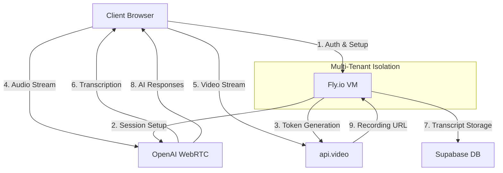

# AI Interview Insights Platform: Consolidated Project History

## Overview

This document provides a comprehensive history of the AI Interview Insights Platform's development, including key architectural decisions, technology evaluations, implementation challenges, and the evolution of the system design. This historical context explains the rationale behind our current architecture and technology choices.

## Initial Lovable MVP Implementation

> **IMPORTANT DISCLAIMER**: The initial Lovable MVP information is provided ONLY for historical context and should NOT be used to change the scope or architecture of the current project.

### Candidate Invitation Flow in Lovable
- Admin could send invites to candidates
- Candidates received links and could start interviews without logging in
- System verified audio and initiated AI interview
- **Critical Issue**: Post-interview transcripts would not save properly
- Despite 3 weeks of debugging, could not resolve the transcript saving issue
- Lovable AI coder's assessment: Issues related to session management and tokens in the invite flow

### Admin Interview Flow in Lovable
- Admins could select a candidate and position
- Run interviews directly in the browser after giving permissions
- Transcript worked perfectly post-interview in this flow
- The difference in behavior suggested session management issues in the invitation flow

### Technical Limitations of Lovable MVP
- No video recording capabilities (VideoSDK.live integration was planned but not implemented)
- Client-side heavy architecture created scalability and reliability issues

## Architectural Evolution

### From Client-Side to Triangular Architecture
- Research led to developing a better architecture ("triangular" vs client-side)
- Current implementation uses a triangular architecture with three main components:
  1. **Client-Side (Browser)**:
     - Captures audio/video through WebRTC
     - Processes audio into chunks (2-second intervals)
     - Converts chunks to base64
     - Sends to Edge Functions
  
  2. **Edge Functions (Server-Side)**:
     - Receives audio chunks
     - Processes speech-to-text conversion
     - Stores transcript entries in the database
     - Broadcasts transcript updates via Supabase Realtime
  
  3. **Database**:
     - Multi-tenant data isolation
     - Structured transcript data storage
     - Relationships between sessions, candidates, positions

- Implemented tenant architecture for SaaS capabilities
- Complete rebuild with improved security, scalability, and reliability

## Infrastructure Evaluation

### E2B Integration Exploration

In our quest to optimize the interview processing infrastructure, we evaluated [E2B](https://e2b.dev) as a potential solution for isolated compute environments:

#### E2B's Key Features
- Cloud-based compute sandboxes with ~150ms startup time
- Isolated execution environments
- JavaScript/TypeScript SDK for integration

#### Benefits Considered
- **Dedicated Resources**: Each interview would get isolated computing resources
- **Horizontal Scaling**: Process would scale linearly with the number of concurrent interviews
- **No Resource Contention**: One interview's processing wouldn't affect others
- **Burst Capacity**: Could handle sudden spikes in interview volume
- **Geographic Distribution**: Could run sandboxes closer to participants for lower latency

#### Consultation Findings
Following discussions with E2B's team, we gained valuable insights:
- **Spin-Up Time**: Approximately 200 milliseconds, confirming expectations
- **Real-Time Processing**: Suitable for WebRTC and other real-time APIs
- **Scalability**: Supports high concurrency for simultaneous interviews
- **Security**: SOC 2 certification in progress (audit not yet complete)
- **Funding**: $11 million in seed funding raised

#### Strategic Alignment Concerns
- **Product Direction**: E2B is increasingly focused on AI agent use cases rather than general-purpose compute
- **Future Divergence**: Their roadmap might not align with our interview processing needs
- **Core Focus**: Building "infrastructure for coordination agents" rather than general compute

### Fly.io Integration Evaluation

After the E2B evaluation, we explored [Fly.io](https://fly.io) as an alternative solution:

#### Fly.io's Key Features
- Distributed, globally-available virtual machines
- Ultra-fast startup times (under 1 second)
- Comprehensive management via both CLI and REST API
- Docker-based deployment

#### Multi-Tenant Implementation with Fly.io
A key advantage of Fly.io is its hierarchical organizational structure, which maps perfectly to our multi-tenant architecture:

##### Fly Apps vs Fly Machines
- **Fly Apps**: Function as organizational containers that group related Machines
  - Provide namespace and network isolation between tenants
  - Have unique subdomains (e.g., `interviews-tenant-123.fly.dev`)
  - Store shared secrets and configuration (API keys, credentials)
  - Serve as a "tenant container" in our architecture

- **Fly Machines**: The actual VMs that run our interview processing code
  - Always belong to a specific App (parent-child relationship)
  - Have individual resource allocations (CPU, memory)
  - Can be started/stopped/destroyed independently
  - Share configuration and secrets from their parent App
  - Function as "interview processors" in our architecture

#### Advantages of Fly.io
- **Production Focus**: Designed for production workloads (vs. E2B's development/AI agent focus)
- **Global Distribution**: 30+ regions worldwide
- **Multi-Tenant Support**: Built-in app/network isolation
- **Platform Maturity**: Established since 2017 with significant funding
- **Strategic Alignment**: General-purpose compute with code execution focus
- **Compliance**: Industry standards in production
- **Pricing Model**: Pay As You Go (since Oct 2024)
- **Documentation**: Comprehensive, production-focused
- **Community Support**: Active community

### Comparative Analysis and Decision

After thorough evaluation, we compared E2B and Fly.io:

| Aspect | Fly.io | E2B | Advantage |
|--------|--------|-----|-----------|
| **Startup Time** | Under 1 second | ~200ms | E2B (slightly) |
| **Production Focus** | Designed for production workloads | Development/AI agent focus | Fly.io |
| **Global Distribution** | 30+ regions worldwide | Limited | Fly.io |
| **Multi-Tenant Support** | Built-in app/network isolation | Limited | Fly.io |
| **Platform Maturity** | Established since 2017 with significant funding | Early-stage startup | Fly.io |
| **Strategic Alignment** | General-purpose compute with code execution focus | AI agent infrastructure | Fly.io |
| **Compliance** | Industry standards (in production) | SOC2 in progress | Fly.io |
| **Pricing Model** | Pay As You Go (since Oct 2024) | Custom enterprise pricing | Fly.io |
| **Documentation** | Comprehensive, production-focused | Limited, development-focused | Fly.io |
| **Community Support** | Active community | Limited | Fly.io |

**Decision**: We selected Fly.io for our interview processing infrastructure due to its superior multi-tenant isolation, production readiness, and better strategic alignment with our needs.

## WebRTC SDP Proxy Development

As part of our architecture evolution, we developed a WebRTC Session Description Protocol (SDP) Proxy to enable secure direct communication between browser clients and OpenAI's WebRTC API:

### Proxy Architecture 
```
┌─────────────────────┐     ┌──────────────────────┐     ┌────────────────────┐
│                     │     │                      │     │                    │
│  Browser Client     │     │  Node.js SDP Proxy   │     │  OpenAI WebRTC API │
│  (React/WebRTC)     │─1──►│  (Fly.io)            │─2──►│                    │
│                     │     │                      │     │                    │
└─────────┬───────────┘     └──────────────────────┘     └──────────┬─────────┘
          │                                                         │
          │                                                         │
          └────────────────────────3─────────────────────────────────┘
                         Direct WebRTC Connection
                        (After signaling completes)
```

### Key Technical Challenges Solved
1. **SDP Format Compatibility**: Maintaining the exact media line order and format between SDP offer and answer
2. **Security**: Providing a secure proxy for API keys that are never exposed to clients
3. **Session Management**: Tracking and managing multiple concurrent interview sessions
4. **Multi-tenant Isolation**: Ensuring complete separation between tenant data and processes

### Benefits Achieved
- **Security**: API keys remain securely on the server-side
- **Performance**: Direct audio streaming without proxy bottlenecks
- **Scalability**: Clean separation for multi-tenant architecture
- **Real-time Processing**: Low-latency transcription through direct WebRTC connections

## Current Hybrid Architecture

Our final architecture combines Fly.io for secure credential management and session orchestration with OpenAI WebRTC for direct audio streaming:



This hybrid architecture provides:
- **Secure Credential Management**: API keys never exposed to clients
- **Direct Audio Processing**: Efficient streaming directly to AI services
- **Complete Tenant Isolation**: Fly.io's hierarchical structure maps perfectly to our multi-tenant model
- **Globally Distributed Processing**: Interview VMs can be provisioned in regions closest to participants
- **Scalable Infrastructure**: One VM per interview session ensures proper resource allocation and isolation

## Conclusion

The AI Interview Insights Platform has evolved significantly from its initial implementation in Lovable. Through careful evaluation of different architectural approaches and infrastructure providers, we've developed a hybrid solution that combines the best aspects of multiple technologies:

1. **Supabase**: For authentication, database, and storage
2. **Fly.io**: For secure credential management and multi-tenant isolation
3. **OpenAI WebRTC**: For direct audio streaming and real-time transcription
4. **api.video** (optional): For interview recording capabilities

This hybrid approach addresses the limitations and challenges identified in the initial MVP while providing a scalable, secure foundation for the platform's future growth.

---

## Note

This is a consolidated document that combines information from:
- `/docs/project-history/initial-lovable-mvp.md`
- `/docs/project-history/e2b-integration-discovery.md`
- `/docs/project-history/fly-io-integration-discovery.md`

For more specific details on each aspect, please refer to the individual documents.