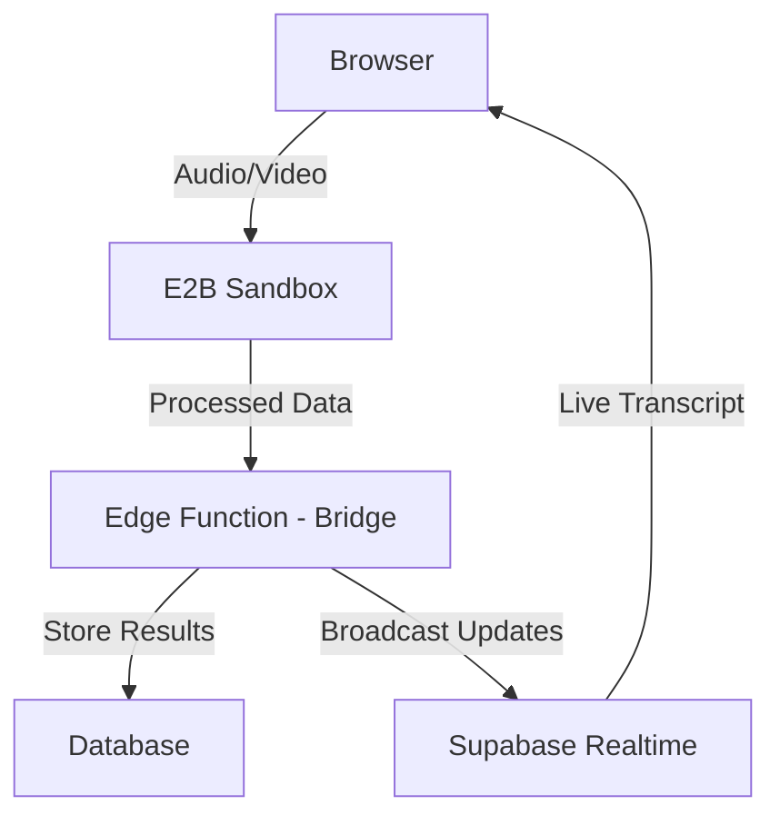

# E2B Integration Discovery for AI Interview Platform

## Introduction

This document explores the potential integration of [E2B](https://e2b.dev) sandboxes into our interview platform architecture. E2B provides isolated, cloud-based compute environments (sandboxes) that can be rapidly provisioned (~150ms startup time) and easily managed via SDK.

## Current Architecture

Our interview platform currently implements a triangular architecture:

1. **Client-Side (Browser)**:
   - Captures audio/video through WebRTC
   - Processes audio into chunks (2-second intervals)
   - Converts chunks to base64
   - Sends to Edge Functions

2. **Edge Functions (Server-Side)**:
   - Receives audio chunks
   - Processes speech-to-text conversion
   - Stores transcript entries in the database
   - Broadcasts transcript updates via Supabase Realtime

3. **Database**:
   - Multi-tenant data isolation
   - Structured transcript data storage
   - Relationships between sessions, candidates, positions

## Proposed E2B Integration

### Architectural Changes

Instead of relying solely on Edge Functions for processing, each interview session would get its own dedicated E2B sandbox:



### Implementation Details

1. **Interview Session Initialization**:
   ```javascript
   import { Sandbox } from '@e2b/sdk'
   
   // When starting an interview
   const sandbox = await Sandbox.create({
     metadata: { 
       interviewId: session.id, 
       tenantId,
       candidateId,
       positionId
     }
   })
   ```

2. **Audio Processing Migration**:
   ```javascript
   // Instead of sending directly to Edge Function:
   const processAudioChunk = async (chunk, sessionId, tenantId, speaker, sequenceNumber) => {
     // Convert audio chunk to format E2B can process
     const arrayBuffer = await chunk.arrayBuffer();
     const base64Audio = btoa(/*...*/);
     
     // Upload to E2B sandbox
     await sandbox.filesystem.write('/tmp/audio_chunk.webm', base64Audio);
     
     // Process in sandbox
     const result = await sandbox.run(
       'python /app/process_transcript.py /tmp/audio_chunk.webm'
     );
     
     // Forward results to Edge Function for DB storage
     await supabase.functions.invoke('transcript-bridge', {
       body: {
         session_id: sessionId,
         tenant_id: tenantId,
         transcript_data: result,
         speaker,
         sequence_number: sequenceNumber,
       },
     });
   };
   ```

3. **Enhanced Processing Capabilities**:
   ```javascript
   // Install specialized packages in the sandbox
   await sandbox.run('pip install openai-whisper numpy scipy')
   
   // Run advanced analysis
   await sandbox.run('python /app/analyze_sentiment.py')
   await sandbox.run('python /app/extract_keywords.py')
   ```

4. **Session Termination and Data Extraction**:
   ```javascript
   // When interview ends
   const fullTranscript = await sandbox.filesystem.read(
     '/app/transcripts/full_transcript.json'
   )
   const analysisResults = await sandbox.filesystem.read(
     '/app/analysis/results.json'
   )
   
   // Save final results
   await supabase.functions.invoke('interview-completion', {
     body: {
       session_id: sessionId,
       tenant_id: tenantId,
       full_transcript: fullTranscript,
       analysis: analysisResults
     },
   });
   
   // Close and clean up the sandbox
   await sandbox.close()
   ```

## Benefits of E2B Integration

### Performance and Scalability
- **Dedicated Resources**: Each interview gets isolated computing resources
- **True Horizontal Scaling**: Process scales linearly with the number of concurrent interviews
- **No Resource Contention**: One interview's processing doesn't affect others
- **Burst Capacity**: Can handle sudden spikes in interview volume
- **Geographic Distribution**: Could run sandboxes closer to participants for lower latency

### Flexibility and Capabilities
- **Enhanced Processing**: Run sophisticated analysis that might be too heavy for Edge Functions
- **Dynamic Package Installation**: Install specific tools needed for particular interview types
- **Customizable Processing**: Different position types could use different analysis pipelines
- **Persistent State**: Maintain context throughout the entire interview
- **File System Access**: Store intermediate results and analysis artifacts

### Operational Benefits
- **Resource Efficiency**: Only pay for compute time during active interviews
- **Rapid Startup**: ~150ms provisioning time means virtually no initialization delay
- **Complete Isolation**: Perfect separation between tenant data
- **Automatic Cleanup**: No lingering sensitive data after interview completion

## Edge Functions vs E2B Sandboxes

While E2B would replace some Edge Function responsibilities, a hybrid architecture is recommended:

| Responsibility | Current Architecture | E2B Integration |
|----------------|---------------------|-----------------|
| Audio/Video Processing | Edge Function | E2B Sandbox |
| Transcription | Edge Function | E2B Sandbox |
| Advanced Analysis | Limited/None | E2B Sandbox |
| Database Operations | Edge Function | Edge Function (Bridge) |
| Authentication | Edge Function | Edge Function |
| API Endpoints | Edge Function | Edge Function |

## Implementation Considerations

### Security
- Need proper authentication between browser, sandbox, and database
- Ensure credentials aren't stored in sandboxes
- Implement proper tenant isolation

### Cost Analysis
- E2B pricing compared to current Edge Function costs
- Potentially higher compute costs but with better performance and capabilities
- Reduced development costs due to simplified architecture

### Development Timeline
1. Create proof-of-concept with a single interview flow
2. Develop and test the bridge Edge Function
3. Implement proper error handling and fallback mechanisms
4. Scale to production with monitoring

## Questions for E2B CEO

Before proceeding with integration, these are key questions we would want to ask E2B's CEO:

### Technical Capabilities
1. What is the maximum runtime for a sandbox before it's automatically terminated?
2. Are there any limitations on real-time streaming data processing that would affect audio/video handling?
3. What is the recommended approach for handling WebRTC streams in E2B sandboxes?
4. Do you support WebAssembly for specialized audio processing?
5. What are the memory and CPU limits for individual sandboxes?

### Scalability and Reliability
1. What happens if we need to scale to hundreds or thousands of concurrent interviews?
2. What is your approach to handling sandbox failures during critical operations?
3. Do you offer geographic distribution for lower latency in different regions?
4. What kind of uptime SLA do you offer for production workloads?
5. How do you handle burst capacity when demand suddenly increases?

### Security and Compliance
1. How are sandboxes isolated from each other to ensure tenant data separation?
2. What security certifications does E2B have (SOC2, HIPAA, etc.)?
3. How is data encrypted in transit and at rest?
4. What is your approach to vulnerability management and updates?
5. Can we conduct security audits of the infrastructure?

### Pricing and Costs
1. What is the pricing model for high-volume, ephemeral sandbox usage?
2. Are there additional costs for data transfer or storage?
3. Do you offer enterprise pricing for predictable monthly costs?
4. What would be the estimated cost for running 1,000 hour-long interviews per month?
5. Are there any cost optimization strategies you recommend for our use case?

### Integration and Support
1. Do you have experience with similar audio/video processing use cases?
2. What kind of technical support is available during integration?
3. Do you offer professional services for specialized integrations?
4. How actively is the SDK maintained and updated?
5. What is your roadmap for features that might impact our use case?

### Vendor Risk Assessment
1. What is your company's funding situation and long-term viability?
2. What happens to our workloads if E2B is acquired or changes direction?
3. Do you have a documented exit strategy for customers if needed?
4. How frequently do you introduce breaking changes to your API?
5. What is your disaster recovery approach for your own infrastructure?

## Conclusion

Integrating E2B sandboxes into our interview platform would significantly enhance our processing capabilities while maintaining the core benefits of our triangular architecture. The primary advantages are improved scalability, resource isolation, and advanced processing capabilities.

This approach would allow us to offer more sophisticated interview analysis while ensuring the platform can scale to enterprise-level demand without architectural limitations.

## Top 5 Critical Questions

If limited to only five questions when evaluating E2B for our interview platform, these would be the most crucial to ask:

1. **"How well does your platform handle real-time streaming data processing, specifically for continuous audio streams that need immediate processing?"** 
   - This directly addresses our core technical requirement of live interview transcription

2. **"What would be the estimated cost for running 1,000 hour-long interviews per month, and how does this scale as we grow?"**
   - Understanding the economics is critical before committing to this architecture

3. **"What security certifications does E2B have, and how is sensitive interview data protected in your infrastructure?"**
   - Interview data contains sensitive information requiring strict protection

4. **"What happens if a sandbox fails mid-interview, and what recovery mechanisms are in place?"**
   - Interview interruptions would severely impact user experience and trust

5. **"What is your company's long-term viability, and what happens to our workloads if E2B is acquired or changes direction?"**
   - We need to assess platform longevity before building a core feature on it

## Initial E2B Consultation Findings

Following an initial consultation with Vasek from E2B, we gained valuable insights that address many of our questions. Here's a summary of the key findings:

### Technical Capabilities
- **Spin-Up Time**: Approximately 200 milliseconds, confirming our expectations
- **Real-Time Processing**: Suitable for WebRTC and other real-time APIs, validating our interview use case
- **Failure Handling**: E2B doesn't manage sandbox crashes internally - we would need to implement our own recovery system

### Scalability and Reliability
- **Horizontal Scaling**: Supports high concurrency rates for simultaneous interviews
- **SLA Guarantees**: Offers high uptime (potentially 99.9%)
- **Recovery Mechanisms**: In case of sandbox failure, another can be quickly spun up (200ms) to maintain continuity
- **Large-Scale Support**: Can handle tens of millions of sandboxes for large customers

### Security and Compliance
- **SOC 2 Certification**: Currently in the audit process (not yet complete)
- **Enterprise Security**: Provides Data Processing Agreements (DPAs) to enterprise customers
- **Security Documentation**: Completes security questionnaires for enterprise inquiries

### Pricing and Business Model
- **Enterprise Pricing**: Based on number of starter sandboxes and compute resources
- **Flexible Models**: Accommodates both numerous short-lived sandboxes or fewer long-running ones
- **Enterprise Contracts**: Tailored for specific customer needs

### Company Stability
- **Funding**: Raised $11 million in seed funding last year
- **Strategic Focus**: Developing agent-driven functionalities and coordination tools
- **Roadmap**: Moving toward AI-driven agents optimizing sandbox environments

### Strategic Alignment Concerns

During further discussion about our specific use case, Vasek raised some important considerations about E2B's strategic direction:

- **Current Product Fit**: While our interview processing use case is technically feasible with E2B, it isn't their primary focus
- **Product Direction**: E2B is increasingly focused on AI agent use cases rather than general-purpose compute
- **Future Divergence**: Vasek cautioned: _"The direction we are going is AI focused, like for the agent... I can't 100% promise that the roadmap that we are going to be building might not diverge from what you need."_
- **Core Infrastructure**: Their focus is building "infrastructure for coordination agents to be effective with working on a large code base, installing dependencies on the fly, starting processes and monitoring them"
- **Potential Alternative**: Vasek initially questioned whether a traditional server approach might be more appropriate for our use case

This strategic direction doesn't invalidate our technical approach but adds a risk factor to consider. While the sandbox functionality may remain stable, E2B's feature prioritization might not align with our specific needs for interview processing in the long term.

### Next Steps
- Trial the sandbox to evaluate performance in our specific interview context
- Develop and test our own recovery mechanisms for potential sandbox failures
- Assess the cost implications for our expected interview volume
- Review their DPA once we express formal interest
- **Consider alternative options**: Given the potential strategic misalignment, we should also evaluate more traditional approaches if they can meet our performance and isolation requirements

These findings largely validate our integration approach while providing crucial information about limitations we need to address, particularly around failure recovery and long-term strategic alignment. 