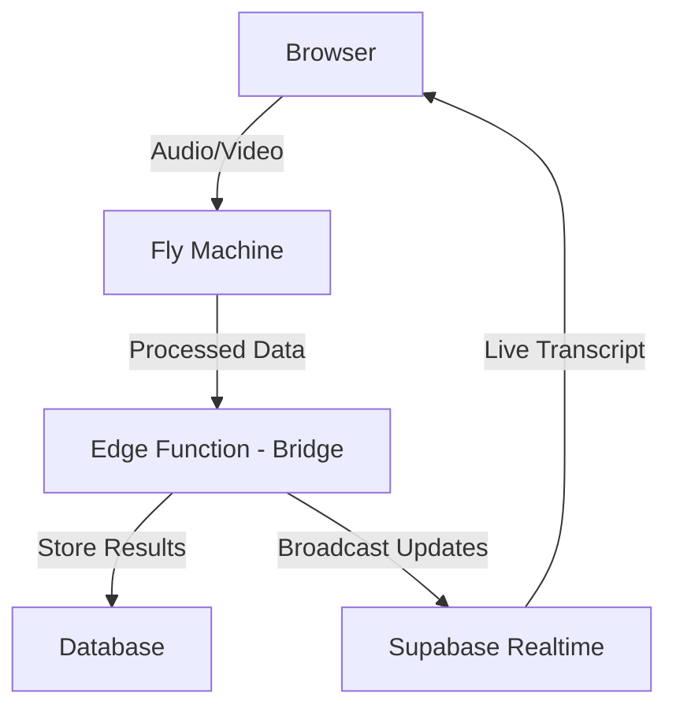

# Fly.io Integration Discovery for AI Interview Platform

## Introduction

This document explores the potential integration of [Fly.io](https://fly.io) Machines into our interview platform architecture. Fly.io provides distributed, globally-available virtual machines with ultra-fast startup times (under 1 second) and comprehensive management via both CLI and REST API.

## Current Architecture

Our interview platform currently implements a triangular architecture:

1. **Client-Side (Browser)**:
   - Captures audio/video through WebRTC
   - Processes audio into chunks (2-second intervals)
   - Converts chunks to base64
   - Sends to Edge Functions

2. **Edge Functions (Server-Side)**:
   - Receives audio chunks
   - Processes speech-to-text conversion
   - Stores transcript entries in the database
   - Broadcasts transcript updates via Supabase Realtime

3. **Database**:
   - Multi-tenant data isolation
   - Structured transcript data storage
   - Relationships between sessions, candidates, positions

## Proposed Fly.io Integration

### Architectural Changes

Similar to the E2B approach, we would replace or augment Edge Functions with Fly Machines, with each interview getting a dedicated VM:



### Multi-Tenant Implementation

A key advantage of Fly.io is its hierarchical organizational structure, which maps perfectly to our multi-tenant architecture:

#### Fly Apps vs Fly Machines

**Fly Apps**:
- Function as organizational containers that group related Machines
- Provide namespace and network isolation between tenants
- Have unique subdomains (e.g., `interviews-tenant-123.fly.dev`)
- Store shared secrets and configuration (API keys, credentials)
- Control network isolation via the `network` parameter
- Manage global routing and IP addresses
- Serve as a "tenant container" in our architecture

**Fly Machines**:
- The actual VMs that run our interview processing code
- Always belong to a specific App (parent-child relationship)
- Have individual resource allocations (CPU, memory)
- Can be started/stopped/destroyed independently
- Share configuration and secrets from their parent App
- Function as "interview processors" in our architecture

#### Network Isolation Configuration

While Fly Apps provide organizational separation, explicit network rules are required to ensure complete tenant isolation:

1. Create separate private networks for each tenant app:
   ```bash
   # When creating the app
   curl -X POST \
     -H "Authorization: Bearer ${FLY_API_TOKEN}" \
     "${FLY_API_HOSTNAME}/v1/apps" \
     -d '{
       "app_name": "interviews-tenant-123",
       "org_slug": "personal",
       "network": "tenant-123-network"
     }'
   ```

2. Configure firewall rules to restrict inter-app communication:
   ```bash
   # Using flyctl to set network rules
   fly network firewall add interviews-tenant-123 \
     --source-app=interviews-tenant-123 \
     --destination=internal \
     --allow
   ```

3. Use private networking for sensitive communications between Machines within the same tenant App

#### Implementation Approach

1. Create a Fly App per tenant organization (complete tenant isolation)
2. Within each tenant app, create ephemeral Machines for individual interviews (one VM per interview)
3. Maintain complete isolation between tenants via explicit network segmentation at the App level
4. Use shared secrets at the App level for tenant-specific API keys
5. Configure machine-specific parameters like regional deployment based on interview participants

This hierarchical structure provides both the isolation we need between tenants and the flexibility to manage individual interview resources efficiently.

### Implementation Details

1. **Tenant App Creation**:
   ```bash
   curl -X POST \
     -H "Authorization: Bearer ${FLY_API_TOKEN}" \
     "${FLY_API_HOSTNAME}/v1/apps" \
     -d '{
       "app_name": "interviews-tenant-123",
       "org_slug": "personal",
       "network": "tenant-123-network"
     }'
   ```

2. **Interview Machine Provisioning**:
   ```bash
   fly machine run \
     --app interviews-tenant-123 \
     --region ord \
     --name "interview-${SESSION_ID}" \
     --env SESSION_ID=${SESSION_ID} \
     --env TENANT_ID=${TENANT_ID} \
     --env CANDIDATE_ID=${CANDIDATE_ID} \
     --env POSITION_ID=${POSITION_ID} \
     --port 8080:http \
     --vm-memory 1024 \
     --vm-cpus 1 \
     --destroy-on-exit \
     ./interview-processor-image
   ```

3. **Audio Processing**:
   ```javascript
   // Modified processAudioChunk function
   const processAudioChunk = async (chunk, sessionId, tenantId, speaker, sequenceNumber) => {
     // Convert audio chunk to base64
     const arrayBuffer = await chunk.arrayBuffer();
     const base64Audio = btoa(/*...*/);
     
     // Send to Fly Machine endpoint
     const response = await fetch(`https://interview-${sessionId}.fly.dev/process-audio`, {
       method: 'POST',
       headers: {
         'Content-Type': 'application/json',
         'Authorization': `Bearer ${apiToken}`
       },
       body: JSON.stringify({
         audio_chunk: base64Audio,
         speaker,
         sequence_number: sequenceNumber
       })
     });
     
     // Process result
     const result = await response.json();
     
     // Update database (could be done by Fly Machine or by an Edge Function)
     // Option 1: Fly Machine updates database directly
     // Option 2: Send results to bridge Edge Function
     await supabase.functions.invoke('transcript-bridge', {
       body: {
         session_id: sessionId,
         tenant_id: tenantId,
         transcript_data: result,
         speaker,
         sequence_number: sequenceNumber,
       },
     });
   };
   ```

4. **Interview Completion and Cleanup**:
   ```javascript
   // With --destroy-on-exit flag, machine will terminate when process completes
   // Final results can be stored in the database before shutdown
   
   // Alternative: manually destroy the machine
   await fetch(`${FLY_API_HOSTNAME}/v1/apps/interviews-tenant-123/machines/${machineId}`, {
     method: 'DELETE',
     headers: {
       'Authorization': `Bearer ${FLY_API_TOKEN}`
     }
   });
   ```

### WebRTC Configuration for Real-Time Communication

Since our platform leverages OpenAI's real-time API for WebRTC functionality, our configuration needs are different from a standard WebRTC implementation:

1. **OpenAI Real-Time API Integration**:
   - The Fly Machine would handle communication with OpenAI's real-time endpoints
   - Audio streams are processed through OpenAI's infrastructure rather than directly between participants
   ```javascript
   // Example OpenAI real-time API integration in Fly Machine
   import OpenAI from 'openai';
   
   const openai = new OpenAI({
     apiKey: process.env.OPENAI_API_KEY,
   });
   
   // Set up real-time audio stream processing
   const stream = await openai.audio.realtime.connect();
   ```

2. **Fly Proxy Configuration**:
   ```toml
   # Example fly.toml configuration for API proxying
   [[services]]
     internal_port = 8080
     protocol = "tcp"
     
     [[services.ports]]
       port = 443
     
     [[services.tcp_checks]]
       interval = "15s"
       timeout = "2s"
       grace_period = "10s"
   ```

3. **Network Optimizations**:
   - Configure Fly Machines in regions closest to OpenAI's endpoints
   - Ensure low-latency connections for real-time audio processing
   - Set appropriate timeouts for WebSocket connections

This approach leverages OpenAI's infrastructure for the complex WebRTC handling, simplifying our implementation while still requiring careful network configuration in Fly.io to ensure optimal performance.

## Benefits of Fly.io Integration

### Performance and Scalability
- **Fast Startup**: Sub-second VM initialization, perfect for on-demand interview processing
- **Global Distribution**: Machines can be deployed in regions closest to participants
- **Region-Specific Placement**: Explicit control over which region runs each interview
- **Autoscaling**: Can automatically handle burst capacity during peak periods
- **Resource Flexibility**: Adjust memory and CPU based on interview requirements

### Operational Advantages
- **Multi-Tenant Architecture**: Clean separation between tenant data and processing
- **Complete Isolation**: Each interview runs in a separate VM with no resource contention
- **Automatic Cleanup**: `--destroy-on-exit` flag ensures no lingering resources
- **Cost Efficiency**: Pay only for actual runtime of interviews
- **Standby Machines**: Can provision standby VMs for critical interviews or high-availability

### Technical Features
- **Docker-Based Deployment**: Package all dependencies consistently
  - Fly.io can also generate containers for popular frameworks if you don't have a Dockerfile
  - Simplifies development workflow for standard interview processing images
- **Secret Management**: Store API keys and credentials securely at app level
- **File-Based Configuration**: Pass configuration through files rather than environment variables
- **Built-in Monitoring**: Access logs and metrics for debugging
- **TLS Termination**: Automatic HTTPS for all machine endpoints

### Developer Experience
- **Simple CLI**: Easy-to-use interface for development and testing
- **REST API**: Full automation capabilities for production
- **Local Testing**: Test the same Docker images locally before deployment

## Fly.io vs E2B Comparison

| Aspect | Fly.io | E2B | Advantage |
|--------|--------|-----|-----------|
| **Startup Time** | Under 1 second | ~200ms | E2B (slightly) |
| **Production Focus** | Designed for production workloads | Development/AI agent focus | Fly.io |
| **Global Distribution** | 30+ regions worldwide | Limited | Fly.io |
| **Multi-Tenant Support** | Built-in app/network isolation | Limited | Fly.io |
| **Platform Maturity** | Established since 2017 with significant funding | Early-stage startup | Fly.io |
| **Strategic Alignment** | General-purpose compute with code execution focus | AI agent infrastructure | Fly.io |
| **Compliance** | Industry standards (in production) | SOC2 in progress | Fly.io |
| **Pricing Model** | Pay As You Go (since Oct 2024) | Custom enterprise pricing | Fly.io |
| **Documentation** | Comprehensive, production-focused | Limited, development-focused | Fly.io |
| **Community Support** | Active community | Limited | Fly.io |

## Implementation Considerations

### Security
- All machine-to-machine communication should be authenticated
- Sensitive credentials should be stored as app secrets
- Each tenant should have network isolation
- WebRTC streams need proper encryption

### Performance Optimization
- Select appropriate VM sizes based on processing needs
- Place VMs in regions closest to participants
- Consider standby machines for zero-startup time in critical scenarios
- Implement proper error handling for machine failures

### Cost Management
- Use `--destroy-on-exit` to ensure machines terminate after interviews
- Benefit from Fly.io's "Pay As You Go" pricing model (updated October 2024)
  - Only pay for actual compute resources used during interviews
  - No minimum costs or idle charges
- Consider auto-stop options for idle machines
- Monitor usage patterns to optimize resource allocation
- Start with minimal VM sizes and scale up as needed

### Development Timeline
1. Create proof-of-concept with a single interview flow in Fly.io
2. Develop Docker image for interview processing
3. Implement automated machine provisioning for interview sessions
4. Add monitoring and error recovery
5. Test scaling with simulated load
6. Roll out to production with careful monitoring

## Questions for Fly.io

Before proceeding with integration, these are key questions we would want to ask Fly.io:

### Technical Capabilities
1. What is the actual startup time for machines in various regions?
2. Are there any latency considerations when connecting to OpenAI's real-time API from different Fly.io regions?
3. What is the maximum runtime for a machine before it's automatically terminated?
4. What are the bandwidth limits for machines?
5. What are your recommendations for optimizing WebSocket connections to external APIs like OpenAI?

### Scalability and Reliability
1. What happens during region outages or machine failures?
2. What kind of SLA can we expect for production workloads?
3. Are there any limits on concurrent machines per organization?
4. How do you handle burst capacity during sudden demand increases?
5. What monitoring and alerting capabilities are available?

### Security and Compliance
1. What security certifications does Fly.io have?
2. How is network traffic isolated between different apps and machines?
3. What data residency options are available for compliance requirements?
4. Do you support private networking between machines and our other infrastructure?
5. What encryption is used for data in transit and at rest?

### Pricing and Costs
1. What would be the estimated cost for running 1,000 hour-long interviews per month?
2. Are there additional costs for data transfer between regions?
3. Are there volume discounts for predictable workloads?
4. How does pricing compare between different regions?
5. Are there any hidden costs we should be aware of?

### Integration and Support
1. What support channels are available during integration?
2. Do you have examples of similar real-time processing workloads?
3. What kind of documentation is available for advanced use cases?
4. How stable is your API and CLI interface?
5. What is the upgrade process for security patches?

## Top 5 Critical Questions

If limited to only five questions when evaluating Fly.io for our interview platform, these would be the most crucial to ask:

1. **"What is the actual performance and reliability for handling WebRTC streams and real-time audio processing in Fly Machines?"**
   - This directly addresses our core technical requirement of live interview management

2. **"What would be the estimated cost for running 1,000 hour-long interviews per month across global regions, and how does this scale?"**
   - Understanding the economics is critical before committing to this architecture

3. **"What security certifications and compliance capabilities does Fly.io offer for handling sensitive interview data?"**
   - Interview recordings and transcripts contain sensitive information requiring proper protection

4. **"What happens if a machine fails mid-interview, and what recovery mechanisms are recommended?"**
   - We need to understand how to handle potential failures during critical interview sessions

5. **"How mature is your platform for production workloads, and what is your track record for API stability and breaking changes?"**
   - We need confidence in the platform's stability before building core functionality on it

## Conclusion

Integrating Fly.io Machines into our interview platform offers significant advantages over both our current architecture and the E2B alternative. The combination of production-ready infrastructure, global distribution, multi-tenant isolation, and Docker-based deployment provides an ideal foundation for our interview processing needs.

The strategic alignment between Fly.io's focus as a general-purpose compute platform and their expansion into code execution environments aligns well with our requirements for reliable, scalable interview processing.

While implementation will require careful consideration of security, performance, and cost optimization, the maturity of the platform and comprehensive documentation significantly reduce technical risk.

We recommend proceeding with a proof-of-concept implementation to validate performance and cost assumptions before committing to a full production rollout. 