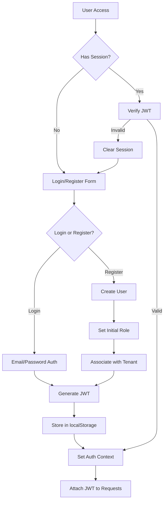
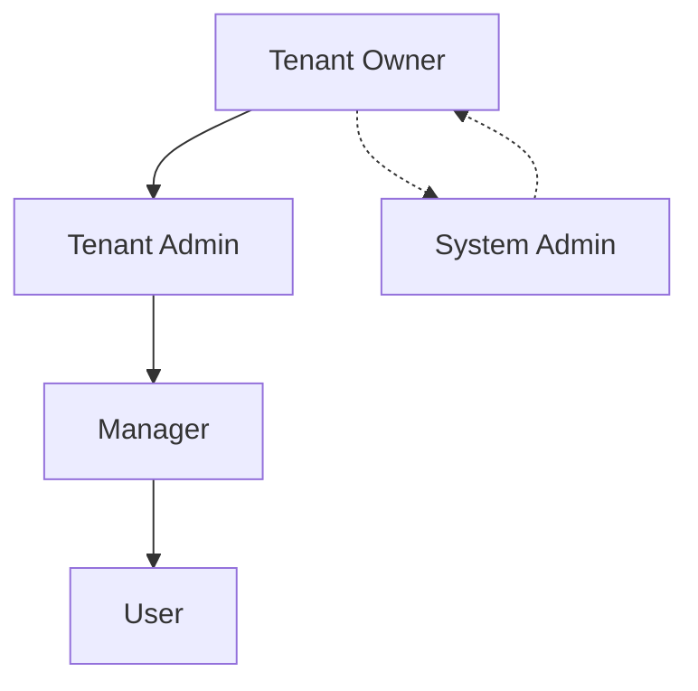

# User Authentication & Permissions Flow

## Overview

This document outlines the authentication, authorization, and permission management system for the AI Interview Insights Platform. The platform implements a role-based access control (RBAC) system within a multi-tenant architecture, ensuring secure data isolation and appropriate access privileges.

## Authentication System

### Authentication Flow



### Authentication Components

1. **`AuthForm.tsx`**
   - Handles login and registration forms
   - Validates user inputs
   - Submits credentials to Supabase Auth

2. **`AuthProvider.tsx`**
   - Manages authentication state
   - Provides auth context to components
   - Handles session persistence

3. **`useAuth.tsx`**
   - Custom hook for accessing auth context
   - Exposes login, logout, and session methods
   - Retrieves user permissions and roles

### Code Examples

```typescript
// Example from AuthForm.tsx
const signUp = async (email: string, password: string, tenantId: string) => {
  const { data, error } = await supabase.auth.signUp({
    email,
    password,
    options: {
      data: {
        tenant_id: tenantId,
      },
    },
  });
  
  if (error) throw error;
  
  // Create user record in public.users table with role
  if (data.user) {
    await supabase
      .from('users')
      .insert({
        id: data.user.id,
        tenant_id: tenantId,
        role: 'user', // Default role
      });
  }
  
  return data;
};
```

## Role & Permission System

### Role Hierarchy



### Permission Structure

The system uses a combination of role-based permissions and tenant-based isolation:

```typescript
// Permission structure
interface Permission {
  resource: string;  // e.g., 'candidates', 'positions', 'interviews'
  action: string;    // e.g., 'create', 'read', 'update', 'delete'
  constraints?: {    // Optional conditions
    ownerOnly?: boolean;
    status?: string[];
  };
}

// Role definition
interface Role {
  name: string;
  permissions: Permission[];
  inherits?: string[]; // Roles this role inherits from
}
```

### User Role Management

```sql
-- Users table structure with role
CREATE TABLE users (
  id UUID PRIMARY KEY REFERENCES auth.users ON DELETE CASCADE,
  tenant_id UUID NOT NULL REFERENCES tenants(id) ON DELETE CASCADE,
  role TEXT NOT NULL DEFAULT 'user',
  created_at TIMESTAMPTZ NOT NULL DEFAULT NOW(),
  updated_at TIMESTAMPTZ NOT NULL DEFAULT NOW()
);

-- Function to get user permissions
CREATE OR REPLACE FUNCTION get_user_permissions(user_id UUID)
RETURNS JSONB AS $$
DECLARE
  user_role TEXT;
  permissions JSONB;
BEGIN
  -- Get user role
  SELECT role INTO user_role FROM users WHERE id = user_id;
  
  -- Get permissions for role (simplified example)
  CASE user_role
    WHEN 'owner' THEN
      permissions := '{"candidates": ["create", "read", "update", "delete"], "positions": ["create", "read", "update", "delete"], "interviews": ["create", "read", "update", "delete"]}';
    WHEN 'admin' THEN
      permissions := '{"candidates": ["create", "read", "update"], "positions": ["create", "read", "update"], "interviews": ["create", "read", "update"]}';
    WHEN 'user' THEN
      permissions := '{"candidates": ["read"], "positions": ["read"], "interviews": ["read"]}';
    ELSE
      permissions := '{}';
  END CASE;
  
  RETURN permissions;
END;
$$ LANGUAGE plpgsql SECURITY DEFINER;
```

## JWT Claims & Authorization

### JWT Structure

```json
{
  "aud": "authenticated",
  "exp": 1714416090,
  "sub": "user-uuid-here",
  "email": "user@example.com",
  "app_metadata": {
    "tenant_id": "tenant-uuid-here",
    "role": "admin"
  },
  "user_metadata": {
    "name": "User Name"
  }
}
```

### JWT Claim Usage

```typescript
// Example from useAuth.tsx
const getUserRole = () => {
  const session = supabase.auth.getSession();
  if (!session?.data?.session) return null;
  
  const role = session.data.session.user.app_metadata?.role;
  return role || 'user'; // Default to 'user' if not specified
};

// Example permission check
const canCreatePosition = () => {
  const role = getUserRole();
  return ['owner', 'admin'].includes(role);
};
```

## Row-Level Security (RLS) Implementation

### RLS Policies

```sql
-- Example RLS policy for candidates table
ALTER TABLE candidates ENABLE ROW LEVEL SECURITY;

-- Users can only see candidates in their tenant
CREATE POLICY tenant_isolation_policy ON candidates
  FOR ALL
  TO authenticated
  USING (tenant_id = (SELECT tenant_id FROM users WHERE id = auth.uid()));

-- Only admins and owners can delete candidates
CREATE POLICY admin_delete_policy ON candidates
  FOR DELETE
  TO authenticated
  USING (
    EXISTS (
      SELECT 1 FROM users 
      WHERE id = auth.uid() 
      AND tenant_id = candidates.tenant_id
      AND role IN ('admin', 'owner')
    )
  );
```

### Function-Based Access Control

```sql
-- Function to check if user has permission
CREATE OR REPLACE FUNCTION user_has_permission(
  resource TEXT,
  action TEXT
) RETURNS BOOLEAN AS $$
DECLARE
  user_role TEXT;
BEGIN
  -- Get user role
  SELECT role INTO user_role FROM users WHERE id = auth.uid();
  
  -- Check permission based on role and action
  IF user_role = 'owner' THEN
    RETURN TRUE; -- Owners have all permissions
  ELSIF user_role = 'admin' AND action != 'delete' THEN
    RETURN TRUE; -- Admins can do everything except delete
  ELSIF user_role = 'user' AND action = 'read' THEN
    RETURN TRUE; -- Users can only read
  ELSE
    RETURN FALSE;
  END IF;
END;
$$ LANGUAGE plpgsql SECURITY DEFINER;
```

## UI Implementation

### Permission-Based Rendering

```tsx
// Example of permission-based UI rendering
const PositionsPage = () => {
  const { canCreatePosition } = usePermissions();
  
  return (
    <div>
      <h1>Positions</h1>
      {canCreatePosition && (
        <Button onClick={() => navigate('/positions/new')}>
          Add Position
        </Button>
      )}
      <PositionsList />
    </div>
  );
};

// Custom hook for permissions
const usePermissions = () => {
  const { user } = useAuth();
  const role = user?.app_metadata?.role || 'user';
  
  return {
    canCreatePosition: ['owner', 'admin'].includes(role),
    canEditPosition: ['owner', 'admin'].includes(role),
    canDeletePosition: ['owner'].includes(role),
    // Additional permission checks
  };
};
```

### API Request Authorization

```typescript
// Example API client with authorization
const apiClient = {
  async fetch(endpoint: string, options = {}) {
    const session = await supabase.auth.getSession();
    const token = session?.data?.session?.access_token;
    
    if (!token) {
      throw new Error('Not authenticated');
    }
    
    const response = await fetch(`/api/${endpoint}`, {
      ...options,
      headers: {
        ...options.headers,
        Authorization: `Bearer ${token}`,
      },
    });
    
    const data = await response.json();
    
    if (!response.ok) {
      throw new Error(data.message || 'API request failed');
    }
    
    return data;
  }
};
```

## Security Considerations

### Password Policies

- Minimum 8 characters
- Requires upper and lowercase letters, numbers, and special characters
- Implementation uses Supabase Auth password policies

### Session Management

- JWT expiration set to 1 hour
- Refresh tokens used for silent re-authentication
- Session revocation on security-sensitive actions

### Privilege Escalation Prevention

- Role changes require admin approval
- Audit logging for all role and permission changes
- Strict validation of JWT claims on the server

### Tenant Isolation Safeguards

- Database triggers verify tenant_id consistency
- Additional checks beyond RLS policies for critical operations
- Regular security audits of tenant isolation effectiveness

## Error Handling

### Authentication Errors

- Invalid credentials
- Account locked
- Email verification required
- Session expired

### Authorization Errors

- Insufficient permissions
- Tenant access denied
- Resource not found (or not visible to user)
- Token validation failed

## Future Enhancements

1. **Social Authentication**
   - Google, GitHub, and LinkedIn integration
   - Identity federation with enterprise systems

2. **MFA Implementation**
   - Time-based one-time passwords (TOTP)
   - SMS verification as fallback

3. **Granular Permission System**
   - Custom role definitions
   - Resource-level permissions
   - User-specific permission overrides

4. **Delegated Administration**
   - Tenant admins can manage permissions within their tenant
   - Limited delegation of administrative privileges

## Conclusion

The authentication and permission system provides robust security through multiple layers:

1. **JWT-based authentication** ensuring secure identity verification
2. **Role-based permissions** controlling feature access
3. **Row-level security policies** enforcing data isolation
4. **UI-level permission checks** preventing unauthorized actions

This multi-layered approach ensures that users can only access and modify data appropriate to their role within their tenant, maintaining security in a multi-tenant environment. 