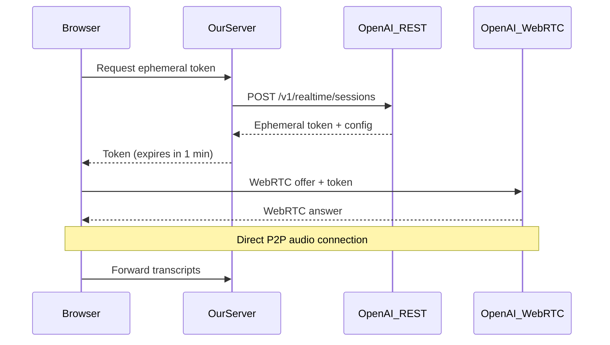

# AI Interview Insights Platform - System Patterns

## System Architecture Overview

The AI Interview Insights Platform is built on a multi-tenant architecture using Supabase as the core infrastructure provider. The system follows a client-server model with a React frontend and Supabase-powered backend (PostgreSQL database, authentication, storage, edge functions, and realtime features).

### Architecture Diagram

```
┌─────────────────┐     ┌─────────────────────────────────────┐
│                 │     │              Supabase               │
│                 │     │                                     │
│    Frontend     │     │  ┌─────────┐       ┌────────────┐  │
│    (React,      │     │  │         │       │            │  │
│     Vite,       │◄────┼─►│ PostgREST◄───────► PostgreSQL │  │
│     Tailwind)   │     │  │         │       │            │  │
│                 │     │  └─────────┘       └────────────┘  │
│                 │     │                                     │
│                 │     │  ┌─────────┐       ┌────────────┐  │
│                 │     │  │         │       │            │  │
│                 │◄────┼─►│ Auth    │       │ Storage    │  │
│                 │     │  │         │       │            │  │
│                 │     │  └─────────┘       └────────────┘  │
│                 │     │                                     │
│                 │     │  ┌─────────┐       ┌────────────┐  │
│                 │     │  │         │       │            │  │
│                 │◄────┼─►│ Realtime│       │ Edge       │  │
│                 │     │  │         │       │ Functions  │  │
└─────────────────┘     │  └─────────┘       └────────────┘  │
                        │                                     │
                        └─────────────────────────────────────┘
                                        │
                                        ▼
                        ┌─────────────────────────────────────┐
                        │        External Services            │
                        │                                     │
                        │  ┌─────────┐       ┌────────────┐  │
                        │  │         │       │            │  │
                        │  │ OpenAI  │       │ PDF.co     │  │
                        │  │         │       │            │  │
                        │  └─────────┘       └────────────┘  │
                        │                                     │
                        │  ┌─────────┐       ┌────────────┐  │
                        │  │         │       │            │  │
                        │  │ PDL     │       │ VideoSDK   │  │
                        │  │         │       │            │  │
                        │  └─────────┘       └────────────┘  │
                        │                                     │
                        └─────────────────────────────────────┘
```

## Development and Deployment Workflow

The project follows a structured development and deployment workflow:

### CI/CD Pipeline

```
┌───────────────┐     ┌───────────────┐     ┌───────────────────────┐
│               │     │               │     │                       │
│    Local      │     │    GitHub     │     │ Supabase/Vercel       │
│  Development  │────►│  Repository   │────►│ Automated Deployment  │
│               │     │               │     │                       │
└───────────────┘     └───────────────┘     └───────────────────────┘
```

1. **Local Development**
   - Developers work with local Supabase instance
   - Environment variables in .env and supabase_secrets.env files
   - Edge functions served locally with --env-file flag

2. **GitHub Integration**
   - Code pushed to thelabvenice/triangularai repository
   - Branch-based development workflow
   - Pull requests for code review

3. **Supabase Integration**
   - Connected to GitHub repository
   - Database branching enabled for development
   - Migrations automatically applied from supabase directory
   - Edge functions automatically deployed

4. **Vercel Deployment**
   - Frontend deployed to Vercel
   - Environment variables synchronized with Supabase
   - Preview deployments for pull requests
   - Production deployment from main branch

## Data Flow Patterns

### Authentication Flow

```
┌──────────┐     ┌───────────────┐     ┌───────────────┐
│          │     │               │     │               │
│  Client  │────►│ Supabase Auth │────►│ JWT Creation  │
│          │     │               │     │               │
└──────────┘     └───────────────┘     └───────┬───────┘
                                              │
┌──────────┐     ┌───────────────┐     ┌──────▼───────┐
│          │     │               │     │               │
│Protected │◄────│  RLS Policies │◄────│ JWT with      │
│Resources │     │               │     │ tenant_id     │
│          │     │               │     │ claim         │
└──────────┘     └───────────────┘     └───────────────┘
```

### Tenant User Authentication Flow

```
┌──────────┐     ┌───────────────┐     ┌───────────────┐
│          │     │               │     │               │
│  Login/  │────►│ Supabase Auth │────►│ User Record   │
│  Signup  │     │ (Email/Pass)  │     │ Creation      │
│          │     │               │     │               │
└──────────┘     └───────────────┘     └───────┬───────┘
                                              │
┌──────────┐     ┌───────────────┐     ┌──────▼───────┐
│          │     │               │     │               │
│ JWT with │◄────│ Role & Tenant │◄────│ Single Tenant │
│ Claims   │     │ Assignment    │     │ Association   │
│          │     │               │     │               │
└──────────┘     └───────────────┘     └───────────────┘
```

### Candidate Authentication Flow

```
┌──────────┐     ┌───────────────┐     ┌───────────────┐
│          │     │               │     │               │
│Invitation│────►│ Account       │────►│ Candidate-Auth│
│Token     │     │ Creation      │     │ Association   │
│          │     │               │     │               │
└──────────┘     └───────────────┘     └───────┬───────┘
                                              │
┌──────────┐     ┌───────────────┐     ┌──────▼───────┐
│          │     │               │     │               │
│Multi-    │◄────│ RLS Policies  │◄────│ Candidate-    │
│Tenant    │     │ for Access    │     │ Tenant       │
│Access    │     │               │     │ Relationships │
└──────────┘     └───────────────┘     └───────────────┘
```

### Resume Processing Flow

```
┌──────────┐     ┌───────────────┐     ┌───────────────┐
│          │     │               │     │               │
│  Upload  │────►│ Supabase      │────►│ process-resume│
│Component │     │ Storage       │     │ Edge Function │
│          │     │               │     │               │
└──────────┘     └───────────────┘     └───────┬───────┘
                                              │
                                              ▼
                                       ┌──────────────┐
                                       │              │
                                       │   PDF.co     │
                                       │              │
                                       └──────┬───────┘
                                              │
┌──────────┐     ┌───────────────┐     ┌──────▼───────┐
│          │     │               │     │               │
│ Candidate│◄────│ analyze-resume│◄────│ Extracted     │
│ Creation │     │ Edge Function │     │ Text          │
│          │     │               │     │               │
└──────────┘     └───────────────┘     └───────────────┘
                         │
                         ▼
                  ┌──────────────┐
                  │              │
                  │   OpenAI     │
                  │              │
                  └──────┬───────┘
                         │
┌──────────┐     ┌──────▼───────┐     ┌───────────────┐
│          │     │               │     │               │
│ Candidate│     │ enrich-       │────►│ People Data   │
│ Profile  │◄────│ candidate     │     │ Labs API      │
│          │     │ Edge Function │     │               │
└──────────┘     └───────────────┘     └───────────────┘
```

### Position Creation Flow

```
┌──────────┐     ┌───────────────┐     ┌───────────────┐
│          │     │               │     │               │
│  Position│────►│ generate-     │────►│ OpenAI API    │
│  Form    │     │ position      │     │               │
│          │     │ Edge Function │     │               │
└──────────┘     └───────┬───────┘     └───────┬───────┘
                         │                     │
                         ▼                     ▼
                  ┌──────────────┐     ┌──────────────┐
                  │              │     │              │
                  │  Position    │     │ Competency   │
                  │  Description │     │ Suggestions  │
                  │              │     │              │
                  └──────┬───────┘     └──────┬───────┘
                         │                    │
                         ▼                    ▼
                  ┌─────────────────────────────────┐
                  │                                 │
                  │      Database Storage           │
                  │                                 │
                  └─────────────────────────────────┘
```

### Interview Session Flow

```
┌──────────┐     ┌───────────────┐     ┌───────────────┐
│          │     │               │     │               │
│ Session  │────►│ Session       │────►│ Invitation    │
│ Creation │     │ Storage       │     │ Generation    │
│          │     │               │     │               │
└──────────┘     └───────────────┘     └───────────────┘
       │
       │
       ▼
┌──────────┐     ┌───────────────┐     ┌───────────────┐
│          │     │               │     │               │
│ Interview│     │ VideoSDK      │     │ transcript-   │
│ Room     │────►│ Integration   │────►│ processor     │
│          │     │               │     │ Edge Function │
└──────────┘     └───────────────┘     └───────┬───────┘
                                              │
                                              ▼
                                       ┌──────────────┐
                                       │              │
                                       │   OpenAI     │
                                       │              │
                                       └──────┬───────┘
                                              │
┌──────────┐     ┌───────────────┐     ┌──────▼───────┐
│          │     │               │     │               │
│Transcript│◄────│ Realtime      │◄────│ Processed     │
│Display   │     │ Subscription  │     │ Transcript    │
│          │     │               │     │               │
└──────────┘     └───────────────┘     └───────────────┘
```

## Authentication and Authorization

The system uses Supabase Auth combined with Row Level Security (RLS) policies to implement a secure multi-tenant model:

### Multi-tenant Isolation

```sql
CREATE POLICY "Tenants can only access their own data" ON table_name
    USING (tenant_id = auth.jwt() -> 'tenant_id');
```

### Role-Based Access

```sql
CREATE POLICY "Role-based access" ON table_name
    USING (auth.jwt() -> 'role' = 'admin');
```

### User Identity

```sql
CREATE POLICY "Users can access their own data" ON table_name
    USING (user_id = auth.uid());
```

### Simplified RLS for Initial User Flow

For some tables like companies, a more permissive RLS policy is used to facilitate initial user flow:

```sql
-- Allow authenticated users to select any company they have access to
CREATE POLICY select_companies_policy ON companies
  FOR SELECT USING (true);

-- Let users create companies (tenant_id will be set via trigger)
CREATE POLICY insert_companies_policy ON companies
  FOR INSERT WITH CHECK (true);

-- Users can only update companies in their tenant
CREATE POLICY update_companies_policy ON companies
  FOR UPDATE USING (
    tenant_id IS NULL OR 
    tenant_id = (CURRENT_SETTING('request.jwt.claims', true)::json->>'tenant_id')::uuid
  );

-- Users can only delete companies in their tenant
CREATE POLICY delete_companies_policy ON companies
  FOR DELETE USING (
    tenant_id IS NULL OR 
    tenant_id = (CURRENT_SETTING('request.jwt.claims', true)::json->>'tenant_id')::uuid
  );
```

### Candidate Multi-tenant Access

For candidate authentication and multi-tenant access, we use a junction table approach:

```sql
-- Junction table for many-to-many candidate-tenant relationships
CREATE TABLE candidate_tenants (
  candidate_id UUID REFERENCES candidates(id) ON DELETE CASCADE,
  tenant_id UUID REFERENCES tenants(id) ON DELETE CASCADE,
  status TEXT NOT NULL DEFAULT 'active',
  relationship_type TEXT NOT NULL DEFAULT 'candidate',
  invitation_date TIMESTAMPTZ NOT NULL DEFAULT NOW(),
  last_interaction TIMESTAMPTZ,
  created_at TIMESTAMPTZ NOT NULL DEFAULT NOW(),
  updated_at TIMESTAMPTZ NOT NULL DEFAULT NOW(),
  PRIMARY KEY (candidate_id, tenant_id)
);

-- Candidate can see their own tenant relationships
CREATE POLICY "Candidates can view their own tenant relationships" ON candidate_tenants
  FOR SELECT
  USING (candidate_id IN (
    SELECT c.id FROM candidates c
    WHERE c.auth_id = auth.uid()
  ));

-- Tenant users can see candidates in their own tenant
CREATE POLICY "Tenant users can view their tenant's candidates" ON candidate_tenants
  FOR SELECT
  USING (tenant_id IN (
    SELECT tenant_id FROM users
    WHERE id = auth.uid()
  ));
```

### Invitation-Based Registration

We use a secure function to generate invitation tokens for candidates:

```sql
-- Function to generate invitation tokens securely
CREATE OR REPLACE FUNCTION create_candidate_invitation(
  p_tenant_id UUID,
  p_candidate_email TEXT,
  p_position_id UUID DEFAULT NULL
) RETURNS UUID AS $$
DECLARE
  v_candidate_id UUID;
  v_invitation_token UUID;
  v_session_id UUID;
BEGIN
  -- Find or create candidate
  SELECT id INTO v_candidate_id FROM candidates 
  WHERE email = p_candidate_email AND tenant_id = p_tenant_id;
  
  IF v_candidate_id IS NULL THEN
    -- Create new candidate
    INSERT INTO candidates (tenant_id, email, full_name, auth_email)
    VALUES (p_tenant_id, p_candidate_email, split_part(p_candidate_email, '@', 1), p_candidate_email)
    RETURNING id INTO v_candidate_id;
  END IF;
  
  -- Create interview session if position provided
  IF p_position_id IS NOT NULL THEN
    INSERT INTO interview_sessions (tenant_id, candidate_id, position_id, status)
    VALUES (p_tenant_id, v_candidate_id, p_position_id, 'invited')
    RETURNING id INTO v_session_id;
  END IF;
  
  -- Create invitation token
  INSERT INTO interview_invitations (tenant_id, candidate_id, session_id, expires_at)
  VALUES (
    p_tenant_id, 
    v_candidate_id,
    v_session_id,
    NOW() + INTERVAL '7 days'
  )
  RETURNING token INTO v_invitation_token;
  
  -- Create candidate-tenant relationship if it doesn't exist
  INSERT INTO candidate_tenants (candidate_id, tenant_id)
  VALUES (v_candidate_id, p_tenant_id)
  ON CONFLICT (candidate_id, tenant_id) DO NOTHING;
  
  RETURN v_invitation_token;
END;
$$ LANGUAGE plpgsql SECURITY DEFINER;
```

## Database Schema Patterns

The database schema follows several key patterns:

### Multi-tenant Design

All major tables include a `tenant_id` column that links to the `tenants` table.

### Relationship Design

Foreign key relationships are used to maintain data integrity:

```sql
CREATE TABLE child_table (
    id UUID PRIMARY KEY DEFAULT uuid_generate_v4(),
    parent_id UUID REFERENCES parent_table(id),
    tenant_id UUID REFERENCES tenants(id),
    ...
);
```

### Dual-Table Approach for Candidate Data

The candidate profile system uses a dual-table approach to separate core candidate data from enriched profile data:

```sql
-- Main candidates table for core data
CREATE TABLE public.candidates (
  id UUID PRIMARY KEY DEFAULT gen_random_uuid(),
  tenant_id UUID NOT NULL REFERENCES tenants(id),
  full_name TEXT NOT NULL,
  email TEXT NOT NULL,
  phone TEXT,
  resume_url TEXT,
  resume_text TEXT,
  resume_analysis JSONB,
  skills TEXT[],
  experience JSONB,
  education JSONB,
  auth_id UUID REFERENCES auth.users(id),
  auth_email TEXT,
  first_name TEXT,
  last_name TEXT,
  created_at TIMESTAMPTZ NOT NULL DEFAULT now(),
  updated_at TIMESTAMPTZ NOT NULL DEFAULT now()
);

-- Enriched candidate_profiles table for PDL data
CREATE TABLE public.candidate_profiles (
  id UUID PRIMARY KEY DEFAULT gen_random_uuid(),
  candidate_id UUID NOT NULL REFERENCES candidates(id),
  tenant_id UUID NOT NULL REFERENCES tenants(id),
  
  -- PDL specific fields
  pdl_id TEXT,
  pdl_likelihood INTEGER,
  last_enriched_at TIMESTAMPTZ,
  
  -- Contact and personal info
  first_name TEXT,
  middle_name TEXT,
  last_name TEXT,
  gender TEXT,
  birth_year INTEGER,
  location_name TEXT,
  location_locality TEXT,
  location_region TEXT,
  location_country TEXT,
  location_continent TEXT,
  location_postal_code TEXT,
  location_street_address TEXT,
  location_geo TEXT,
  
  -- Professional data
  job_title TEXT,
  job_company_name TEXT,
  job_company_size TEXT,
  job_company_industry TEXT,
  job_start_date TEXT,
  job_last_updated TEXT,
  
  -- Social profiles
  linkedin_url TEXT,
  linkedin_username TEXT,
  linkedin_id TEXT,
  twitter_url TEXT,
  twitter_username TEXT,
  facebook_url TEXT, 
  facebook_username TEXT,
  github_url TEXT,
  github_username TEXT,
  
  -- Arrays and structured data
  skills TEXT[],
  interests TEXT[],
  countries TEXT[],
  experience JSONB,
  education JSONB,
  industry TEXT,
  job_title_levels TEXT[],
  
  -- Timestamps
  created_at TIMESTAMPTZ NOT NULL DEFAULT now(),
  updated_at TIMESTAMPTZ NOT NULL DEFAULT now(),
  
  -- Constraints
  CONSTRAINT candidate_profiles_candidate_id_key UNIQUE (candidate_id, tenant_id)
);

-- Junction table for many-to-many candidate-tenant relationships
CREATE TABLE candidate_tenants (
  candidate_id UUID REFERENCES candidates(id) ON DELETE CASCADE,
  tenant_id UUID REFERENCES tenants(id) ON DELETE CASCADE,
  status TEXT NOT NULL DEFAULT 'active',
  relationship_type TEXT NOT NULL DEFAULT 'candidate',
  invitation_date TIMESTAMPTZ NOT NULL DEFAULT NOW(),
  last_interaction TIMESTAMPTZ,
  created_at TIMESTAMPTZ NOT NULL DEFAULT NOW(),
  updated_at TIMESTAMPTZ NOT NULL DEFAULT NOW(),
  PRIMARY KEY (candidate_id, tenant_id)
);
```

This pattern offers several advantages:
1. Core information from resume parsing is stored in the candidates table
2. Enhanced information from People Data Labs is stored in the candidate_profiles table
3. Both tables have the tenant_id column for multi-tenant isolation
4. The 1:1 relationship is enforced with a unique constraint on (candidate_id, tenant_id)
5. The separation allows for independent evolution of both datasets
6. The candidate_tenants junction table enables many-to-many relationships between candidates and tenants
7. Different relationship statuses can be tracked per tenant-candidate relationship

### Metadata Storage

JSON columns are used for flexible metadata storage:

```sql
CREATE TABLE table_name (
    id UUID PRIMARY KEY DEFAULT uuid_generate_v4(),
    metadata JSONB DEFAULT '{}',
    ...
);
```

### Transaction History

Triggers are used to maintain transaction history:

```sql
CREATE TRIGGER track_changes
AFTER INSERT OR UPDATE OR DELETE ON table_name
FOR EACH ROW EXECUTE FUNCTION audit_trail();
```

### Tenant Association via Triggers

For certain tables like companies, automatic tenant association is handled via triggers:

```sql
CREATE OR REPLACE FUNCTION set_tenant_id_for_companies()
RETURNS TRIGGER AS $$
BEGIN
  -- If no tenant_id was specified and we have JWT claim
  IF NEW.tenant_id IS NULL AND current_setting('request.jwt.claims', true) != '' THEN
    -- Extract the tenant_id from the JWT claims
    NEW.tenant_id := (current_setting('request.jwt.claims', true)::json->>'tenant_id')::uuid;
  END IF;
  RETURN NEW;
END;
$$ LANGUAGE plpgsql SECURITY DEFINER;

CREATE TRIGGER companies_tenant_id_trigger
BEFORE INSERT ON companies
FOR EACH ROW EXECUTE FUNCTION set_tenant_id_for_companies();
```

This pattern allows:
1. Initial creation of records without tenant_id (for first-time users)
2. Automatic association with tenant when JWT is available
3. Proper RLS enforcement for subsequent operations
4. Flexibility for system operations when needed

## Error Handling Patterns

### Edge Function Error Handling

```typescript
try {
  // Function logic
  return new Response(
    JSON.stringify({ status: 'ok', data: result }),
    { headers: { ...corsHeaders, "Content-Type": "application/json" } }
  );
} catch (error) {
  return new Response(
    JSON.stringify({ error: error.message || "Unknown error" }),
    { status: 500, headers: { ...corsHeaders, "Content-Type": "application/json" } }
  );
}
```

### Frontend Error Handling

```typescript
const fetchData = async () => {
  setLoading(true);
  try {
    const { data, error } = await supabase.from('table').select('*');
    if (error) throw error;
    setData(data);
  } catch (error) {
    setError(error.message);
  } finally {
    setLoading(false);
  }
};
```

## Frontend Component Patterns

### Layout Components

```tsx
const DashboardLayout = ({ children }: { children: React.ReactNode }) => {
  return (
    <div className="flex min-h-screen">
      <Sidebar />
      <div className="flex-1">
        <Header />
        <main className="p-4">{children}</main>
      </div>
    </div>
  );
};
```

### Data Fetching with Hooks

```tsx
const useFetchData = (table: string) => {
  const [data, setData] = useState<any[]>([]);
  const [loading, setLoading] = useState(true);
  const [error, setError] = useState<string | null>(null);
  
  useEffect(() => {
    const fetchData = async () => {
      try {
        const { data, error } = await supabase.from(table).select('*');
        if (error) throw error;
        setData(data);
      } catch (error) {
        setError(error.message);
      } finally {
        setLoading(false);
      }
    };
    
    fetchData();
  }, [table]);
  
  return { data, loading, error };
};
```

### Permission-Based Rendering

```tsx
const PositionsPage = () => {
  const { user } = useAuth();
  const role = user?.app_metadata?.role || 'user';
  const canCreatePosition = ['owner', 'admin'].includes(role);
  
  return (
    <div>
      <h1>Positions</h1>
      {canCreatePosition && (
        <Button onClick={() => navigate('/positions/new')}>
          Add Position
        </Button>
      )}
      <PositionsList />
    </div>
  );
};
```

### Custom Authorization Hook

```tsx
const usePermissions = () => {
  const { user } = useAuth();
  const role = user?.app_metadata?.role || 'user';
  
  return {
    canCreatePosition: ['owner', 'admin'].includes(role),
    canEditPosition: ['owner', 'admin'].includes(role),
    canDeletePosition: ['owner'].includes(role),
    // Additional permission checks
  };
};
```

### Candidate Authentication Components

```tsx
const CandidateRegistration = ({ invitationToken }: { invitationToken: string }) => {
  const [email, setEmail] = useState('');
  const [password, setPassword] = useState('');
  
  const handleRegister = async () => {
    try {
      // Create user account
      const { data, error } = await supabase.auth.signUp({
        email,
        password,
      });
      
      if (error) throw error;
      
      // Link account with candidate record using invitation token
      await supabase.functions.invoke('link-candidate-account', {
        body: {
          invitationToken,
          userId: data.user.id
        }
      });
      
      // Redirect to dashboard
      navigate('/candidate/dashboard');
    } catch (error) {
      console.error('Registration error:', error);
    }
  };
  
  return (
    <div className="registration-form">
      <h2>Create Your Account</h2>
      <input
        type="email"
        value={email}
        onChange={(e) => setEmail(e.target.value)}
        placeholder="Email"
      />
      <input
        type="password"
        value={password}
        onChange={(e) => setPassword(e.target.value)}
        placeholder="Password"
      />
      <button onClick={handleRegister}>Register</button>
    </div>
  );
};
```

## Security Patterns

### JWT Claims Structure

```json
{
  "aud": "authenticated",
  "exp": 1714416090,
  "sub": "user-uuid-here",
  "email": "user@example.com",
  "app_metadata": {
    "tenant_id": "tenant-uuid-here",
    "role": "admin"
  },
  "user_metadata": {
    "name": "User Name"
  }
}
```

### Function-Based Access Control

```sql
CREATE OR REPLACE FUNCTION user_has_permission(
  resource TEXT,
  action TEXT
) RETURNS BOOLEAN AS $$
DECLARE
  user_role TEXT;
BEGIN
  -- Get user role
  SELECT role INTO user_role FROM users WHERE id = auth.uid();
  
  -- Check permission based on role and action
  IF user_role = 'owner' THEN
    RETURN TRUE; -- Owners have all permissions
  ELSIF user_role = 'admin' AND action != 'delete' THEN
    RETURN TRUE; -- Admins can do everything except delete
  ELSIF user_role = 'user' AND action = 'read' THEN
    RETURN TRUE; -- Users can only read
  ELSE
    RETURN FALSE;
  END IF;
END;
$$ LANGUAGE plpgsql SECURITY DEFINER;
```

### Security Considerations

1. **JWT-based authentication**: Using secure JWT tokens for authentication
2. **Role-based access control**: Different permissions based on user role
3. **Row-level security**: Enforcing data isolation at the database level
4. **Tenant isolation**: Each tenant can only access their own data 
5. **Permission-based UI rendering**: Showing only allowed actions in the UI
6. **Security-definer functions**: Using proper PostgreSQL security context
7. **Cross-tenant candidate authentication**: Secure handling of candidates with multiple tenant relationships 

## WebRTC Implementation Patterns

### WebRTC Architecture (Corrected Implementation)

The platform uses OpenAI's WebRTC support for ultra-low latency voice interactions:

#### Ephemeral Token Flow
1. **Token Request**: Browser requests ephemeral token from our server
2. **Token Generation**: Server uses API key to get token from OpenAI REST API
3. **Direct Connection**: Browser establishes WebRTC peer connection with OpenAI
4. **Audio Stream**: Audio flows directly between browser and OpenAI (P2P)
5. **Transcript Relay**: Browser forwards transcripts to our server via WebSocket



#### Key Benefits
- **Ultra-low latency**: Direct P2P connection
- **Security**: API key never exposed to client
- **Multi-tenancy**: Server controls access via tokens
- **Full visibility**: Transcripts forwarded to server

### Per-Session VM Isolation

Each interview session gets its own dedicated VM:

```
┌───────────────────────────────────────────────────────────┐
│                                                           │
│                     Fly.io Platform                       │
│                                                           │
│  ┌───────────────────┐      ┌───────────────────┐        │
│  │                   │      │                   │        │
│  │  VM: Session A    │      │  VM: Session B    │        │
│  │  Tenant 1         │      │  Tenant 1         │        │
│  │                   │      │                   │        │
│  └───────────────────┘      └───────────────────┘        │
│                                                           │
│  ┌───────────────────┐      ┌───────────────────┐        │
│  │                   │      │                   │        │
│  │  VM: Session C    │      │  VM: Session D    │        │
│  │  Tenant 2         │      │  Tenant 2         │        │
│  │                   │      │                   │        │
│  └───────────────────┘      └───────────────────┘        │
│                                                           │
└───────────────────────────────────────────────────────────┘
```

This architecture provides:
- Complete isolation between sessions (even within same tenant)
- Secure credential management without client exposure
- Direct audio streaming for lowest latency
- Scalable infrastructure with minimal resource usage
- Automatic resource cleanup after session completion

### WebRTC Hook Architecture

The WebRTC implementation uses a hooks-based pattern:

```
┌───────────────────────────────────────────────────────────┐
│                                                           │
│                       WebRTCManager                       │
│                                                           │
│  ┌───────────────────────────────────────────────────┐   │
│  │                                                   │   │
│  │                     useWebRTC                     │   │
│  │                                                   │   │
│  └───────────────────────────────────────────────────┘   │
│                                                           │
│  ┌─────────────┐  ┌─────────────┐  ┌──────────────────┐  │
│  │             │  │             │  │                  │  │
│  │ useRetry    │  │ useConnect  │  │ useTranscript    │  │
│  │             │  │ ionState    │  │ Manager          │  │
│  └─────────────┘  └─────────────┘  └──────────────────┘  │
│                                                           │
│  ┌─────────────┐  ┌─────────────┐  ┌──────────────────┐  │
│  │             │  │             │  │                  │  │
│  │ useWebRTC   │  │ useWebSocket│  │ useOpenAI        │  │
│  │ Connection  │  │ Connection  │  │ Connection       │  │
│  └─────────────┘  └─────────────┘  └──────────────────┘  │
│                                                           │
└───────────────────────────────────────────────────────────┘
```

#### Core Hooks Implementation

**useConnectionState**: Manages connection state and provides consistent state reporting
```typescript
export const useConnectionState = () => {
  const [connectionState, setConnectionState] = useState<ConnectionState>('disconnected');
  const [error, setError] = useState<string | null>(null);
  
  return {
    connectionState,
    setConnectionState,
    error,
    setError,
    isConnected: connectionState === 'connected',
    isConnecting: connectionState === 'connecting',
  };
};
```

**useRetry**: Handles retry logic with exponential backoff
```typescript
export const useRetry = (maxRetries = 5, baseDelay = 1000) => {
  const [retryCount, setRetryCount] = useState(0);
  const [isRetrying, setIsRetrying] = useState(false);
  
  const retry = useCallback(async (fn: () => Promise<void>) => {
    if (retryCount >= maxRetries) return;
    
    setIsRetrying(true);
    const delay = baseDelay * Math.pow(2, retryCount);
    
    await new Promise(resolve => setTimeout(resolve, delay));
    await fn();
    
    setRetryCount(prev => prev + 1);
    setIsRetrying(false);
  }, [retryCount, maxRetries, baseDelay]);
  
  const reset = () => setRetryCount(0);
  
  return { retry, reset, retryCount, isRetrying };
};
```

**useAudioVisualization**: Handles audio capture and visualization
```typescript
export const useAudioVisualization = () => {
  const [audioLevel, setAudioLevel] = useState(0);
  const audioContextRef = useRef<AudioContext | null>(null);
  const analyserRef = useRef<AnalyserNode | null>(null);
  
  const startVisualization = useCallback((stream: MediaStream) => {
    const audioContext = new AudioContext();
    const analyser = audioContext.createAnalyser();
    const source = audioContext.createMediaStreamSource(stream);
    
    source.connect(analyser);
    analyser.fftSize = 256;
    
    const dataArray = new Uint8Array(analyser.frequencyBinCount);
    
    const updateLevel = () => {
      analyser.getByteFrequencyData(dataArray);
      const average = dataArray.reduce((a, b) => a + b) / dataArray.length;
      setAudioLevel(average / 255);
      
      requestAnimationFrame(updateLevel);
    };
    
    updateLevel();
    
    audioContextRef.current = audioContext;
    analyserRef.current = analyser;
  }, []);
  
  const stopVisualization = useCallback(() => {
    if (audioContextRef.current) {
      audioContextRef.current.close();
      audioContextRef.current = null;
    }
    setAudioLevel(0);
  }, []);
  
  return { audioLevel, startVisualization, stopVisualization };
};
```

This pattern:
- Separates concerns into focused hooks
- Eliminates circular dependencies
- Improves testability with isolated components
- Enhances maintainability with clear interfaces
- Enables composition of functionality
- Provides comprehensive unit test coverage
- Supports both SDP proxy and direct OpenAI connections
- Handles error states and recovery gracefully
- Manages resources properly with cleanup on unmount